name: inverse
layout: true
class: center, middle, inverse
.indexlink[[<i class="fa fa-arrow-circle-o-up"></i>](#) [<i class="fa fa-list-ul"></i>](#index) [<i class="fa fa-tint"></i>](../change-color.php) [<i class="fa fa-file-pdf-o"></i>](download)]

---

name: normal
layout: true
class: left, middle
.indexlink[[<i class="fa fa-arrow-circle-o-up"></i>](#) [<i class="fa fa-list-ul"></i>](#index) [<i class="fa fa-tint"></i>](../change-color.php)[<i class="fa fa-file-pdf-o"></i>](download)]

---

template:inverse
# CSS 3
<a href="http://www.fe.up.pt/~arestivo">André Restivo</a>

---

template: inverse
name:index
# Index

.indexlist[
1. [Introduction](#intro)
1. [Linking](#linking)
1. [Resources](#resources)
1. [Selectors](#selectors)
1. [Color](#color)
1. [Dimensions](#dimensions)
1. [Units](#units)
1. [Fonts](#fonts)
1. [Text](#text)
1. [Box Model](#boxmodel)
1. [Border](#border)
1. [Background](#background)
1. [Lists](#lists)
1. [Tables](#tables)
1. [Transforms](#transforms)
1. [Transitions](#transitions)
1. [Positioning](#positioning)
1. [Flexbox](#flexbox)
1. [Grid](#flexbox)
1. [Precedence](#precedence)
1. [Responsive Design](#responsive)
1. [Vendor Prefixes](#prefix)
1. [Validation](#validation)
]

---

template: inverse
name:intro
# Introduction

---

# What are they?

* **C**ascading **S**tyle **S**heets
* A style sheet language used for describing the the look and formatting of a document written in a markup language (like HTML).
* Based on two concepts: **selectors** and **properties**.

---

# History

* 1996 **CSS 1** Limited and poorly supported by browsers
* 1998 **CSS 2**
* 1999 **CSS 1** Supported by browsers
* 2003 **CSS 2** Decently supported by browsers
* 2003 **CSS Zen Garden** (http://www.csszengarden.com/)
* 2011 **CSS 2.1**
* 2011-2012 **CSS 3**

---

# Selectors

Allow us to select the HTML elements to which we want to apply some styles.

---

# Properties

Define what aspect of the selected element will be changed or styled.

```css
p {            /* selector */
  color: red;  /* property: value */
}
```

---

template: inverse
name:linking
# Linking to HTML

We can apply CSS styles to HTML documents in three different ways.

---

## Inline

Directly in the HTML element

```html
<p style="color: red">
  This is a red paragraph.
</p>
```

---

# Internal Style Sheet

Using a stylesheet inside the HTML document

```html
<head>
  <style>
  p {
    color: red;
  }
  </style>
</head>
<body>
  <p>This is a red paragraph.</p>
</body>
```
---
## External Style Sheet

In a separate stylesheet

```html
<head>
  <link rel="stylesheet" href="style.css">
</head>
<body>
  <p>This is a red paragraph.</p>
</body>
```

style.css

```css
p {
  color: red;
}
```

The preferred way. Allows for style **separation** and **reuse**.

---

template:inverse
name:resources
# Resources

* References:
  * https://developer.mozilla.org/en/docs/Web/CSS/Reference
  * http://www.w3.org/Style/CSS/specs.en.html

* Tutorials:
  * https://css-tricks.com/almanac/
  * http://www.htmldog.com/guides/css/
  
---

template: inverse
name:selectors
# Selectors

---

# Element Selectors

Select elements by their tag name

```css
a
```


---
# Id Selector

Selects element by their id (#)

```css
#menu
```


---
# Class Selector

Selects element by their class (.)

```css
.introduction
```


---

# Select All

Selects all elements (*)
```css
 *
```


---

# Descendant Selector

Selects all descendants (space)

```css
article a
```


---

# Child Selector

Selects all children (&gt;)
```css
aside > a
```


---

# Immediatly After Selector

Selects next sibling (+)

```css
.selected + li
```


---

# After Selector

Selects next siblings (~)

```css
.selected ~ li
```


---

# Multiple Selectors

Multiple selectors (,)

```css
.selected ~ li, p > a, #menu
```


---

# Combinations

All these concepts can be combined to form powerful selectors

```css
aside#menu li.selected + li > a
```


---

## Pseudo Classes and Elements

* A pseudo-class is a way of selecting existing HTML elements, based on some specific characteristic (e.g. a visited link)
* Pseudo-elements allow logical elements to be defined which are not actually in the document element tree (e.g. The first letter of a paragraph)

More on [pseudo-classes](https://developer.mozilla.org/en-US/docs/Web/CSS/Pseudo-classes) and [pseudo-elements](https://developer.mozilla.org/en-US/docs/Web/CSS/Pseudo-elements)

---

## Anchor Pseudo-classes

Selects anchors (links) based on their state:

```css
a:hover
```

* **link**: Link was not visited
* **visited**: Link was visited previously
* **active**: Link is active
* **hover**: Mouse is over the link (works on other elements)

---

# Form Pseudo-classes

Selects form controls that have input focus:
```css
input:focus

input:valid
input:invalid

input:required
input:optional

input:read-only
input:read-write

radio:checked
```

---

# Target Pseudo-class

The **target** pseudo-class represents the unique element, if any, with an id matching the fragment identifier of the URI of the document.

```html
<a href="#menu">Menu</a>

<div id="menu"></div>
```

```css
div:target {
  border: 1px solid red;
}
```

---

## First and Last Pseudo-classes

Selects elements based on their position in the tree:
```css
p:first-child
```

* **first-child**: Selects elements that are the first child of their parents
* **last-child**: Selects elements that are the last child of their parents
* **first-of-type**: Selects elements that are the first child of their type in their parents children's list
* **last-of-type**: Selects elements that are the last child of their type in their parents children's list

---

## Nth Child Pseudo-classes

The **nth-child(an+b)** selector, selects elements that are the **bth** child of an element after all its children have been split into groups of **a** elements each.

In other words, this class matches all children whose index fall in the set ```{ an + b; n = 0, 1, 2, ... }```.

```css
  :nth-child(1)    /* is the same as :first-child */
  :nth-child(2)    /* second child */
  :nth-child(2n)   /* the even childs */
  :nth-child(2n+1) /* the odd childs */
  :nth-child(-n+3) /* one of the first three children */
```

The **nth-of-type(an+b)** selector does the same thing but counts only siblings with the same name.

---

## First and Last Pseudo-elements

Selects parts of elements based on their position in the tree:
```css
p:first-letter
```

* **first-line**: Selects the first line of the selector
* **first-letter**: Selects the first character of the selector

---

# Before and After Pseudo-elements

Before and after pseudo-elements can be combined with the **content** property to generate content in an element.

The **content** property can have the following values:

 * **none** The default value, adds nothing. Cannot be combined with other values. ```none```
 * **a string** Using single quotes. Adds the text to the element. ```'Chapter'```
 * **an url** An external resource (such as an image). ```url('dog.png')```
 * **counter** Variables maintained by CSS whose values may be incremented by CSS rules to track how many times they're used. ```counter(section)``` [Learn more](https://developer.mozilla.org/en-US/docs/Web/Guide/CSS/Counters).
 * **open-quote** and **close-quote** Open and close quotes. ```open-quote```

```css
blockquote:before { content: open-quote;  }
blockquote:after  { content: close-quote; }
```

---

# Attribute Selectors

Select elements based on their attribute existence and values:

```css
form[method=get]
```

* **[attribute]** exists
* **[attribute=value]** equals
* **[attribute~=value]** containing value (word)
* **[attribute|=value]** starting with value (word)
* **[attribute^=value]** starting with value
* **[attribute$=value]** ending with value
* **[attribute*=value]** containing value

---

template: inverse
name:color
# Color

---
# Text Color

Setting the text color of any element.

```css
p {
  color: green;
}
```

---

# Background Color

Setting the background color of any element.

```css
p {
  background-color: green;
}
```

---

# Color by Name

Colors can be referenced using one of these pre-defined names:

```css
aqua, black, blue, fuchsia, gray, green, 
lime, maroon, navy, olive, orange, purple, 
red, silver, teal, white, and yellow.
```

```css
p {
  background-color: fuchsia;
}
```

---
## Color by Hexadecimal Value

A hexadecimal color is specified with: #<span style="color:red">RR</span><span style="color:green">GG</span><span style="color:blue">BB</span>, where the <span style="color:red">RR</span> (red), <span style="color:green">GG</span> (green) and <span style="color:blue">BB</span> (blue) hexadecimal integers specify the components of the color. All values must be between 00 and FF.

```css
p {
  background-color: #336699;
}
```

\#<span style="color:red">R</span><span style="color:green">G</span><span style="color:blue">B</span> is a shorthand for #<span style="color:red">RR</span><span style="color:green">GG</span><span style="color:blue">BB</span>

```css
p {
  background-color: #369;
}
```

---

## Color by Decimal Value

An RGB color value also be specified using: rgb(<span style="color:red">red</span>, <span style="color:green">green</span>, <span style="color:blue">blue</span>). Each parameter (<span style="color:red">red</span>, <span style="color:green">green</span> and <span style="color:blue">blue</span>) defines the intensity of the color and can be an integer between 0 and 255 or a percentage value (from 0% to 100%).

```css
p {
  background-color: rgb(50, 100, 200);
}
```
---

#Opacity

Specifies the transparency of an element. Values can go from 0.0 (completely transparent) to 1.0 (fully opaque).

```css
p {
  opacity: 0.5;
}
```

---

template: inverse
name:dimensions
# Dimensions

---

# Width and Height

Set the width and height of an element. Values can be a **length**, a **percentage** or **auto**.

```css
div {
  width: 50%;
  height: 200px;
}
```

Auto is the default value.

---

# Minimum and Maximum

Set the minimum and maximum width and height of an element. Values can be a **length**, a **percentage** or **none**.

```css
div {
  max-width: 800px;
  min-height: none;
}
```

None is the default value.

---

template: inverse
name:units
# Length Units

https://developer.mozilla.org/en-US/docs/Web/CSS/length

---
# Absolute length

Absolute length units represents a physical measurement. They are useful when the physical properties of the output medium are known, such as for print layout.

```css
mm, cm, in, pt and pc
```

* **mm** One millimeter.
* **cm** One centimeter (10 millimeters).
* **in** One inch (2.54 centimeters).
* **pt** One point (1/72nd of an inch).
* **pc** One pica (12 points).

---
# Font relative length

Font relative length units are relative to the size of a particular character or font attribute in the font currently in effect in the element (or parent element in some cases). 

They are useful when the physical properties of the output medium are unknown, such as for screen layout.

* **rem** Represents the size of the root element font.
If used in the root element, represents the initial (default) value of the browser (typically 16px).
* **em** When used with *font-size*, represents the size of the parent element font. For lengths, represents the size of the current element font.

---
# Example (rem)

```html
<div>
  <p>Some text</p>
  <div>
    <p>Some more text</p>
  </div>
</div>
```

```css
div {
  font-size: 1.2rem;
}
```

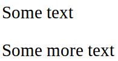

---

# Example (em)

```html
<div>
  <p>Some text</p>
  <div>
    <p>Some more text</p>
  </div>
</div>
```

```css
div {
  font-size: 1.2em;
}
```

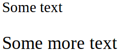

---

# Pixel

* On low dpi screens, the **pixel (px)** represents one device pixel (**dot**). 
* On higher dpi devices, a pixel represents an integer number of device pixels so that 1in ≈ 96px.

---

# Percentage

The *percentage* CSS data type represents a percentage value. A percentage consists of a *number* followed by the percentage sign %. There is no space between the symbol and the number.

```css
  div {
    width: 50%;
  }
```

Many CSS properties (width, margin, padding, font-size, ...) can take *percentage* values to define a size as relative to its parent object.

---

template: inverse
name:fonts
# Fonts

---

# Font Family

In CSS, there are two types of font family names:

* **generic family** - a group of font families with a similar look.
* **font family** - a specific font family (e.g. Times New Roman).
---
# Specific Font Family

You can define a specific font family to be used. Be careful as the it might not exist in the target computer.

```css
p {
  font-family: "Arial";
}
```
---
# Generic Font Family

Or a generic family like: **serif**, **sans-serif** and **monospace**.

```css
p {
  font-family: serif;
}
```

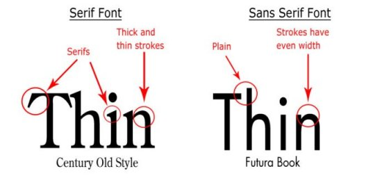
---
# Typography Humor

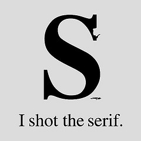
---
# Web Safe Fonts

* You can specify several fonts. The browser will try to use the first and continue down the list if it doesn't exist.
* Start with the font you want and gradually fall back to platform defaults and finally generic defaults:

```css
p {
  font-family: 'Open Sans', 'Droid Sans', Arial, sans-serif;
}
```

---
# Boldness

You can specify the weight of the font using the font-weight property. Values can be **normal**, **bold**, **bolder**, **lighter** or values from **100** to **900**.

```css
p.introduction {
  font-weight: bold;
}
```
---
# Style

The font-style property allows you to specify if the font style should be italic. Values can be **normal**, **italic**, or **oblique**.

```css
span.author {
  font-style: italic;
}
```
---
# Size

To define the font size you use the **font-size** property.

```css
p.introduction {
  font-size: 1.2em;
}
```

Use **rem** or **em**.

---

template:inverse
name:text
# Text

---

# Decoration

The **text-decoration** property is mostly used to remove underlines from links. But it has other possible values: **none**, <span style="text-decoration: underline">underline</span>, <span style="text-decoration: overline">overline</span> and <span style="text-decoration: line-through">line-through</span>.

```css
#menu a {
  text-decoration: none;
}
```
---
# Alignment

Text can be aligned **left**, **right**, **center** or justified (**justify**) using the **text-align** property. This property should be used for aligning text only.

```css
#menu {
  text-align: center;
}
```

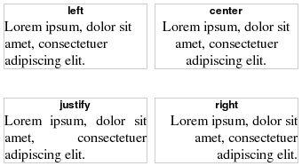

---

# Transformation

The **text-transform** property can be used to make the text **uppercase**, **lowercase** or capitalized (**capitalize** first letter of each word).

```css
h1 {
  text-transform: capitalize;
}
```

---

# Indentation

The first line of each paragraph can be indented using the **text-indent** property. This property takes a length as its value.

```css
.chapter p {
  text-indent: 10px;
}
```

---

template: inverse
name:boxmodel
# Box Model

---

# Box Model

Elements all live inside a box. They can have a **border**, some space between themselves and that border (**padding**) and some space between themselves and the next element (**margin**).


---

# Display

There are 40 different possible values for the **display** property. For now, we will concentrate on only four of them: **none**, **inline**, **block** and **inline-block**.

https://developer.mozilla.org/en-US/docs/Web/CSS/display

---

# Block Elements

* Block elements are laid out one after the other, **vertically**.
* If no **width** is set, they will **expand** naturally to **fill** their parent container.
* They can have **margins** and/or **padding**.
* If no **height** is set, they will **expand** naturally to **fit** their child elements and content.

Examples: p, div, h1-h6

```css
img {
  display: block;
}
```

---

# Blocks


---

# Inline Elements

* **Do not force** any **line changes**.
* **Ignore top** and **bottom margin** settings, but will **apply left** and **right margins**, and **any padding**.
* Will **ignore** the **width** and **height** properties.
* Are subject to the **vertical-align** property.

Examples: img, span, strong

```css
span {
  display: inline;
  margin: 1em;
  padding: 1em;
  background-color: red;
}
```

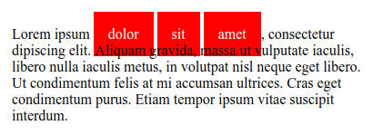


---

# Blocks and Inlines 


---

# Inline-Block Elements

Inline elements that **do not ignore** the **width** and **height** properties.

Block elements that will be flowed with surrounding content as if they were single inline boxes.

```css
span {
  display: inline-block;
  margin: 1em;
  padding: 1em;
  background-color: red;
}
```

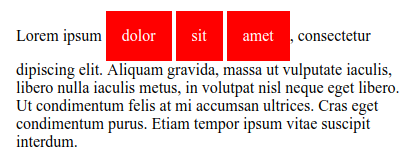

---


# Display None

* Setting the **display** property to none, **removes** the element from the page.
* Different from making it invisible (with the *visibility* attribute).

```css
#menu {
  display: none;
}
```

---

# Margin and Padding

* To change the margin and padding of an element we use the following properties: **margin-top**, **margin-right**, **margin-bottom**, **margin-left**, **padding-top**, **padding-right**, **padding-bottom** and **padding-left**.

* They all take a length as their value.

```css
h1 {
  margin-top: 10px;
}
```

* **Auto** A suitable margin is calculated by the browser (useful for centering).
* **Percentage** Calculated with respect to the width of the generated containing block (event for top/bottom).

---

# Shorthands

To make it easier to define the margin and padding properties, shorthands can be used:

* Using **two values**, the **top/bottom** (vertical) and **left/right** (horizontal) margins are defined simultaneously.

* Using **three values**, the **top**, **horizontal** and **bottom** margins are defined.

* Using **four values**, the **top**, **right**, **bottom** and **left** values are defined (in that order i.e. **clockwise**).

* Using **one value**, **all values** are defined the same.

---

# Shorthand Examples

```css
h1 {
  margin: 5px 10px;
}

#menu {
  margin: 10px;
}

#content {
  padding: 5px 3px 10px 15px;
}
```

Common shorthand used to center the *body* element:

```css
body {
  margin: 0 auto;
}
```


---
# Margin Collapse

Adjacent margins collapse in three different cases

* The margins of **adjacent siblings** are collapsed.
* If there is no border, padding, inline content, or clearance to separate the margin-top of a block with the margin-top of its **first child** block, or no border, padding, inline content, height, min-height, or max-height to separate the margin-bottom of a block with the margin-bottom of its **last child**, then those margins collapse.
* If there is no border, padding, inline content, height, or min-height to separate a block's margin-top from its margin-bottom, then its top and bottom margins collapse.
---
## Margin Collapse Examples


---

template:inverse
name:border
# Border

---
# Element Border

An element border is a line that separates the padding from the margin.


---
# Border Style

* The **border-style** property specifies what kind of border to display. The following values are possible: **none**, **dotted**, **dashed**, **solid**, **double**, **groove**, **ridge**, **inset** and **outset**.

* We can set different border styles for each side using the properties: **border-top-style**, **border-right-style**, **border-bottom-style** and **border-left-style**.

```css
#menu {
  border-style: solid;
}
```
---
## Border Style Examples


---
# Border Width

* The **border-width** property is used to specify the width of the border. Its value can be a length or a predefined value: **thin**, **medium**, or **thick**.

* We can set different border widths for each side using the properties: **border-top-width**, **border-right-width**, **border-bottom-width** and **border-left-width**.

```css
#menu {
  border-left-width: 10px;
  border-right-width: thin;
}
```
---
# Border Color

* The **border-color** property is used to specify the color of the border.

* We can set different border colors for each side using the properties: **border-top-color**, **border-right-color**, **border-bottom-color** and **border-left-color**.

```css
#menu {
  border-color: #336699;
}
```
---
# Shorthands

* As with the padding and margin properties we can use more than one value in the style, color and width properties to change the border of several sides at the same time.

* Using **two values**, the **top/bottom** and **left/right** border properties are defined simultaneously.

* Using **four values**, the **top**, **right**, **bottom** and **left** values are defined (in that order i.e. **clockwise**).

* Using **one value**, **all values** are defined the same.

```css
#menu {
  border-width: 5px 10px;
}
```
---
# Shorthands

* The **border** property allows us to define all border properties in one declaration.

* The properties that can be set, are (in order): **border-width**, **border-style**, and **border-color**.

* It does not matter if one of the values above is missing.

```css
#menu {
  border: 1px solid red;
}
```

---

# Border Radius

* The **border-radius** property is used to define how rounded border corners are.
* The curve of each corner is defined using one or two radii, defining its shape: circle or ellipse.
* We can set different border radius for each corner using the properties: **border-top-left-radius**, **border-top-right-radius**, **border-bottom-right-radius** and **border-bottom-left-radius**.
* Values can be a length or a percentage.
* If two radii are used, they are separated by a **/**.

---

# Shorthands

* As with other properties we can use more than one value in the radius property to change the border radius of several corners at the same time.

The possible combinations are as follows:

* One value: single radius for the whole element
* Two values: **top-left-and-bottom-right** and **top-right-and-bottom-left**
* Three values: **top-left**, **top-right-and-bottom-left** and **bottom-right**
* Four values: **top-left**, **top-right**, **bottom-right**, **bottom-left**

---

# Examples

```html
<div id="a"></div><div id="b"></div><div id="c"></div>
<div id="d"></div><div id="e"></div><div id="f"></div>
```

```css
div {
  background-color: #336699;
  width: 50px; height: 50px;
  margin: 10px; float: left;
}
#a { border-radius: 10px; background-color: blue;}
#b { border-radius: 40px 10px; background-color: red;}
#c { border-radius: 40px 10px / 20px 20px; background-color: green;}
#d { border-radius: 10% / 10% 20% 30% 40%; background-color: orange;}
#e { border-radius: 10% 20% / 40px 10px; background-color: yellow;}
#f { border-radius: 20px 0; background-color: fuchsia;}
```


---

template: inverse
name:background
# Background

---
# Image

* Besides having a background color, elements can also have an image as background using the **background-image** property. 
* This property accepts an URL as its value.

```css
div#menu {
  background-image: url('squares.png');
}
```
---
# Position

* The position of the background image can be set using the **background-position** property. This property receives two values. 
* The first one can be **left**, **right**,  **center** or a **length**.
* The second one can be **top**, **bottom**, **center** or a **length**.

```css
div#menu {
  background-image: url('squares.png');
  background-position: left top;
}
```
---
# Attachment

* Using the **background-attachment** property, we can specify if the background should or not scroll with the page or element. 
* Possible values are **fixed** (in relation to the viewport), **scroll** (in relation to the element) and **local** (in relation to the content). 
* Scroll is the default value.

```css
div#menu {
  background-image: url('squares.png');
  background-position: left top;
  background-attachment: local;
}
```

https://css-tricks.com/almanac/properties/b/background-attachment/

---

# Repeat

We can also define if the background repeats along one or both axis with the **background-repeat** property. Possible values are **no-repeat**, **repeat-x**, **repeat-y** and **repeat**.

```css
div#menu {
  background-image: url('squares.png');
  background-position: left top;
  background-attachment: local;
  background-repeat: repeat;
}
```

---

# Clipping

* By default, background properties, like **background-color**, apply to the space occupied by the element, its padding and border.

* This can be changed using the **background-clip** property.

* The possible values are: **border-box** (default), **padding-box** (only content and border) and **content-box** (only content).

https://css-tricks.com/almanac/properties/b/background-clip/

---

# Shorthands

* The **background** shorthand property sets all the background properties (including color) in one declaration.

* The properties that can be set, are: **background-color**, **background-position**, **background-size**, **background-repeat**, **background-origin**, **background-clip**, **background-attachment**, and **background-image**.

* It does not matter if one of the values above are missing.

```css
div#menu {
  background: url('squares.png') repeat left top;
}
```
---

template: inverse
name:lists
# Lists

---

# Markers

* Each item, in ordered and unordered lists, have left marks defining its position.
* We can change the markers of both types of lists using the **list-style-type** property.
* Some possible values for unordered lists are: **none**, **disc** (default), **circle** and **square**.
* For ordered lists we can use: **none**, **decimal** (default), **lower-alpha**, **lower-greek**, **lower-roman**, **upper-alpha** and **upper-roman**.

```css
  #menu ul { list-style-type:none }
  .article ol { list-style-type:lower-roman }
```
---
# Images as Markers

It is also possible to use an arbitrary image as the list marker:

```css
div#menu ul{
  list-style-image: url('diamong.gif');
}
```

---

template: inverse
name:tables
# Tables

---

# Borders

To draw border around table elements we can use the **border** property that we've seen before:

```css
table, th, td {
	border: 1px solid black;
}
```
---

# Collapse Borders

* Both tables and cells have borders. 
* Specifying borders for both will result in a double border effect. 
* To collapse borders from these two elements into one single border we can use the **border-collapse** property:

```css
table {
	border-collapse: collapse;
}
```

---

template:inverse
name:transforms
#Transforms

---

#Transform

* The **transform** propery modifies the coordinate space of the CSS visual formatting model. A space separated list of transforms, which are applied one after the others.
* The **transform-origin** property specifies the position of the transform origin. By default it is at the center of the element. It takes two values (x-offset and y-offset) that can be a length, a percentage or one of left, center, right, top and bottom.

---

#Examples

```html
<div id="a"></div><div id="b"></div><div id="c"></div>
<div id="d"></div><div id="e"></div><div id="f"></div>
```

```css
div {
  margin: 30px;
  float: left;
  width: 50px; height: 50px;
}
#a {transform: rotate(30deg); background-color: blue;}
#b {transform: skew(30deg); background-color: red;}
#c {transform: translate(10px, 10%); background-color: green;}
#d {transform: scale(0.3); background-color: orange;}
#e {transform: rotate(30deg) scale(0.5); background-color: yellow;}
#f {transform: skew(30deg) rotate(30deg); background-color: fuchsia;}
```


---

template:inverse
name:transitions
#Transitions

---

#Transitions

* Provide a way to control **animation speed** when changing CSS properties

* Instead of having property changes take effect immediately, you can cause the changes in a property to take place over a period of time.

* CSS transitions let you decide: 
  * which properties to animate (**list**)
  * when the animation will start (**delay**)
  * how long the transition will last (**duration**)
  * how the transition will run (**timing function**)

---

#Example

<div class="transition"></div>

```css
.box {
    border-style: solid;
    border-width: 1px;
    width: 100px;
    height: 100px;
    background-color: #0000FF;
    transition: width 2s, height 2s, background-color 2s, transform 2s;
}

.box:hover {
    background-color: #FFCCCC;
    width: 150px;
    height: 150px;
    transform: rotate(180deg);
}
```

---

template: inverse
name:positioning
# Positioning

---

# The Flow

* By default, elements follow something called **the flow** of the document.

* In order to make page drawing easier for browsers, elements are always placed from **top** to **bottom** and **left** to **right**. Unless they are removed from the flow.

---

# Position

The **position** property allows the developer to alter the way an element is positioned. There are 4 possible values:

* static
* relative
* fixed
* absolute

---

# Position Static

* The default value. 
* The element keeps its place **in the document flow**.


```css
#b {
  position: static;
}
```

---

# Position Relative

* The element keeps its position **in the flow**.
* But can be moved relatively to its static position using the properties: **top**, **right**, **bottom** and **left**.


```css
#b {
  position: relative;
  left: -20px;
  top: 20px;
}
```

---

# Position Fixed

* The element is **no longer a part of the flow**.
* Can be positioned relatively to the **browser window**. 
* **Scrolling doesn't** change the element's **position**.


```css
#b {
  position: fixed;
  left: 20px;
  top: 0px;
  height: 20px;
}
```

---

# Position Absolute

* **No longer a part of the flow** and scrolls with the page.
* Can be positioned relatively to its **first non static parent**. 


```css
#b {
  position: absolute;
  left: 20px;
  top: 0px;
  height: 20px;
}
```

---

# Float

The **float** property removes an element from the document flow and shifts it to the **left** or to the **right** until it touches the edge of its containing box or another floated element.


```css
#b {
  float: left;
}
```
---
# Floats and Text

Text always flows around floated elements. This is useful to make text that flows around images.


```css
.article img {
  float: left;
}
```
---
# Multiple Floats

Floats go right or left until they find another float or the parent container.


```css
#b1, #b2 {
  float: left;
}
```
---
## Clear

* The **clear** property indicates if an element can be next to floating elements that precede it or must be moved down. 
* Values can be **left**, **right** or **both**.


```css
#b1, #b2 { float: left; }
# b1 { clear: both; }
```
---
# Ordering

* When elements are positioned outside the normal flow, they can overlap other elements. The **z-index** property specifies the stack order of an element.
* An element with greater stack order is always in front of an element with a lower stack order.

```css
#b { 
  z-index: -1;
}
```

By default, the elements are stacked following the order they are declared in the HTML.

---

# Overflow

* The **overflow** property especifies the behavior of an element when its contents don't fit its specified size.

* Possible values are:

 * **visible**:	The overflow is not clipped. It renders outside the element's box. This is default.
 * **hidden**:	The overflow is clipped, and the rest of the content will be invisible.
 * **scroll**:	The overflow is clipped, but a scroll-bar is added to see the rest of the content.
 * **auto**:	If overflow is clipped, a scroll-bar should be added to see the rest of the content.

---

template: inverse
name:flexbox
# Flexbox

---

# Flexbox

A direction agnostic alternative to the box model layout model.

Flexbox provides block level arrangement of parent and child elements that are flexible to adapt to display size.

It does not use floats, nor do the flex container's margins collapse with the margins of its contents.

https://css-tricks.com/snippets/css/a-guide-to-flexbox/

---

# Flexbox Vocabulary


---

# Running Example

```html
<div class="container">
  <div class="item">1</div>
  <div class="item">2</div>
  <div class="item">3</div>
</div>
```

```css
.container {
  background-color: #665178;
  padding: 1em;
}

.item {
  color: black;
  text-align: center;
  margin: 1em;
  padding: 1em;
  background-color: #A9CDC3;
}
```

---

# Running Example


---

# Flex

Changing the *display* property of the container to *flex* transforms the contained items into flexboxes.

```css
.container {
  display: flex;
}
```


By default the main axis is horizontal from left to right.

---

# Flex Direction

We can change the directon of the main axis by changing the *flex-direction* property of the container to: **row**, **row-reverse**, **column** or **column-reverse**.

```css
.container {
  flex-direction: column;
}
```


---

# Flex Wrap

The *flex-wrap* property allows us to specify how items should
wrap when changing lines: **no-wrap**, **wrap**, **wrap-reverse**

```css
.container {
  flex-wrap: wrap-reverse;
}
```

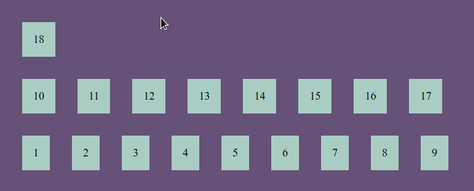

---

# Justify Content

The *justify-content* property defines the alignment along the **main** axis allowing the distribution of extra space: **flex-start**, **flex-end**, **center**, **space-around**, **space-between**, **space-evenly**.

```css
.container {
  justify-content: flex-startxb;
}
```

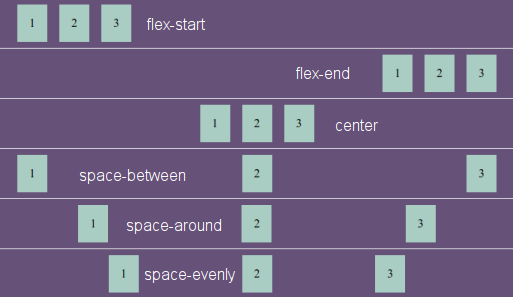

---

# Align Items

The *align-items* property defines the default behaviour for how flex items are laid out along the **cross** axis on the current line: **flex-start**, **flex-end**, **center**, **baseline**, **stretch**.

```css
.container {
  align-items: flex-start;
}
```

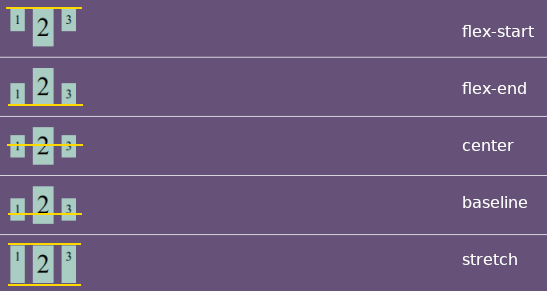

---

# Order

The **order** property alters the order in which a flex item is layed out in its container.

```css
.item:first-child {
   order: 3;
}
```


---

# Grow and Shrink

The *flex-grow* and *flex-shrink* properties define the ability for a flex item to grow, if there is extra space, or shrink, if there isn't enough. They accept a unitless value that serves as a proportion.

```css
.item {
  flex-grow: 1;
}

.item:nth-child(2) {
  flex-grow: 2;  
}
```


---

template: inverse
name:grid
# Grid

---

# Grid

A grid layout enables us to align elements into **columns** and **rows**. 

A grid container's child elements could position themselves so they actually overlap and layer.


https://css-tricks.com/snippets/css/complete-guide-grid/

---

# Running Example

```html
<div class="container">
  <div class="item header">Header</div>
  <div class="item menu1">Menu 1</div>
  <div class="item menu2">Menu 2</div>
  <div class="item content">Lorem ipsum...</div>
  <div class="item footer">Footer</div>
</div>
```

```css
.container {
  background-color: #1A3C3D;
  padding: 5px;
}
.item {
  color: black;
  text-align: center;
  margin: 2px;
  padding: 1em;
  background-color: #84A174;
}
```

---

# Running Example


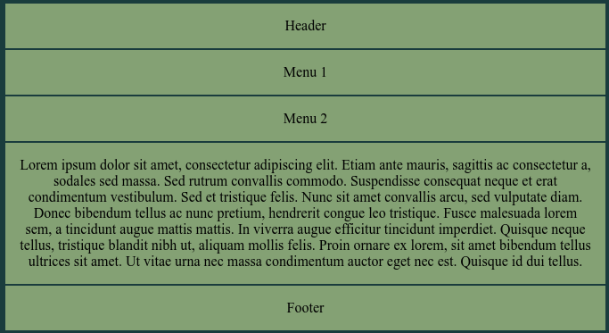

---

# Grid

Changing the *display* property of the container to *grid* transforms the container into a grid layout.

```css
.container {
  display: grid;
}
```

By default there is only one column.

---

# Grid Templates

The *grid-template-columns* and *grid-template-rows* properties allow us to define the number and size of the columns and rows of our table.

Sizes can be defined as **auto**, a **length**, a **percentage** or a **fraction** of the free space (using the *fr* unit).

```css
.container {
  grid-template-columns: auto 1fr;
  grid-template-rows: auto auto 1fr auto;
}
```

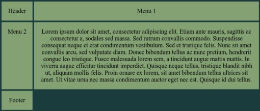

---

# Numerical Names

By default, grid lines are assigned numerical values.


---

# Assigning Location

We can assign a **location** to an item within the grid by referring to specific grid lines using the *grid-column-start*, *grid-column-end*, *grid-row-start* and *grid-row-end* properties.

```css
.header {
  grid-column-start: 1;
  grid-column-end: 3;
  grid-row-start: 1;
  grid-row-end: 2;
}
```

Values can be the **numerical** default names of the grid lines or a name assigned by us.

The end values can also be the number of rows or columns to span. By default these values are a span of one.

```css
.header {
  grid-column-end: span 2;
  grid-row-end: span 1;    /* not needed - default value */
}
```

---

# Location Shorthand

The *grid-column* and *grid-row* properties can be used as a shorthand for assigning the location of an item. Each one of them receives two values separated by a forward slash (start / end).

The *grid-area* property can be used as a shorthand for the four values at once: *row-start* / *column-start* / *row-end* / *column-end*.

.small[
```css
.header {
  grid-area: 1 / 1 / span 1 / span 2;
}

.menu1 {
  grid-column: 1;
  grid-row: 2;
}

.menu2 {
  grid-column: 1;
  grid-row: 3 / 5;
}

.content {
  grid-column: 2;
  grid-row: 2 / span 2;
}

.footer {
  grid-column: 2;
  grid-row: 4;
}
```
]

---

# Location Result

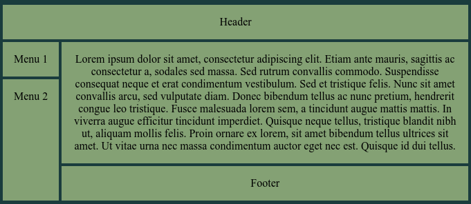

---

# Grid Line Names

When defining the grid template, we can assign names to the grid lines. A line can have more than one name.

```css
.container {
  grid-template-columns: [left] auto [middle] 1fr [right];
  grid-template-rows: [top] auto [header-end content-start] auto 
                      [menu-sep] 1fr [footer-start] auto [bottom];
}
.content {
  grid-area: content-start / middle / footer-start / right;
}
```


---

# Grid Template Areas

By giving names to items using the *grid-area* property, we can define a grid template in a more visual fashion.

Any number of adjacent periods can be used to declare a single empty cell.

```css
.container {
  grid-template-columns: auto 1fr;
  grid-template-rows: auto auto 1fr auto;
  
  grid-template-areas: "header header"
                       "menu1  content"
                       "menu2  content"
                       "menu2  footer";
}

.header { grid-area: header; }

.menu1 { grid-area: menu1; }

.menu2 { grid-area: menu2; }

.content { grid-area: content; }

.footer { grid-area: footer; }
```

---

template: inverse
name:precedence
# Precedence, Inheritance and Specificity

---

# Example

The text becomes red but the links are still blue. Why?

```css
<div>
  <p>This is some text with a <a>link</a></p>
</div>
```

```css
div {
  color: red;
}
```
---

# Defaults

* Each browser has **its own** set of default values for the properties of each HTML element. 
* These defaults are very similar between browsers but the little differences make cross-browser development harder.

**Tip**: There are several reset CSS available that redeclare each default value to have the same value in every browser.

---

# Inherit

* A special value that can be used in almost every property.
* When a property is set to **inherit**, the value of that property is **inherited** from the element's **parent**.

```css
<div id="menu">
  <h1>Menu</h1> <!-- inherits the blue color from the div -->
</div>
```

```css
h1{
  color: inherit;
}

#menu {
  color: blue;
}
```
---
# I Get it Now

* In most browsers the **anchor** color is defined as **blue**. 
* On the other hand, the **paragraph** color is defined as **inherit**.

```css
<div>
  <p>This is some text with a <a>link</a></p>
</div>
```

```css
a {
  color: blue;
}

p {
  color: inherit;
}

div {
  color: red;
}
```
---
# Specificity

```css
<div id="menu">
  <p>What is my color?</p>
</div>
```

```css
#menu p {
  color: green;
}

p {
  color: red;
}
```
--
<div class="fragment roll-in"><span style="color: green">Green</span>! Because the first rule is more specific than the second one.</div>
---
## Calculating Specificity

* The specificity of a rule is defined as 4 values (a, b, c, d). 
* Each one of them is incremented when a certain type of selector is used:
 * **d**: Element, Pseudo Element
 * **c**: Class, Pseudo class, Attribute
 * **b**: Id
 * **a**: Inline Style
---
## Specificity Examples

* p: 1 element – (0,0,0,1)
* div: 1 element – (0,0,0,1)
* \#sidebar: 1 id – (0,1,0,0)
* div#sidebar: 1 element, 1 id – (0,1,0,1)
* div#sidebar p: 2 elements, 1 id – (0,1,0,2)
* div#sidebar p.bio: 2 elements, 1 class, 1 id – (0,1,1,2)

Specificity Calculator: [http://specificity.keegan.st](http://specificity.keegan.st) 

---
## Specificity Rules

* Rules with a bigger **a** value are **more specific**.
* If the **a** value is the same for both rules, the **b** value is used for comparison. 
* If still needed, the **c** and **d** values are used.
---
# Cascading

* The rule to be applied is selected using the following rules in order:
 * Origin (author, user, default)
 * Specificity (bigger is better)
 * Position (last is better)

* Origin Explanation:
 * **author**: The CSS rules defined by the page developer
 * **user**: User defined preferences 
 * **default**: Browser defaults
 
---

template:inverse
name:responsive
# Responsive Design

---

# Responsive Design

Responsive web design is a way of making websites that works effectively on both desktop browsers and the myriad of mobile devices on the market.


.footnote[
http://foodsense.is/ image taken from http://designmodo.com/responsive-design-examples/
]

---

# Responsive vs Adaptative

**Adaptive Design** : Multiple **fixed** width layouts

**Responsive Design** : Multiple **fluid** grid layouts

**Mixed Approach** : Multiple fixed width layout for larger screens, multiple fluid layout for smaller screens.

---

# Viewport

Pages optimized for a variety of devices must include a meta viewport element in the head of the document. A meta viewport tag gives the browser instructions on how to control the page's dimensions and scaling.

```html
<meta name="viewport" content="width=device-width, initial-scale=1.0">
```

* *width=device-width* matchs the screen's width in device independent pixels.
* initial-scale=1* establishs a 1:1 relationship between CSS pixels and device independent pixels.

Learn more: https://developer.mozilla.org/en/docs/Mozilla/Mobile/Viewport_meta_tag and a tale of two viewports [part 1](http://www.quirksmode.org/mobile/viewports.html) and [part 2](http://www.quirksmode.org/mobile/viewports2.html)

---

# Media Queries

A **media-query** is composed of a **media type** and/or a number of **media features**.

They can be used when linking to a CSS file from HTML or directly in the CSS code.

```html
<link rel="stylesheet" 
      media="(min-width: 600px) and (max-width: 800px)" 
      href="medium.css" />
```

```css
@media (max-width: 600px) {
  .sidebar {
    display: none;
  }
}
```

---

# Media Types

The media type indicates the type of media the CSS is to be applied to.

* **all** - suitable for all devices.
* **print** - intended for paged material and for documents viewed on screen in print preview mode.
* **screen** - intended primarily for color computer screens.
* **speech** - intended for speech synthesizers (aural in CSS2).

```html
<link rel="stylesheet" media="print" href="print.css" />
```

---

# Media Features

* **min-width**	width over the value defined in the query.
* **max-width**	width under the value defined in the query.
* **min-height** height over the value defined in the query.
* **max-height** height under the value defined in the query.
* **orientation=portrait** height is greater than or equal to the width.
* **orientation=landscape**	width is greater than the height.

```html
<link rel="stylesheet" media="(min-width: 800px)" href="large.css" />
```

Parentheses are required around expressions; failing to use them is an error.

---

# Logical Operators

* **and** used for combining multiple media features together
* **comma-separated** lists behave as the logical operator **or**
* **not** applies to the whole media query and returns true if the media query would otherwise return false

```html
<link rel="stylesheet" 
      media="(min-width: 800px) and screen, print" 
      href="large.css" />
```

Learn more: <br>https://developer.mozilla.org/en-US/docs/Web/Guide/CSS/Media_queries

---

template:inverse
name:prefix
#Vendor Prefixes

---

#Vendor Prefixes

While the specification of selectors, properties and values are still being finalized, it is normal for browsers to go through an **experimentation** period.

Browsers might also have **proprietary** extensions to the CSS standard.

In order to accommodate the release of vendor-specific extensions, the CSS specifications define a specific format that vendors should follow:

```css
.round {
  -webkit-border-radius: 2px;
  -moz-border-radius: 2px;
  border-radius: 2px;
}
```

Prefixes: **-webkit-** (chrome, safari), **-moz-** (firefox), **-o-** (opera), **-ms-** (internet explorer), ...

Check browser suppport: http://caniuse.com/

---

template:inverse
name:validation
#Validation
http://jigsaw.w3.org/css-validator/

---

# Extra stuff

* Frameworks: [Ink](http://ink.sapo.pt/), [Bootstrap](http://getbootstrap.com/), [Flat UI](http://designmodo.github.io/Flat-UI/), [Pure](http://purecss.io/)
* Reset: [CSS Reset](http://www.cssreset.com/)
* Fonts: [Google Fonts](https://www.google.com/fonts)
* Advanced/Experimental: [Flexbox](http://css-tricks.com/snippets/css/a-guide-to-flexbox/), [Shadows](https://developer.mozilla.org/en-US/docs/Web/CSS/box-shadow), [Animations](https://developer.mozilla.org/en-US/docs/Web/CSS/animation), [Grids](https://drafts.csswg.org/css-grid-1/)
* Pre-processors: [Less](http://lesscss.org/), [Sass](http://sass-lang.com/)
* Information: [Google Web Essentials](https://developers.google.com/web/fundamentals/), [Mozilla Developer Network](https://developer.mozilla.org/en-US/)
* Icons: [Font Awesome](http://fortawesome.github.io/Font-Awesome/)

