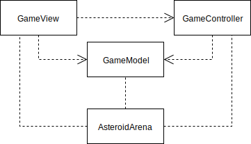
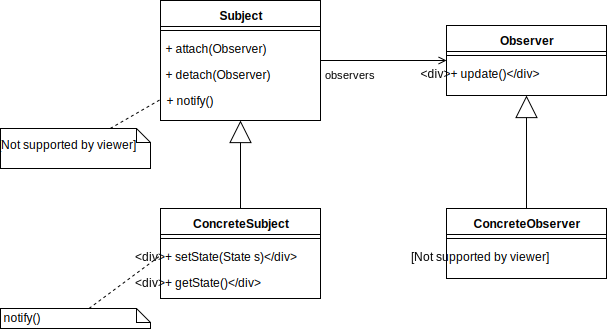
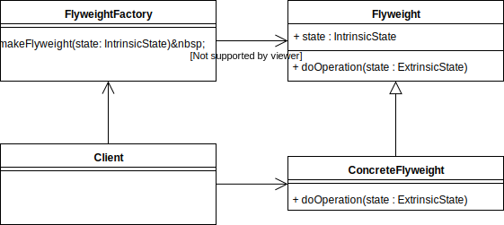

name: inverse
layout: true
class: center, middle, inverse
.indexlink[[<i class="fa fa-arrow-circle-o-up"></i>](#) [<i class="fa fa-list-ul"></i>](#index) [<i class="fa fa-tint"></i>](../change-color.php)[<i class="fa fa-file-pdf-o"></i>](download)]

---

name: normal
layout: true
class: left, middle
.indexlink[[<i class="fa fa-arrow-circle-o-up"></i>](#) [<i class="fa fa-list-ul"></i>](#index) [<i class="fa fa-tint"></i>](../change-color.php)[<i class="fa fa-file-pdf-o"></i>](download)]

---

template:inverse
# Game Patterns
<a href="http://www.fe.up.pt/~arestivo">André Restivo</a>

---

template:inverse
name:index
# Index

.indexlist[
1. [Introduction](#intro)
1. [Singleton](#singleton)
1. [Observer](#observer)
1. [Flyweight](#flyweight)
1. [Object Pool](#pool)
1. [State](#state)
1. [Strategy](#strategy)
1. [Visitor](#visitor)
1. [Abstract Factory](#factory)
]

---

template:inverse
name:intro
# Patterns in Games

---

template:inverse
name:singleton
# One to rule them All

---

# Motivation

Game needs **one, and only one**, instance of the GameModel, GameController and GameView classes. Theses classes are accessed in **several** different places of our code.

---

# Singleton

Ensure a class has only one instance, and provide a global point of access to it.

---

# Implementation

~~~java
public class GameController {
  private static GameController instance;

  public static GameController getInstance() {
    if (instance == null)
      instance = new GameController();
    return instance;
  }
}
~~~

~~~java
public class GameView {
  public void render(float delta) {
    GameController.getInstance().update(delta);
    /* ... */
  }
}
~~~

---

# Drawbacks

* They hide dependencies and promote bad code.
* They control their own creation and lifecycle.
* They make tests harder.

---

template:inverse
name:observer
# I see You

---

# Motivation

Events in the physics engine, like collisions, must be **reflected** in the game model **without** keeping the objects **tightly coupled**. 

---

# Observer

Define a one-to-many dependency between objects so that when **one** object changes state, all its **dependents** are **notified** and updated automatically.

---

# Implementation

~~~java
world.setContactListener(new ContactListener() {
  @Override
  public void beginContact(Contact contact) {
  }

  @Override
  public void endContact(Contact contact) {
  }

  @Override
  public void preSolve(Contact contact, Manifold oldManifold) {
  }

  @Override
  public void postSolve(Contact contact, ContactImpulse impulse) {
  }
});

~~~

---

template:inverse
name:flyweight
# The Forest for the Trees

---

# Motivation

We need to maintain a lot of asteroid objects but maintaining a sprite and/or texture for each one of them is expensive.

---

# Flyweight

Use sharing to support large numbers of fine-grained objects efficiently.

---

# Flyweight

Each **flyweight** object is divided into two pieces: the state-dependent (extrinsic) part, and the state-independent (intrinsic) part:

* Intrinsic state is stored (shared) in the Flyweight object.
* Extrinsic state is passed when operations are invoked.

---

# Implementation

~~~java
public class ViewFactory {
  public enum ViewType {BIGASTEROID, MEDIUMASTEROID, SHIP, BULLET};

  private static Map<ViewType, EntityView> cache = 
    new HashMap<ViewType, EntityView>();

  public static EntityView makeView(AsteroidArena game, ViewType type) {
    if (!cache.containsKey(type)) {
      if (type == BIGASTEROID) 
        cache.put(BIGASTEROID, new BigAsteroidView(game));

        /* ... */
    }
    return cache.get(type);
  }
}
~~~

~~~java
for (AsteroidModel asteroid : asteroids) {
  EntityView view = ViewFactory.makeView(game, BIGASTEROID);
  view.draw(game.getBatch(), asteroid);
}
~~~

---

template:inverse
name:pool
# Reuse. Restore. Recycle.

---

# Motivation

There are **never** a lot of *bullets* flying at one given moment; but they are created and destroyed at a very **high rate**. The cost of instantiating a class makes this prohibitive.

---

# Object Pool 

---

template:inverse
name:strategy
# Strategy

---

template:inverse
name:visitor
# Visitor

---

template:inverse
name:state
# State

---

template:inverse
name:factory
# Abstract Factory
