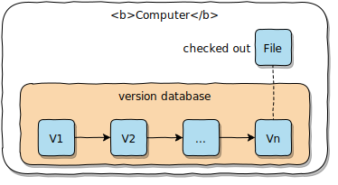
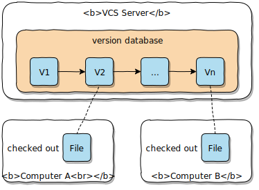
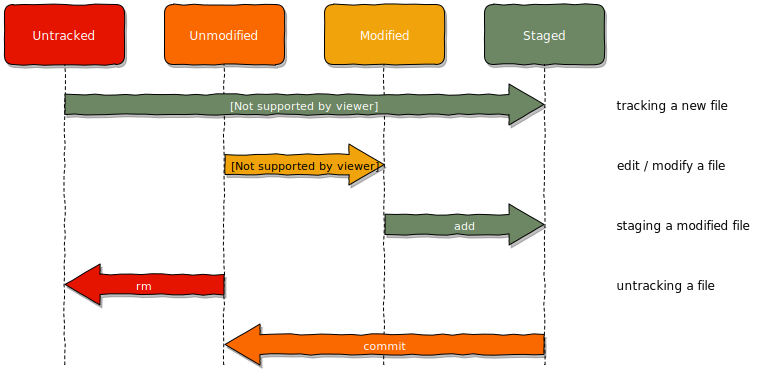

name: inverse
layout: true
class: center, middle, inverse
.indexlink[[<i class="fa fa-arrow-circle-o-up"></i>](#) [<i class="fa fa-list-ul"></i>](#index) [<i class="fa fa-tint"></i>](../change-color.php)[<i class="fa fa-file-pdf-o"></i>](download)]

---

name: normal
layout: true
class: left, middle
.indexlink[[<i class="fa fa-arrow-circle-o-up"></i>](#) [<i class="fa fa-list-ul"></i>](#index) [<i class="fa fa-tint"></i>](../change-color.php)[<i class="fa fa-file-pdf-o"></i>](download)]

---

template:inverse
# Git
<a href="http://www.fe.up.pt/~arestivo">André Restivo</a>

---

template:inverse
name:index
# Index

.indexlist[
1. [Introduction](#intro)
1. [Local](#local)
]

---

template:inverse
name:intro
# Introduction

---

# Version Control Systems (VCS)

A system that records changes to a file or set of files over time.


It allows you to:

- **revert** selected files, or a project, back to a previous state
- **compare** changes over time
- see **who modified** something
- ...

AKA Source Control Management (**SCM**)

---

# Local VCS

* Local VCS use a simple database that keeps all changes to files under revision control.
* Most store only the differences between files instead of copies of each version.
* Examples: [RCS](https://www.gnu.org/software/rcs/)




---

# Centralized VCS

* A **single server** that contains all the versioned files.
* Computers can **checkout** a particular file version.
* Examples: [CVS](http://cvs.nongnu.org/), [Subversion](https://subversion.apache.org/)



---

# Centralized VCS 

Advantages:

* Everyone knows what everyone is doing.
* **Fine grained control** over who can do what.

Disadvantages

* Single point of **failure**.
* Needs constant **connectivity**.
* Needs **backups**.

---

# Distributed VCS

* All clients **fully mirror** the repository, including its **full history**.
* There is **no difference** between a server and a client.
* But one, or more, computers can be used as a **central point** of synchronization.
* Allows lots of different **workflows**.


Examples: [Git](https://git-scm.com/), [Mercurial](https://www.mercurial-scm.org/), [Bazaar](http://bazaar.canonical.com/en/), [Darcs](http://darcs.net/)


---

template:inverse
name:local
# Local Git
Git as a **local** VCS

---

# Basics

* Snapshots:
  * Does not store versions of a file only by their differences. 
  * Instead it saves them as a series of **snapshots**.
  * If files have not changed, it does not store them again.
* Local operations: Most Git operations are **local**
* Integrity: 
  * Everything in Git is *checksummed* (**SHA-1**) before it is stored.
  * Everything is then **referred** to by that **checksum**.

---

# Snapshots


---

# Create a Repository

Enter a local directory, currently not under version control:

```bash
cd project
```

And turn it into a Git repository:

```bash
git init
```

This will create an hidden *.git* subdirectory containing all of your necessary repository files.

---

# Git Sections

The **Git directory** is where Git stores the metadata and object database for your project.

The **working tree** is a single checkout of one version of the project. 

The **staging area** (or **index**) is a file in your Git directory that stores information about what will go into your next commit.


---

# File States



---

# Status

---

# Add

---

# Commit

---

# Rm

---

# Partially Staged Files

A file can be partially staged:

```bash
echo "some text" > README    # File is modified
git add README               # Modifications are staged
echo "another text" > README # File is modified again
```

1) Commiting again would only commit the initial staged edits:

```bash
git commit                   # File now still has changes
git add README               # Staging those changes
git commit                   # File is now unmodified
```

2) Or we could only commit once:

```bash
git add README               # Staging the new changes
git commit                   # Commiting both changes at once
```
