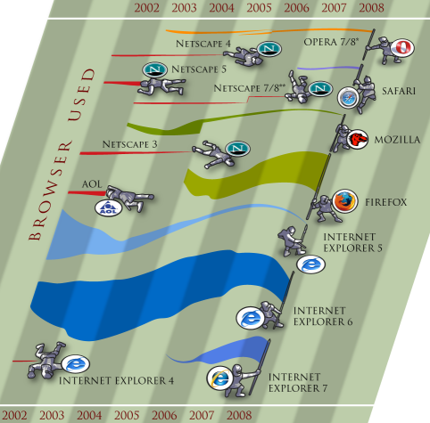
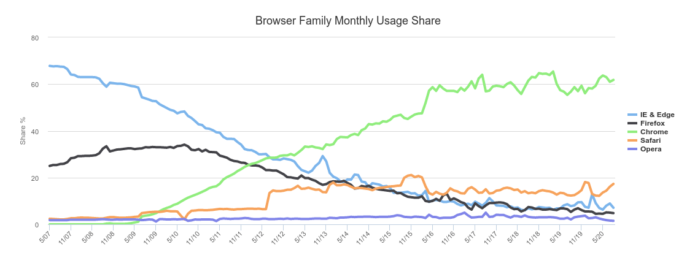
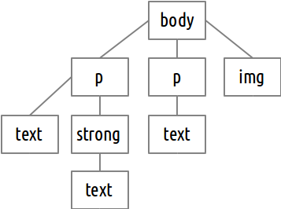
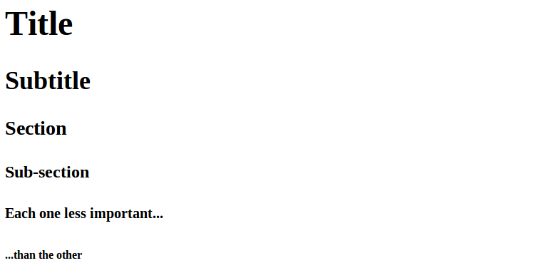
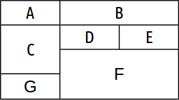
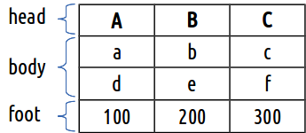
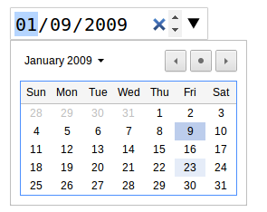
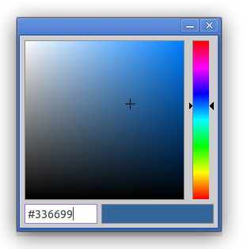
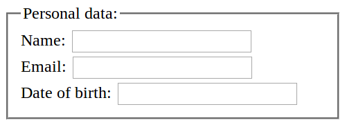
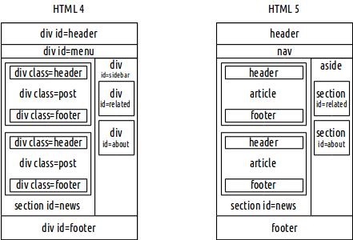

name: inverse
layout: true
class: center, middle, inverse
.indexlink[[<i class="fa fa-arrow-circle-o-up"></i>](#) [<i class="fa fa-list-ul"></i>](#index) [<i class="fa fa-tint"></i>](../change-color.php)[<i class="fa fa-file-pdf-o"></i>](download)]

---

name: normal
layout: true
class: left, middle
.indexlink[[<i class="fa fa-arrow-circle-o-up"></i>](#) [<i class="fa fa-list-ul"></i>](#index) [<i class="fa fa-tint"></i>](../change-color.php)[<i class="fa fa-file-pdf-o"></i>](download)]

---

template:inverse
# HTML 5
<a href="http://www.fe.up.pt/~arestivo">André Restivo</a>

---

template:inverse
name:index
# Index

.indexlist[
1. [Introduction](#intro)
1. [Resources](#resources)
1. [Document](#document)
1. [Basic Tags](#basic)
1. [Lists](#lists)
1. [Tables](#tables)
1. [Forms](#forms)
1. [Text](#text)
1. [Character Entities](#entities)
1. [Element Types](#elements)
1. [Media](#media)
1. [Document Type](#doctype)
1. [Metadata](#metadata)
1. [Validation](#validation)
]

---

template:inverse
name:intro
# Introduction
and some History

---

template:normal

# What is it?

* **H**yper **T**ext **M**arkup **L**anguage
* Markup language used to create web pages
* Written using HTML **elements**
* **Not** for design or presentation
* Structure and semantics

---


# History
* 1992: **HTML 1.0**, Tim Berners-Lee original proposal
* 1993: **HTML+**, Dave Raggett's competing standard
* 1994: **HTML 2.0**, tables, file upload, ... (IETF)
* 1995: Non-standard Netscape features
* 1996: Competing Netscape and Internet Explorer features
* 1996: **HTML 3.2**, W3C standard, the Browser Wars end
* 1997: **HTML 4.0**, stylesheets are introduced
* 1999: **HTML 4.01**, we have a winner!
* 2000: **XHTML 1.0**, an XML version of HTML 4.01
* 2001: **XHTML 1.1**, modularization
* 2008: **HTML 5**, reduces the need for proprietary plug-in based apps

Learn more: http://en.wikipedia.org/wiki/HTML#History

---

template:inverse
# Browser Wars



---

template:inverse
# Browser Share



Source: http://www.w3counter.com/trends

---

# HTML Elements
* HTML is composed of a **tree** of HTML elements.
* Elements can contain other elements and/or **text**.
* Defined using **tags**.
* Can also have **attributes**.
* Browsers display each tag using a predefined style that can be changed using CSS.

---

# Tags

Tags start with a **&lt;** and end with a **&gt;** and always contain a name. 

They are case insensitive but lowercase is recommended.

```html
<html>
```

***

Most tags come in pairs. An opening tag and a closing tag. 

Closing tags have a **/** after the **&lt;**. 

```html
<html> ... </html>
```

---

# Tag content

The content of a tag is everything between the opening and closing tags. 

```html
<p>Some content</p>
```

Some tags don't have content and do not need to be closed. 

```html
<br>
```

Tags can have attributes. Some are optional and some are mandatory.

```html

```

---

template:inverse
name:resources
# Resources
* References:
  * http://www.w3.org/TR/html-markup/
  * http://developer.mozilla.org/en-US/docs/Web/HTML/Element
  * WHATWG Living Standard <br> https://html.spec.whatwg.org/multipage/ 
* Books:
  * http://diveintohtml5.info/
* Tutorials:
  * http://docs.webplatform.org/wiki/html/tutorials
  * http://www.htmldog.com/guides/html/
  * http://html5tutorial.info/

---

template:inverse
name:document
# Document 

---

# Tree Structure

* HTML elements form a **tree** like structure.
* Some HTML elements can have children. Those have **start** and **end** tags.
* HTML elements that do not allow children only have an opening tag.

---

# Example


```html
<body>
  <p id="first">Some <strong>text</strong></p>
  <p>Some other text</p>
  
</body>
```

---


# Basic Document

* All HTML documents have a **html** root tag.
* They all contain a **head** and **body** sections.
* The head section must contain a **title** tag.
```html
<html>
   <head>
     <title>Title</title>
   </head>
   <body>
   </body>
</html>
```

---

template:inverse
name:basic
# Basic Tags

---


# Headings
    
* HTML implements six levels of document headings. **&lt;h1&gt;** is the most important and **&lt;h6&gt;** is the least. 
* A heading element briefly describes the topic of the section it introduces.    

```html
<h1>Title</h1> <!-- only one per document -->
<h2>Subtitle</h2> <!-- this is a comment btw -->
<h3>Section</h3>
<h4>Sub-section</h4>
<h5>Each one less important...</h5>
<h6>...than the other</h6>
```

---

template:inverse
# Example



---


# Paragraphs and Line Breaks

```html
<p>This is a paragraph.</p>
<p>
This is another paragraph<br> <!-- empty tag -->
with a line break.
</p>
```


---

# Anchor

Anchors (or links) can be relative or absolute.

```html
<a href="anotherpage.html">Another Page</a>
<a href="somewhere/deeper.html">Deeper</a>
<a href="../start.html">Back</a>
<a href="http://www.google.com">Search</a>
```


---


# Images

The **alt** attribute is mandatory and represents an alternative image description for browsers incapable of showing images.

> Omitting this attribute indicates that the image is a key part of the content, but no textual equivalent is available. Setting this attribute to the empty string indicates that this image is not a key part of the content; non-visual browsers may omit it from rendering.

The **width** and **height** attributes are optional and should not be used to resize images on the fly.

```html

```


---

# Common Attributes

* **hidden**: Specifies that an element is not yet, or is no longer, relevant.
* **accesskey**: Specifies a shortcut key to activate/focus an element.

---

template:inverse
name:lists
# Lists

---

# Ordered Lists

```html
<ol>
  <li>An item</li>
  <li>Another item</li>
  <li>And another one</li>
</ol>
```


---


# Unordered Lists

```html
<ul>
  <li>An item</li>
  <li>Another item</li>
  <li>And another one</li>
</ul>
```


---


# Nested Lists

```html
<ul>
  <li>A list:
    <ol>
      <li>Something</li>
      <li>Something else</li>
    </ol>
  </li>
  <li>Another item</li>
  <li>And another one</li>
</ul>
```


---

# Description Lists

* Define terms and descriptions.
* A term can have several descriptions.
* Several terms can have the same description.

```html
<dl>
  <dt>A term</dt>
  <dd>And its definition</dd>
  <dt>This one</dt>
  <dd>Has a different definition</dd>
  <dd>Alternative definition</dd>
</dl>
```


---

template:inverse
name:tables
# Tables

---

# Rows and Data

A table is organized using rows (tr) that contain data cells (td).

```html
<table>
  <tr>
    <td>A</td><td>B</td><td>C</td>
  </tr>
  <tr>
    <td>D</td><td>E</td><td>F</td>
  </tr>
</table>
```


---

# Headers

Some data cells can be headers (**th** instead of **td**)


```html
<table>
  <tr>
    <th>A</th><th>B</th><th>C</th>
  </tr>
  <tr>
    <td>D</td><td>E</td><td>F</td>
  </tr>
</table>
```


---

# Cell Merging

Cells can be merged horizontally or vertically


```html
<table>
  <tr>
    <td>A</td><td colspan="2">B</td>
  </tr>
  <tr>
    <td rowspan="2">C</td><td>D</td><td>E</td>
  </tr>
  <tr>
    <td colspan="2" rowspan="2">F</td>
  </tr>
  <tr>
    <td>G</td>
  </tr>
</table>
``` 


---

## Sections

.small[
```html
<table>
  <thead>
    <tr>
      <th>A</th><th>B</th><th>C</th>
    </tr>
  </thead>
  <tfoot>
    <tr>
      <td>100</td><td>200</td><td>300</td>
    </tr>
  </tfoot>
  <tbody>
    <tr>
      <td>a</td><td>b</td><td>c</td>
    </tr>
    <tr>
      <td>d</td><td>e</td><td>f</td>
    </tr>
  </tbody>
</table>
```
]


---

template:inverse
name:forms
# Forms

---

# What are they?

Forms allow users to enter data that is sent to a server for processing


---

# Action and Method

* **action**: the web page that receives and processes the form results 
* **method**: either **get** (values are sent in the URL) or **post** (values are sent inside the HTTP header)

```html
<form action="save.php" method="get">
  <!-- form controls go here -->
</form>
```

---

template:inverse
# Form Controls

---

# Form Controls

Three main types of form controls

* **input** Several types of user editable fields
* **textarea** A big editable text field
* **select** A dropdown list

---

# Input

An input field can vary in many ways, depending on the **type** attribute.

```html
<input type="text" name="address">

<input type="password" name="password">

<input type="e-mail" name="email">
```


---

# Input Common Attributes

*	**type**: the type of the input
*	**name**: name of the field to be passed to the action
* **autocomplete**: value of the control can be automatically completed by the browser (on/off)
* **readonly**: input value cannot be modified (boolean)
* **required**: input must be filled out (boolean)
* **disabled**: input is disabled (boolean)

**Boolean**: If the attribute is present, its value must either be the empty string or a value that is an ASCII case-insensitive match for the attribute's canonical name, with no leading or trailing whitespace.

```html
<input type="text" name="address" required="required" disabled>
```

<small>Learn more: https://developer.mozilla.org/en-US/docs/Web/HTML/Element/input</small>

---

# Text Inputs

```html
<input type="tel" name="phone" value="555-555-555">
```

* **type**:
  * **text**: text input with no constraints
  * **password**: characters are not shown
  * **tel**: input value is a telephone number
  * **search**: input value is used to perform a search
  * **url**: input value is an URL
  * **e-mail**: input value is used an e-mail
* **value**: the initial value

---

# Number Inputs

```html
<input type="number" value="10" min="0" max="100" step="5">
```

* **type**:
  * **number**: a precise control for setting a number
  * **range**: imprecise control for setting a number
* **value**: the initial value
* **min**: the minimum value
* **max**: the maximum value
* **step**:  limits the increments at which a value can be set


---


# Date/Time Inputs

```html
<input type="date" value="2009-01-09">
```

* **type**:
  * **time**: control to select a time of the day
  * **date**: control to select a date
  * **datetime**: control to select a time in a certain day
  * **week**: control to select a week
* **value**: the initial value according to: <a href="http://tools.ietf.org/html/rfc3339">RFC3339</a>



---

# Color Input

```html
<input type="color" value="#336699">

```

* **type**:
  **color**: control to select a color
* **value**: initial color in hexadecimal format



---

# Checkbox and Radio


```html
<input type="checkbox" name="vehicle" value="Bike">I have a bike
<input type="checkbox" name="vehicle" value="Car" checked="checked" >I have a car
<!-- user can select several -->

<input type="radio" name="gender" value="male" checked="checked">Male
<input type="radio" name="gender" value="female">Female
<!-- only one can be selected             -->
<!-- name must be the same for each group -->
```


---

# File Upload

Allows file uploading for storing or processing

```html
<form action="upload_file.php" method="post" enctype="multipart/form-data">
  <input type="file" name="file">
</form>
```

To use file uploading in a form, *method* must be **post** and *enctype* must be **multipart/form-data**


---

# Hidden Input

```html
<input type="hidden" name="?">
```

The same as a text field but it does not show on the browser. We'll find what these are used for later...


---

# Submit

* A **button** that allows the user to submit the form for processing.

* The **value** contains the text to be used for the submit button. A multilingual default will be used if left blank. 

```html
<input type="submit" value="Send">
```

---

# Select

Dropdown boxes that allow users to select options from a list.

```html
<select name="fruit">
  <option value="orange">Orange</option>
  <option value="banana">Banana</option>
  <option value="tomato">Tomato</option>
  <option value="apple">Apple</option>
</select>
```

* **value**: The value sent to the server
* **content**: The text presented to the user


---


# Option Groups

Options in select controls can be grouped to make selecting them easier.

```html
<select name="food">
  <optgroup label="Fruits">
    <option value="orange">Orange</option>
    <option value="banana">Banana</option>
  </optgroup>
  <optgroup label="Vegetables">
    <option value="lettuce">Lettuce</option>
    <option value="carrot">Carrot</option>
  </optgroup>
</select>
```


---

# Select Attributes

* **name**: name of the field to be passed to the action
* **multiple**: allow multiple selections (boolean)
* **required**: field must be filled out (boolean)
* **disabled**: input is disabled (boolean)

```html
<select name="food" multiple="multiple" required>

</select>
```

---

# Text Area

A text input field for larger texts.

```html
<textarea rows="4" cols="50">
This is an input field that allows 
the user to input several lines of text. 
This is the default value for that input. 
Be careful about extra white space.
</textarea>
```


Text areas also allow the common attributes **name**, **disabled**, **readonly** and **required**.

---

# Label

* Allows the association between a **label** and its corresponding **input**. 
* Clicking the **label** activates the **input**. 
* Important for disabled people.
* Two ways of using it:

```html
<label for="id_name">Name:</label>
<input type="text" name="name" id="id_name">
```

```html
<label>Name:
  <input type="text" name="name">
</label>
```


---


# Field Set

* Allows grouping inputs in larger forms.
* Legend is the name of the group.

```html
<form>
  <fieldset>
    <legend>Personal data:</legend>
    Name: <input type="text"><br>
    Email: <input type="text"><br>
    Date of birth: <input type="text">
  </fieldset>
</form>
```



---

template: inverse
name:text
# Text Tags 

Text tags define portions of text as having a special meaning.

---


# Formatting Tags

```html
<em>emphasized</em> <!-- Defines emphasized text -->
<small>small</small> <!-- Defines smaller text -->
<strong>strong</strong> <!-- Defines important text -->
<sub>subscripted</sub> <!-- Defines subscripted text -->
<sup>superscripted</sup> <!-- Defines superscripted text -->
<ins>inserted</ins> <!-- Defines inserted text -->
<del>deleted</del> <!-- Defines deleted text -->
<mark>highlighted</mark> <!-- Defines marked/highlighted text -->
```


---

# Output Tags

```html
<code>...</code> <!-- Defines computer code text -->
<kbd>...</kbd> <!-- Defines keyboard text  -->
<samp>...</samp> <!-- Defines sample computer code -->
<var>...</var> <!-- Defines a variable -->
<pre>...</pre> <!-- Defines preformatted text -->
```

---

# Special Tags

```html
<abbr></abbr> <!-- Defines an abbreviation or acronym -->
<address></address> <!-- Defines contact information for someone -->
<time></time> <!-- Defines a time of the day -->
<progress></progress> <!-- Defines a progress of a task -->
<bdo></bdo> <!-- Defines the text direction -->
<blockquote></blockquote>  <!-- Quoted from another source -->
<q></q> <!-- Defines an inline (short) quotation -->
<cite></cite> <!-- Defines the title of a work -->
<dfn></dfn> <!-- Defines a definition term -->
```

---

template:inverse
name:entities
# Character Entities

---

# Character Entities

A given character encoding may not be able to express all characters of the document character set.

Some characters might have some special meaning (<, >, " and &) and be confused by the browser as markup.

Character references in HTML may appear in two forms:

* Numeric character references (either decimal or hexadecimal).
* Named character entity references.

---

# Character Entities

Character entities always start with a **&** and end with a **;**

For example, the ampersand (&amp;):

* Decimal character: ```&#38;```
* Hexadecimal character: ```&#x26;```
* Named character entity: ```&amp;```

Most important character entities:

* Less than sign (&lt;): ```&lt;```
* Greater than sign (&gt;): ```&gt;```
* Ampersand (&amp;): ```&amp;```
* Double quote sign (&quot;): ```&quot;```
* Non-breaking space (&nbsp;): ```&nbsp;```

Other character entities: http://dev.w3.org/html5/html-author/charref

---

template:inverse
name:elements
# Elements 

---

# Elements 

There are two major types of HTML elements according to the way they display on the browser:

* **Inline** elements occupy only the space they need and don't force line changes. Example: strong, a, ...


* **Block** elements, by default, use all the horizontal space they can get and force a line change before and after themselves. Example: p, h1, ...


---

# Id and Class

The **id** and **class** attributes are used to easily identify a tag for manipulation (using javascript) or styling (using CSS).

A HTML document **cannot** have two elements with the same **id**:

```html

```

A HTML element can have more than one **class** (separated by whitespace).

```html
<p class="first important">Some text</p>
```

We can create an anchor to an element with a specific **id** within a page:

```html
<a href="anotherpage.html#introduction">Another page</a>
```

---

# Span 

Span is a generic **inline** tag that can be used, for example, to mark specific parts of text:

```html
<p>This book has been written 
by <span class="author person">Arthur C. Clark</span>.</p>
```

---

# Div

Div is a generic **block** tag that can be used to define sections of a website:

```html
<div id="menu">
	<ul>
		<li><a>Home</a></li>
		<li><a>Contacs</a></li>
		<li><a>Register</a></li>
	</ul>
</div>
```

---

# Semantic Elements

* Semantic tags tell the browser something about what's inside them.
* Tags like **div** and **span** tell nothing!
* HTML 5 brings a whole new set of semantic tags to replace commonly used div blocks.




---

# Semantic Elements

**header**

> represents a group of introductory or navigational aids. It may contain some heading elements but also other elements like a logo, wrapped section's header, a search form, and so on.

**nav**

> represents a section of a page that links to other pages or to parts within the page: a section with navigation links.

**aside**

> represents a section of the page with content connected tangentially to the rest, which could be considered separate from that content. These sections are often represented as sidebars or inserts.

---

# Semantic Elements

**section**

> represents a generic section of a document, i.e., a thematic grouping of content, typically with a heading.

**article**

> represents a self-contained composition in a document, page, application, or site, which is intended to be independently distributable or reusable, e.g., in syndication. Each *article* should be identified, typically by including a heading as a child.

**footer**

> represents a footer for its nearest sectioning content or sectioning root element. A footer typically contains information about the author of the section, copyright data or links to related documents.

---

# Example

```html
<html>
  <head><title>Science News</title></head>
  <body>
    <header>
      
      <form action="search.php">...</form>
      <nav>
        <ul>
          <li><a href="other.php">Other</a></li>
          ...
        <ul>
      </nav>
    </header>
    <div id="main">
      <section id="news">
        <h2>News</h2>
        <article>
          <h3>Great news everyone!</h3>
          <p>...</p>  
          <footer>Author: Hubert J. Farnsworth</footer>
        </article>
      </section>
    </div>
    <footer>
      Copyright: Mad Scientists News 2014
    </footer>
  </body>
</html>
```

---

template:inverse
name:media
# Media

---

# Canvas

A **canvas** is an empty rectangle that can be used to draw on the fly using *javascript*.

```html
<canvas width="?" height="?"></canvas>
```

Some <a href="http://davidwalsh.name/canvas-demos">examples</a>

---

# SVG

* **S**calable **V**ector **G**raphics.
* SVG images can be created and edited with any text editor.
* SVG images can be searched, indexed, scripted, and compressed.
* SVG images are scalable.
* SVG images can be printed with high quality at any resolution.
* SVG images are zoomable without degradation.

---

# SVG Example

```html
<svg xmlns="http://www.w3.org/2000/svg" version="1.1" width="190">
  <polygon 
        points="100,10 40,180 190,60 10,60 160,180"
        style="fill:lime;stroke:purple;stroke-width:5;fill-rule:evenodd;"
  >
</svg>
```

<center>
  <svg xmlns="http://www.w3.org/2000/svg" version="1.1" width="190" height="190" style="display:block; margin: 0 auto;">
    <polygon 
          points="100,10 40,180 190,60 10,60 160,180"
          style="fill:lime;stroke:purple;stroke-width:5;fill-rule:evenodd;">
  </svg>
</center>

---

# Other Media Tags


HTML 5 also includes specific tags for:

* **audio**: defines sound, such as music or other audio streams
* **video**: specifies video, such as a movie clip or other video streams 
* **source**: specify multiple media resources for media elements
* **track**: text tracks for video and audio elements

Learn more: [Using HTML5 Audio and Video](https://developer.mozilla.org/en-US/docs/Web/Guide/HTML/Using_HTML5_audio_and_video)

---

template:inverse
name:doctype
# Document Type

---

# Document Type

* The Document Type declaration is **not** an HTML tag
* It must be the first thing on your document
* It tells the browser which HTML version you are using
* For HTML 5 just use:

```html
<!DOCTYPE html>
```

* HTML 4.01 & XHTML 1.0 (strict):

```html
<!DOCTYPE HTML PUBLIC "-//W3C//DTD HTML 4.01//EN" 
                      "http://www.w3.org/TR/html4/strict.dtd">

<!DOCTYPE html PUBLIC "-//W3C//DTD XHTML 1.0 Strict//EN" 
                      "http://www.w3.org/TR/xhtml1/DTD/xhtml1-strict.dtd">
```

---

template: inverse
name:metadata
# Metadata

You can define metadata for your document inside the head tag.

---

# Meta Content

```html
<head>
  <meta name="?" content="?">
<head>
```

* **name:**
  * **application-name**, defining the name of the web application running in the webpage.
  * **author**, defining, in a free format, the name of the author of the document.
  * **description**, containing a short and accurate summary of the content of the page.
  * **generator**, containing, in a free format, the identifier to the software that generated the page.
  * **keywords**, containing, as strings separated by commas, relevant words associated with the content of the page.
* Learn more: https://developer.mozilla.org/en-US/docs/Web/HTML/Element/meta

---

# Character Set

Defining the character set used by the document.

```html
<meta charset="utf-8">
```

* **UTF-8** Character encoding for Unicode (recommended)
* **ISO-8859-1** Character encoding for the Latin alphabet

---

template:inverse
name:validation
# Validation

http://validator.w3.org/
