name: inverse
layout: true
class: center, middle, inverse
.indexlink[[<i class="fa fa-arrow-circle-o-up"></i>](#) [<i class="fa fa-list-ul"></i>](#index) [<i class="fa fa-tint"></i>](../change-color.php)[<i class="fa fa-file-pdf-o"></i>](download)]

---

name: normal
layout: true
class: left, middle
.indexlink[[<i class="fa fa-arrow-circle-o-up"></i>](#) [<i class="fa fa-list-ul"></i>](#index) [<i class="fa fa-tint"></i>](../change-color.php)[<i class="fa fa-file-pdf-o"></i>](download)]

---

template:inverse
# Database Tuning
## PostgreSQL
<a href="http://www.fe.up.pt/~arestivo">André Restivo</a>

---

template:inverse
name:index
# Index

.indexlist[
1. [Physical Schema](#schema)
1. [Storage](#storage)
1. [Sequential Files](#sequential)
1. [Indexes](#indexes)
1. [Ordered Indexes](#ordered)
1. [Primary Indexes](#primary)
1. [Secondary Indexes](#secondary)
1. [B+ Tree Indexes](#btree)
1. [Hash Indexes](#hash)
1. [PostgreSQL](#postgresql)
1. [Full Text Search](#fts)
1. [Database Tuning](#tuning)
1. [Examples](#examples)
1. [Choosing Indexes](#choosing)
1. [Denormalization](#denormalization)
]

---

template:inverse
name:schema
# Physical Schema

---

# Physical Schema

**Logical Schema**: A **design-centric** database structure built to meet your business requirements.

**Physical Schema**: How data is to be represented and stored.

  * How are tables **stored**? Using files? With what structure?
  * What **datatypes** are we going to use and how should they be stored?
  * What **triggers** should be implemented?
  * How can we make sure queries have a good performance? **denormalization**, **derived** attributes + **triggers**, **indexes**, ...

---

template:inverse
name:storage
# Storage

---

# Hard Disk

.diagram[

]

---

# Blocks

* Data is read or written from the hard disk a **whole block** at a time.
* Each block can contain **several tuples**.
* Table blocks are **not** necessarily **sequential**.

.diagram[

]

---

# Performance

* Biggest database performance bottleneck is having too many **I/O operations**.

* Hard disk is accessed **block by block**.

* Block fetch requires about 5 to 10 **milliseconds** (10-3), versus about 100 **nanoseconds** (10-9) for memory access.

* It is important to **minimize** the number of blocks fetched.

* On many different operations:
  * search, insert, delete, update, sort, ranges, ...

---

# SSD

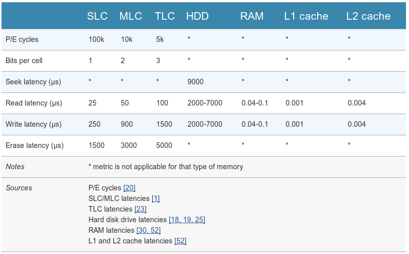

Image from [CodeCapsule](http://codecapsule.com/2014/02/12/coding-for-ssds-part-2-architecture-of-an-ssd-and-benchmarking/)

---

# Indicators

Some important values that we will use throughout this presentation:

* Number of tuples: **t**
* Block size: **B** bytes
* Tuple size: **T** bytes

Typically B >= T

Some important indicators:

* Blocking Factor: **bfr** = B / T (how many tuples in each block)
* Block Number: **b** = t / bfr (how many blocks to store all tuples)

---

# Running Example

.diagram[

]

---

template:inverse
name:sequential
# Sequential Files

---

# Unordered Sequential File

.pull-right.diagram[

]

* File has **no special order** between tuples.

* Inserting and updating is very **fast**.

* Searching and ordering very **slow**.

--

* Searching:

  * Keys: b / 2 = **1500** blocks

  * Non-keys: b = **3000** blocks

---

# Ordered Sequential File

.pull-right.diagram[
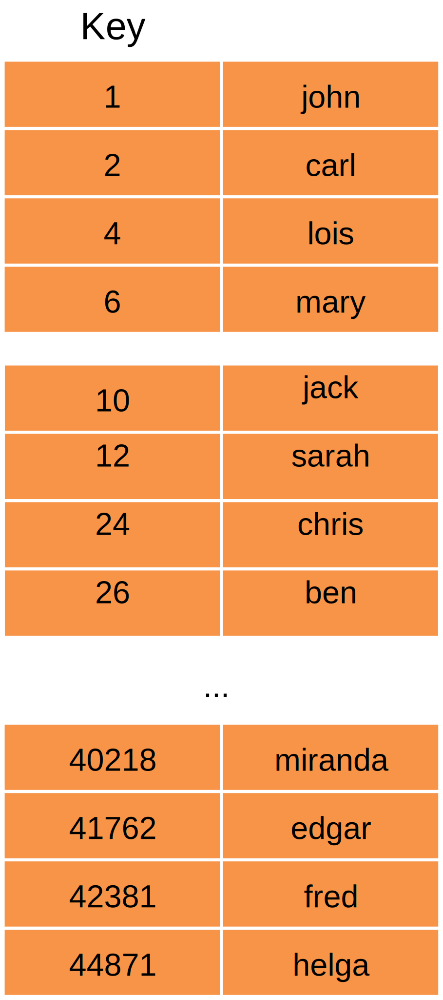
]

* File **ordered** by **primary key**.

* Inserting and updating can be **slow**. Unless sequentially or some space is wasted.

* Searching and ordering very **slow** except on primary key.

--

* Searching:
  
  * Primary Keys: log2b  = **12** blocks
  
  * Other Keys: b / 2 = **1500** blocks
  
  * Non-keys: b = **3000** blocks

---

template:inverse
name:indexes
# Indexes

---

# A Useful Metaphor

---

# Indexes

* Mechanisms used to **speed up** data access.

* Index files are typically much **smaller** than the **original** file.

* Two basic kinds: **ordered** and **hashed**.

* Index evaluation: **genericity**, **performance** and **overhead**.

---

template:inverse
name:ordered
# Ordered Indexes

---

# Ordered Indexes

An ordered index typically consist of entries having a **search-key** and a **pointer**.

.diagram[

]

Entries (in the index) are sorted by their **search-key**.

* **Primary indexes**:
    An index having a *search-key* in the **same order** as the file.
   **Only one** per file.
   Also called **clustering index**.

* **Secondary indexes**:
    An index having a **search-key** in a different order as the file.
   **Many** per file are possible.

---

template:inverse
name:primary
# Primary Indexes

---

# Dense Primary Indexes

**Dense** indexes have **one index entry** for each **search-key value** in the indexed file.

.diagram.large[
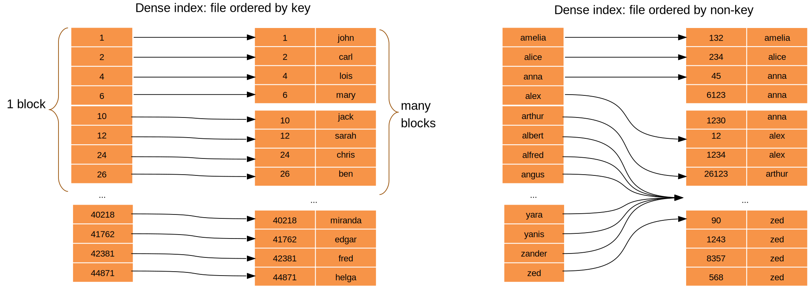
]

---

# Sparse Primary Indexes

**Sparse** indexes contain entries for **only some** search-key
values.

Normally **one entry per block**.

* Advantages: Less **space** and less **maintenance**.
* Disadvantages: Only applicable when entries are **ordered on search-key**.

.short[

]

---

# Dense or Sparse

* **Search-key**: 9 bytes
* **Pointer**: 6 bytes (2.8 * 1014 tuples)

.pull-left[
**Dense** Index

* **ti**: 30000 (same as t)
* **Ti**: 15 bytes (9 + 6)
* **bfri**: 68 tuples/block (1024 / 15)
* **bi**: 441 blocks (30000 / 68)
]

.pull-left[
**Sparse** Index (one entry per block)

* **ti**: 3000 (same as b)
* **Ti**: 15 bytes (9 + 6)
* **bfri**: 68 tuples/block (1024 / 15)
* **bi**: 44 blocks (3000 / 68)
]

--

Search on **dense**: log2441 + 1 = **10** blocks

Search on **sparse**: log244 + 1 = **7** blocks

But search isn't everything...

---

template:inverse
name:secondary
# Secondary Indexes

---

# Secondary Indexes

* **Always** have to be **dense**.
* In non-key indexes, entries point to a **bucket of pointers** to the actual tuples.

.diagram[

]

---

# Multi-Level Indexes

If an index does **not fit in memory**, access can become **expensive**.

Solution is to keep a first index (**inner** index) on disk and construct a sparse index on it (**outer** index).

If even outer index is too large to fit in main memory, yet **another level** of index can be created, and so on.

.short[

]

---

# Multi-Level Indexes

* **bi2**: 30000/68 = 442 blocks

* **bi1**: 442/68 = 7 blocks

* **bi0**: 7/68 = 1 blocks

--

&nbsp;

Search: **4** blocks (**3** if outer index kept in memory)

One for each index + 1 for the block containing the tuple.

---

template:inverse
name:btree
# B+ Tree Indexes

---

# B+ Tree Indexes

Uses a tree-like data structure where each tree node has:

* **q** pointers to another node
* **q – 1** values

.tiny[

]

The last level nodes (leafs) have:

* **q – 1** pointers to tuples/blocks
* **q – 1** values
* **1** pointer to the next leaf node

.tiny[

]

Allows searching, sorting, range search.

---

# B+ Tree Indexes

---

# B+ Tree Indexes

* Use **partially full blocks** to speed insertions and deletions.

* When a level is too full, create a new level.

* In a B+ Tree that is 70% full in each level:

  *  34 value-pointer pairs per node.
  *  34 * 0.7 = 22 values and 23 pointers.
  *  Root: 1 node = 22 values and 23 pointers.
  *  Level 1: 23 nodes = 506 values and 529 pointers.
  *  Level 2: 529 nodes = 11638 values and 12167 pointers.
  *  Leafs: 12167 nodes = 255507 pointers to blocks.
  *  Each block has 10 tuples: 2.5 million tuples indexed

--

Search: **5** blocks.

---

# B+ Tree vs Ordered Indexes

Ordered Indexes:
  * **performance degrades** as file changes.
  * periodic **reorganization** of entire file is required.

B+ Trees:
  * automatically reorganizes itself with **small local changes**.
  * **reorganization** of entire file is **not required**.
  * extra insertion and **deletion overhead**, **space overhead**.

Summary:

* Advantages of B+ Trees **outweigh** disadvantages.
* B+ Trees are used extensively.

---

template:inverse
name:hash
# Hash Indexes

---

# Hash Indexes

* A **bucket** is a unit of storage containing one or more tuples (typically a block).
* We obtain the bucket of a tuple directly from its search-key value using a **hash** function.
* Hash function is a function from the set of all **search-key** values to the set of all **bucket** addresses.
* Tuples with different search-key values may be mapped to the same bucket; thus entire bucket has to be searched **sequentially** to locate a tuple.
* Buckets can **overflow**: link buckets together.

---

# Hash Function

* A hash-function receives a search key and returns the bucket for that search-key.

* An ideal hash function is **uniform**: each bucket is assigned the same number of search-key values (from all possible values).
* An ideal hash function is **random**: each bucket will have the same number of tuples (whatever tuples exist).

.diagram[

]

---

# Example: Simple Hash Function

Consider we have 10 buckets.

An hash function that receives a string, calculates the binary representation of each character (a = 1, b = 2, ...) and returns the sum of those representations *modulo* 10.

~~~cpp
int h(string word) {
  int sum = 0;
  for (int i = 0; i < word.length(); i++)
    sum += word[i] - 'a';
  return sum % 10;
}
~~~

h(john) = 3; h(carl) = 0; h(gustafsson) = 1; ...

Real hash functions are, obviously, **more complex** than this.

---

# Hash Indexes

* The overflow buckets of a given bucket are chained together in a **linked list**.

* Hash indexes are always **secondary** indexes.

* Hash Indexes **do not allow sorting or range** searches.

.short[

]

---

template:inverse
name:postgresql
# Indexes in PostgreSQL

---

# Creating Indexes

PostgreSQL supports both B+ Tree and Hash indexes:

~~~sql
CREATE INDEX name ON table (column); -- btree by default
CREATE INDEX name ON table USING btree (column);
CREATE INDEX name ON table USING hash (column);
~~~

PostgreSQL does not support primary indexes. All indexes are secondary and thus, dense.

---

# Multicolumn Indexes

An index can be defined on more than one column of a table.

~~~sql
CREATE INDEX name ON table (column_a, column_b);
~~~

Works well on queries searching for values in columns *a* and *b* simultaneously or just on column *a*; but not just on column *b*.

For example, a phone book is indexed on (*last name*, *other names*) making it easy to look for *John Doe* but not for *John*.

---

# Unique Indexes

Indexes can also be used to enforce uniqueness of a column's value, or the uniqueness of the combined values of more than one column.

~~~sql
CREATE UNIQUE INDEX name ON table (column);
~~~

Unique indexes are **automatically** created on unique and primary key constraints.

In fact, primary and unique keys are **enforced** by these automatic unique indexes.

---

# Indexes on Expressions

An index column need not be just a column of the underlying table, but can be a **function** computed from one or more columns of the table.

~~~sql
CREATE INDEX idx_name ON employees (lower(name));
~~~

This index would be automatically used in this query:

~~~sql
SELECT * FROM employees WHERE lower(name) = 'john';
~~~

This can also be used to enforce constraints that are not definable as simple unique constraints:

~~~sql
CREATE UNIQUE INDEX idx_mail ON employees (lower(email));
~~~

---

# Partial Indexes

A partial index is an index built over a **subset** of a table.

One reason for using a partial index is to avoid indexing common values.

~~~sql
CREATE INDEX idx_type ON employees (type) WHERE type <> 'normal';
~~~

Would be automatically used in this query:

~~~sql
SELECT * FROM employees WHERE type <> 'normal';
~~~

Another possible use for partial indexes is to enforce constraints in a subset of the table:

~~~sql
CREATE UNIQUE INDEX idx_mail ON employees (mail) WHERE type <> 'admin';
~~~

---

# Clustering

PostgreSQL does not support primary indexes but the *CLUSTER* command can be used to
reorder a table based on one &mdash; **and only one** &mdash; index.

~~~sql
CLUSTER table_name USING index_name;
~~~

Clustering is a **one-time** operation: when the table is subsequently updated, the changes are not clustered.

If needed, clustering can be set to run periodically using [cron](https://en.wikipedia.org/wiki/Cron).
PostgreSQL remembers which indexes were clustered, so a single CLUSTER command with **no parameters** is enough.

---

# Generalized Indexes in PostgreSQL

Besides Hash and B-tree, PostgreSQL also provides several other index types:

* GiST - Generalized Inverted Seach Tree:
  * **Lossy**. May produce false positives.
  * Works by hashing components of the data into a single bit.
  * Best for **dynamic** data. Faster to update.

* GIN - Generalized Inverted Index:
  * Faster than GiST and handles large ammounts of different data better.
  * Best for **static** data. Slower to update.

Both these indexes are able to implement **arbitrary** indexing schemes.

They can be used for Full Text Search (FTS), geometric and spatial data, ...

---

template:inverse
name:fts
# Full Text Search

---

# Why not just ILIKE?

When we execute a query like this one:

~~~sql
SELECT * FROM employee WHERE name ILIKE 'john%';
~~~

A B+ Tree index can be used to speed up the query. But for this one:

~~~sql
SELECT * FROM employee WHERE name ILIKE '%john%';
~~~

* There is no way in which a normal index can help us.

* Think of it as trying to find all people having *john* in their name in a phone book.

* We need to index each word individually.

---

# Lexemes and the *tsvector* type

  * FTS is based on [lexemes](https://glossary.sil.org/term/lexeme).
  * A *tsvector* value is a sorted list of distinct lexemes.

~~~sql
SELECT to_tsvector('english', 'The quick brown fox jumps over the lazy dog')
~~~

~~~txt
'brown':3 'dog':9 'fox':4 'jump':5 'lazi':8 'quick':2
~~~

  * The *to_tsvector* function **normalizes** words into lexemes, removes **duplicates**, removes **stop words** and records the **position** of each lexeme.

---

# Searching using *tsqueries*

  * A *tsquery* value stores the *lexemes* that we want to search.
  * Lexemes can be combined using the boolean operators & (AND), | (OR), and ! (NOT):

~~~sql
SELECT to_tsquery('english', 'jumping & dog');
~~~

~~~txt
'jump' & 'dog'
~~~

  * The function *plainto_tsquery* simplifies this operation:

~~~sql
SELECT plainto_tsquery('english', 'the jumping dog'); -- same result
~~~

---

# Matching *tsqueries* to *tsvectors*

The @@ operator is used to assert if a *tsvector* matches a *tsquery*:

.small[
~~~sql
SELECT title
FROM posts
WHERE to_tsvector('english', title || ' ' || body) @@ plainto_tsquery('english', 'jumping dog');
~~~
]

**Note**: The || operator concatenates strings but it also concatenates *ts_vectors*.

.small[
~~~sql
SELECT title
FROM posts
WHERE (to_tsvector('english', title) || to_tsvector('english', body)) @@ plainto_tsquery('english', 'jumping dog');
~~~
]

---

# FTS weights

Sometimes we want to give more **importance** to some specific fields.

We can use the *setweight* to attach a **weight** to a certain *ts_vector*.

Weights go from 'A' (more important) to 'D' (less important).

.small[
~~~sql
SELECT
   setweight(to_tsvector('english', 'The quick brown fox jumps over the lazy dog'), 'A') ||
   setweight(to_tsvector('english', 'An English language pangram. A sentence that contains
                                     all of the letters of the alphabet.'), 'B')
~~~
]

~~~txt
'alphabet':24B 'brown':3A 'contain':17B 'dog':9A 'english':11B
'fox':4A 'jump':5A 'languag':12B  'lazi':8A 'letter':21B 'pangram':13B
'quick':2A 'sentenc':15B
~~~

As you can see, we can concatente *tsvectors* directly.

---

# Ranking FTS results

The *ts_rank* and *ts_rank_cd* functions, return a **score** for each returned row for a certain match
between a *tsquery* and *tsvector*.

.small[
~~~sql
SELECT
  ts_rank(
    setweight(to_tsvector('english', 'The quick brown fox jumps over the lazy dog'), 'A') ||
    setweight(to_tsvector('english', 'An English language pangram. A sentence that contains
                                     all of the letters of the alphabet.'), 'B'),
    plainto_tsquery('english', 'jumping dog')
  )could
~~~
]

~~~txt
0.9524299
~~~

You can also change the weights of the *ts_vector* classes (A to D) and set how normalization, due to different document lengths, should be performed.

.small[
~~~sql
ts_rank([ weights float4[], ] vector tsvector, query tsquery [, normalization integer ])
~~~
]

---

# Pre-calculate FTS

For **performance** reasons, we should consider adding a column to tables where FTS is to be performed containg the *ts_vector* values of **each row**.

This column should be updated whenever a row changes or is inserted. This can be done easily using a **trigger**:

~~~sql
CREATE FUNCTION post_search_update() RETURNS TRIGGER AS $$
BEGIN
  IF TG_OP = 'INSERT' THEN
    NEW.search = to_tsvector('english', NEW.title);
  END IF;
  IF TG_OP = 'UPDATE' THEN
      IF NEW.title <> OLD.title THEN
        NEW.search = to_tsvector('english', NEW.title);
      END IF;
  END IF;
  RETURN NEW;
END
$$ LANGUAGE 'plpgsql';
~~~

---

# Putting it all together

To select all posts containing *jumping* and *dog* we can use the following query:

~~~sql
SELECT title
FROM posts
WHERE search @@ plainto_tsquery('english', 'jumping dog')
ORDER BY ts_rank(search, plainto_tsquery('english', 'jumping dog')) DESC
~~~

Considering that *search* is a pre-calculated column containing the *ts_vector* of the columns we want to search.

---

# Indexing FTS

To improve the performance of our full text searches, we can use GIN or GiST indexes:

~~~sql
CREATE INDEX search_idx ON posts USING GIN (search);
~~~

~~~sql
CREATE INDEX search_idx ON posts USING GIST (search);
~~~

**Note**: We could also used a index on a *ts_vector* expression directly.

Which type to use?

* GIN index lookups are about three times **faster** than GiST.
* GIN indexes take about three times **longer** to build than GiST.

So use GIN if updates to searchable terms are rare and you want to make searches fast.

---

template:inverse
name:tuning
# Database Tuning

---

# Query Log Analysis

Sometimes we realize that our database isn't performing as well as we expected.

Are our indexes the correct ones? To help us answer this question, a query log
analyzer tool is invaluable.

One such tool is [pgBadger](https://pgbadger.darold.net/) (a sucessor to the older, and discontinued, [pgFouine](http://pgfoundry.org/projects/pgfouine/)).

---

# Fouine vs Badger

---

# pgBadger

To use *pgBadger*, we must first turn on **query logging** (this will make PostgreSQL slower, so be careful) and run *pgBadger*
against the generated log.

The ammount of statistical data generated by *pgBadger* is staggering, but in this case we will focus on *pgBadger*'s abbility
to identify **time consuming queries**. Here's a sample [report](http://pgbadger.darold.net/samplev7.html#time-consuming-queries):

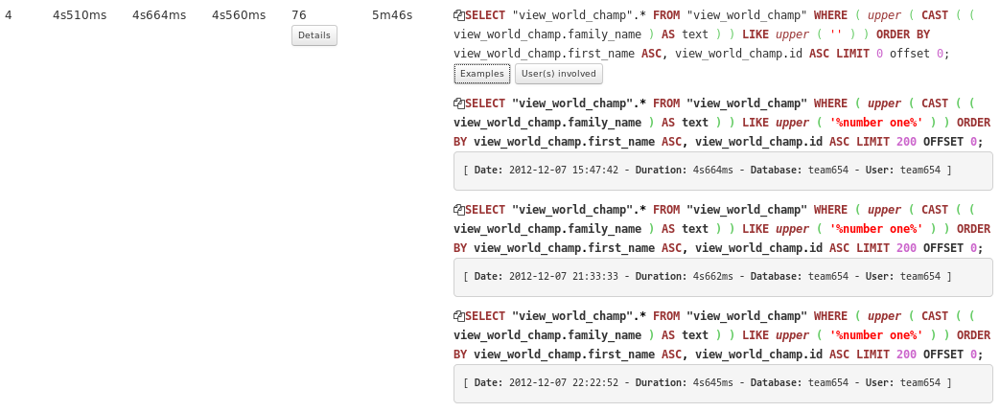

---

# PostgreSQL Planner

When executing a query, PostgreSQL:

  * Starts by analyzing all possible ways to scan **each table** using all available indexes (or no index at all).
  * If the query requires **joining** two or more relations, plans for joining relations are considered:
    * The right relation is scanned once for every row found in the left relation (*nested loop* &mdash; might use existing indexes).
    * Each relation is sorted on the join attributes before the join starts (*merge join* &mdash; might use existing indexes).
    * The right relation is first scanned and loaded into a hash table (*hash join*).
  * When the query involves more than two relations, the planner examines different possible join sequences.

---

# Analyzing Plans

After identifying a **problematic query**, we might want to understand how *PostgreSQL* is executing it.

For that we can use the EXPLAIN command that displays the **execution plan** that the PostgreSQL planner generates for the supplied statement:

~~~sql
EXPLAIN <query>
~~~

Or EXPLAIN ANALYZE that causes the statement to be actually executed, not only planned.

~~~sql
EXPLAIN ANALYZE <query>
~~~

---

template:inverse
name:examples
# Examples

---

# Example 1

Consider the following database:

.diagram[
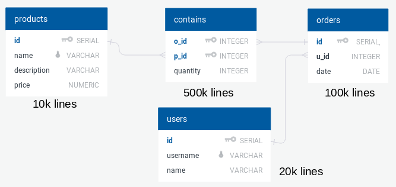
]

---

# Example 1

And the following query that selects *all users that ordered more than one product costing 100*:

~~~sql
EXPLAIN SELECT users.name, COUNT(*)
FROM orders JOIN
     contains ON orders.id = contains.o_id  JOIN
     products ON products.id = contains.p_id JOIN
     users ON orders.u_id = users.id
WHERE products.price = 100
GROUP BY username, users.name
HAVING COUNT(*) > 1
ORDER BY COUNT(*) DESC
~~~

Notice that we added the EXPLAIN clause in the beginning.

---

# Example 1

The result is a tree structure showing the plan as idealized by PostgreSQL:

.diagram[
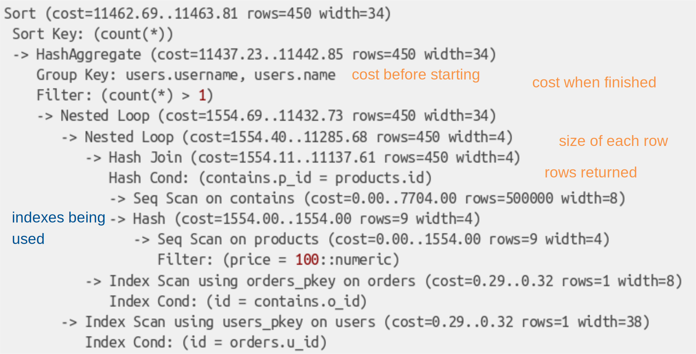
]

Cost is measured, generically, in blocks read from the disk.

---

# Example 1

Luckily, there are some tools that can help us understand these plans easier:

  * Like the [Postgres EXPLAIN Visualizer](http://tatiyants.com/postgres-query-plan-visualization/) by Alex Tatiyants.
  * Or [pgAdmin](https://www.pgadmin.org/)

So let's try it again with *PEV*.

---

# Example 1

Much better. But it seems PostgreSQL is **losing** a lot of time **joining** the *contains* and *products* table.

.diagram[
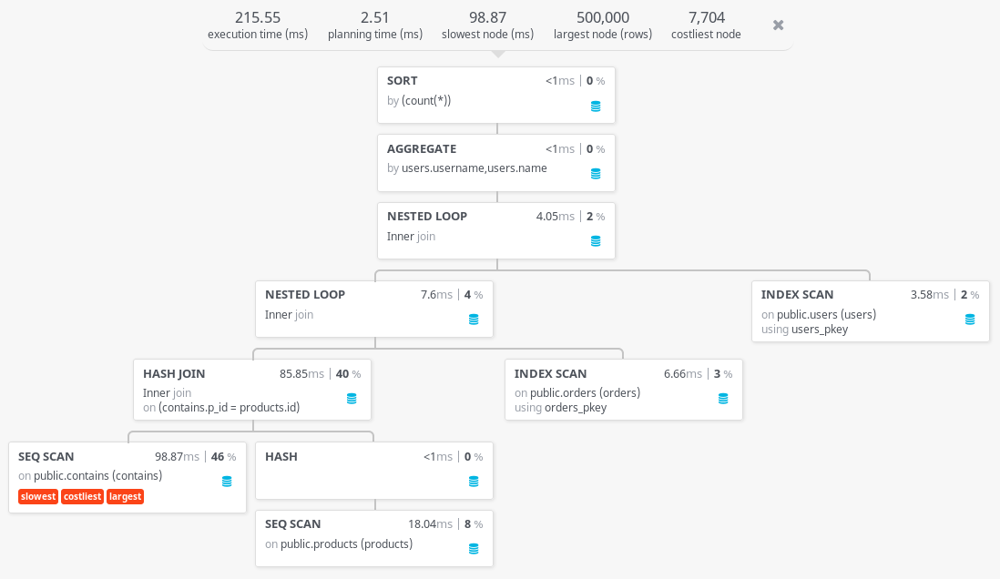
]

---

# Example 1

Why is this happening?

  * After getting all products with the desired price, PostgreSQL has to find **all orders containing those products**.
  * That table (*contains*) has **500k lines** and PostgreSQL is taking almost *100ms* doing it.

An **index** on the *contains.p_id* column could help us minimize this cost.

~~~sql
CREATE INDEX contains_product_idx ON contains USING btree (p_id);
~~~

---

# Example 1

From **200ms** to **14ms** by just creating the right index.

.diagram[
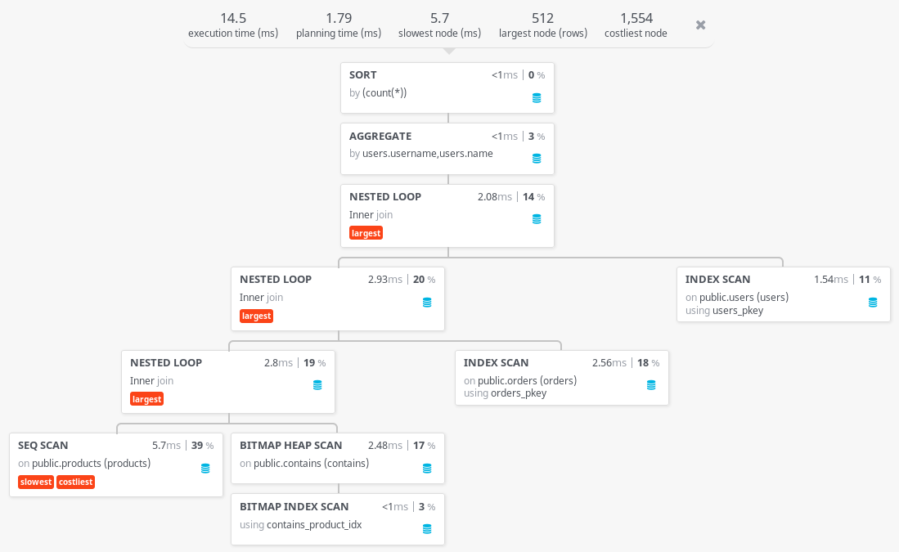
]

---

# Example 1

Now most of the time is spent **looking for the products** with the **desired price**.

Let's try creating another index:

~~~sql
CREATE INDEX product_price_idx ON products USING btree (price);
~~~

---
# Example 1

Not as dramatic as before but still some improvement. Remember, indexes have theirs **costs** (slower updates, space, ...).

.diagram[
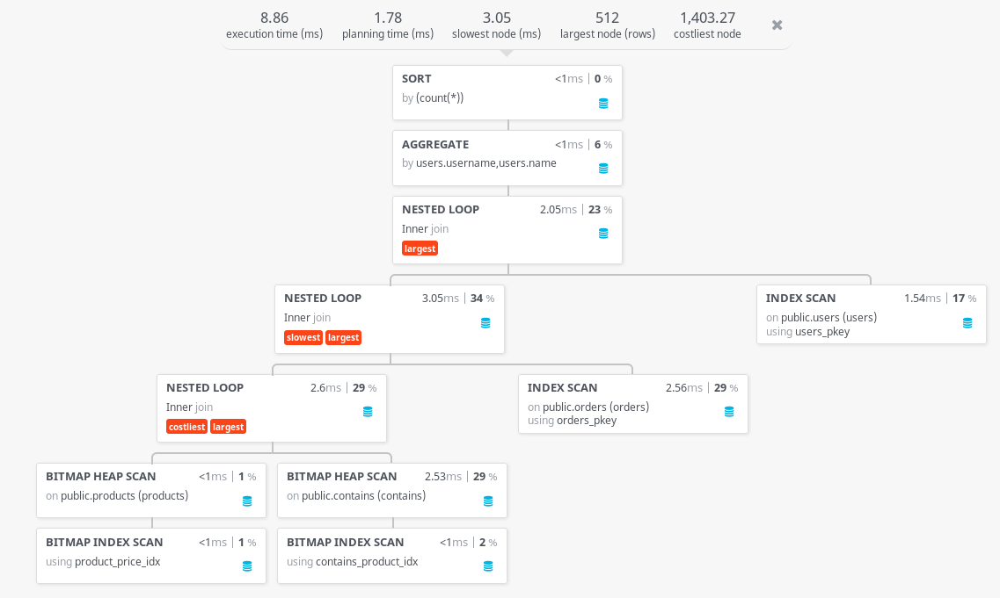
]

---

# Example 2

Now, let's consider this other query that selects *all orders containing product with ids between 200 and 300*:

~~~sql
EXPLAIN SELECT o_id
FROM contains
WHERE p_id > 200 AND p_id < 300
~~~

---

# Example 2

We already have an index on the *p_id* column so the query should be pretty fast:

.diagram[

]

---

# Example 2

But we can do better. Because the index on *p_id* is not clustered, it means most blocks have only **a few** wanted rows.

If we try clustering the index, a much **lower number of blocks** has to be read:

~~~sql
CLUSTER contains
USING contains_product_idx;
~~~

.diagram.smaller[

]

---

# Example 2

We get the **same data** in **fewer blocks** and end up getting our results faster:

.diagram[

]

---

# Example 3

We now have a single table containing **all** Wikipedia titles:

~~~txt
wikipedia (id, title)
~~~

The table has approximately **44 Million** rows and we want to search the table for some words.

The total table size on the hard disk is **2436 MB**. The primary key index occupies an extra **950 MB**.

---

# Example 3

If we try to search for *oil painting* using ILIKE:

~~~sql
SELECT * FROM wikipedia
WHERE title ILIKE '%oil%painting%'
~~~

We get **174 rows** in **54 seconds**:

.diagram[

]

---

# Example 3

If we try using *ts_vectors* and a *ts_query* with no indexes:

~~~sql
SELECT * FROM wikipedia
WHERE to_tsvector('english', title) @@
      to_tsquery('english', 'oil & painting')
~~~

The query returns **158 rows** in **4 minutes**. The added time is due to having to calculate *ts_vectors* for all rows:

.diagram[

]

---

# Example 3

If we execute the same query but we add a GiST index first:

~~~sql
CREATE INDEX search_idx ON wikipedia USING GIST (to_tsvector('english', title));
~~~

It now takes only **600 ms**. Creating the index took **52 minutes** and used **1708 MB** but you only have to do it once:

.diagram[
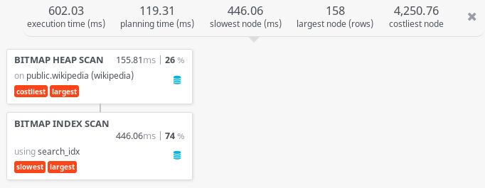
]

---

# Statistics

When calculating the ideal plan for a certain query, PostgreSQL relies on some **key statistics** collected about the columns in the database:

  * The fraction of the column's entries that are null.
  * The number of distinct *non null* data values in the column.
  * Numerical statistics including histograms of the column values.

To force PostgreSQL to update these statistics when can use the ANALYZE command:

~~~sql
ANALYZE [table] [(column1, column2, ...)]
~~~

ANALYZE analyzes all tables by default but we can choose to analyze only one table or only some columns.

It's important to keep these statistics updated (use a *cron* job).

---

# Vacuum

* In PostgreSQL, tuples that are deleted or obsoleted by an update are not physically removed from their table.
* The VACUUM command **reclaims** this storage by making available for reuse.
* The VACUUM FULL command **reclaims** this storage by rewriting the entire contents of the table into a new disk file with no extra space.
* It's important to do VACUUM periodically, especially on frequently updated tables.

~~~sql
VACUUM [FULL] [ANALYZE] [table] [(column1, column2, ...)]
~~~

* VACUUM reorganizes all tables by default but we can choose to reorganize only one table or only some columns.
* We can VACUUM and ANALYZE tables at the same time.
* VACUUM FULL is slow and requires an exclusive lock making it not recommended for production.

---

template:inverse
name:choosing
# Choosing Indexes

---

# Workload

In order to choose our indexes, we must first estimate the workload of the system:

  * The most important queries (SELECT) and how often they arise.
  * The most important updates (UPDATE, DELETE) and how often they arise.
  * The desired performance for these queries and updates.
  * An estimate of the number of tuples for each relation.

---

# Table Estimates

We start by estimating the number of tuples in each relation:

.simple.small[
| Relation reference | Relation Name | Order of magnitude        | Estimated growth     |
| ------------------ | ------------- | ------------------------- | -------------------- |
| R01                | Users         | tens of thousands         | hundreds per day     |
| R02                | Products      | tens of thousands         | hundreds per week    |
| R03                | Orders        | hundreds of thousands     | hundreds per day     |
| R04                | Contains      | millions                  | thousands per day    |
]

---

# Important queries

We then start describing each one of the most important queries:

.simple[
| Query reference   | SELECT01                                     |
| ----------------- | -------------------------------------------- |
| Query description | Selects all orders made by a specific client.|
| Query frequency   | hundreds per hour                            |
| SQL code                                                         |
]
~~~sql
 SELECT *                                                         
 FROM orders                                                      
 WHERE c_id = ?                                                   
~~~

---

# Cardinality

The **uniqueness** of data values contained in a particular column. The lower the cardinality, the more duplicate values in the column. Examples:

  * **high** cardinality - primary key
  * **medium** cardinality - last name in a customer table
  * **low** cardinality - boolean column

Cardinality is used by the PostgreSQL *planner*, amongst other statistics, to estimate the number of rows returned by a WHERE clause. This is
then used to decide if, and what, indexes should be used.

---

# When to Cluster?

  * To **reduce** the number of block reads:
    * When the number of tuples to be read is high enough and there are many tuples per block.
    * Normally on **medium** cardinality columns in tables with small tuples.
  * To allow **sequential** reading of blocks:
    * Normally on range searches or **low** cardinality columns.
    * Specially in hard-disks (not important on SSD).

Clustering is useful whenever **many tuples** are to be retrieved, but **not too many**.

---

# Choosing Indexes

.simple[
| Index reference     | IDX01                                |
| --------------------| ------------------------------------ |
| Query references    | SELECT01, ...                        |
| Index relation      | R03                                  |
| Index attribute     | c_id                                 |
| Index type          | Hash                                 |
| Cardinality         | Medium                               |
| Clustering          | Yes                                  |
| Justification       | Table is very large, query SELECT01 has to be fast as it is    |
|                     | executed many times, doesn't need range query support,         |
|                     | cardinality is medium so it is a good candidate for clustering.|
| SQL code                                                   |]
~~~sql
 SELECT *                                                         
 FROM orders                                                      
 WHERE c_id = ?                                                   
~~~

---

template:inverse
name:denormalization
# Denormalization

---

# Denormalization

* A strategy used on a **previously normalized** database to increase performance.
* Denormalization is the process of trying to improve performance of a database by adding **redundant** copies of data or by chosing **alternative** 3NF (or even lower NFs) schemas.
* Redundant data should be kept consistent. For example, using triggers.

---

# Example

Adding a redundant **total** column to the *orders* table to prevent having to calculate it everytime.

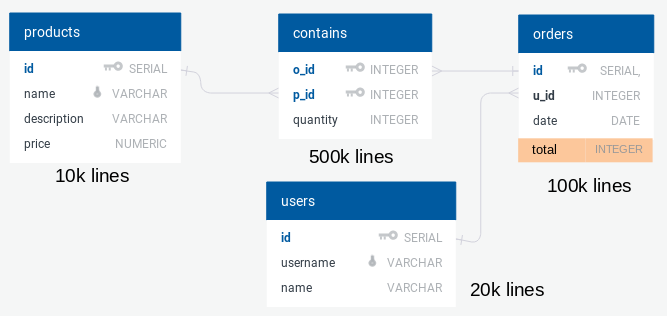

---

# Keeping Data consistent

~~~sql
CREATE OR REPLACE FUNCTION calculate_total(order_id integer)
RETURNS trigger AS $$
BEGIN
  UPDATE orders
  SET total = (SELECT SUM(quantity * price)
               FROM products JOIN
                    contains ON p_id = id
               WHERE o_id = order_id)
  WHERE id = order_id;
  RETURN NEW;
END;
$$ LANGUAGE plpgsql;
~~~

~~~sql
CREATE TRIGGER contains_ins_upd
AFTER INSERT or UPDATE
ON contains
FOR EACH ROW
EXECUTE PROCEDURE calculate_total(NEW.order_id);
~~~

Another trigger is needed for UPDATE or DELETE using OLD.order_id as the parameter.

---

# Materialized Views

An **alternative** to denormalization is the usage of materialized views.

A materialized view **stores** the result of a query in a table and can be **refreshed** as needed.

~~~sql
CREATE MATERIALIZED VIEW orders_total AS
SELECT orders.*, SUM(quantity * price)
FROM orders JOIN
     contains ON orders.id = o_id JOIN
     products ON products.id = p_id
GROUP BY orders.id
~~~

~~~sql
REFRESH MATERIALIZED VIEW orders_total
~~~

---

template: inverse

&ldquo; Premature optimization is the root of all evil. &rdquo;

&mdash; Donald Knuth
