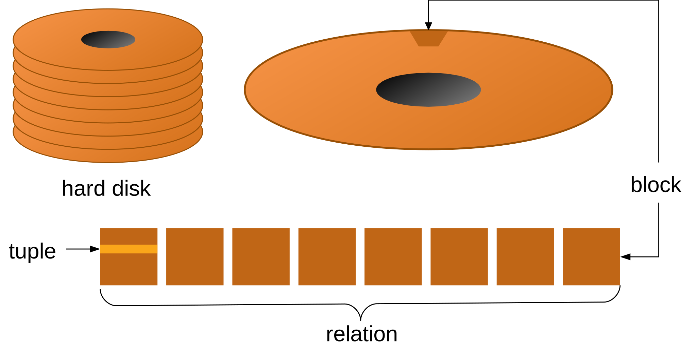
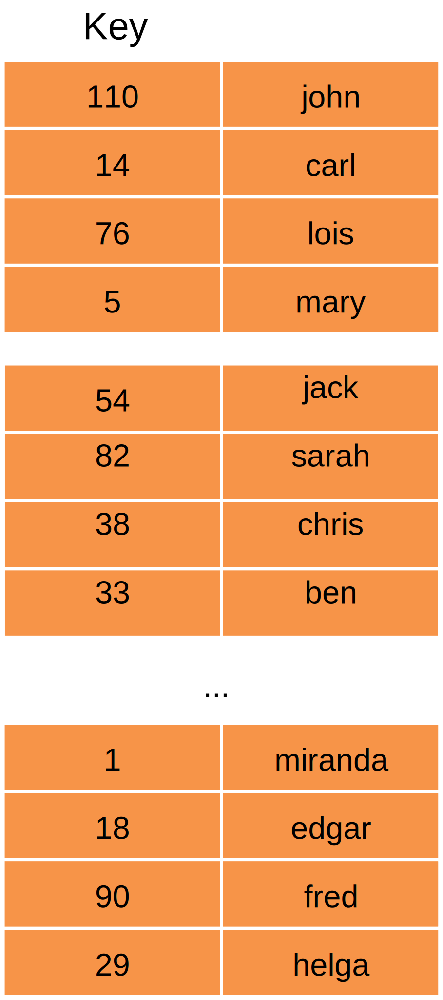
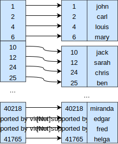
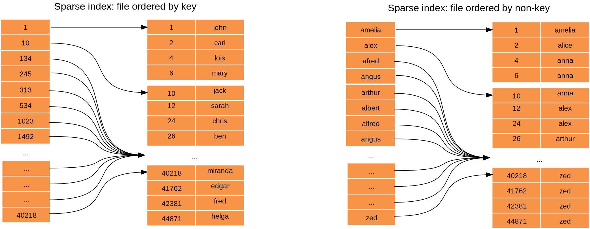
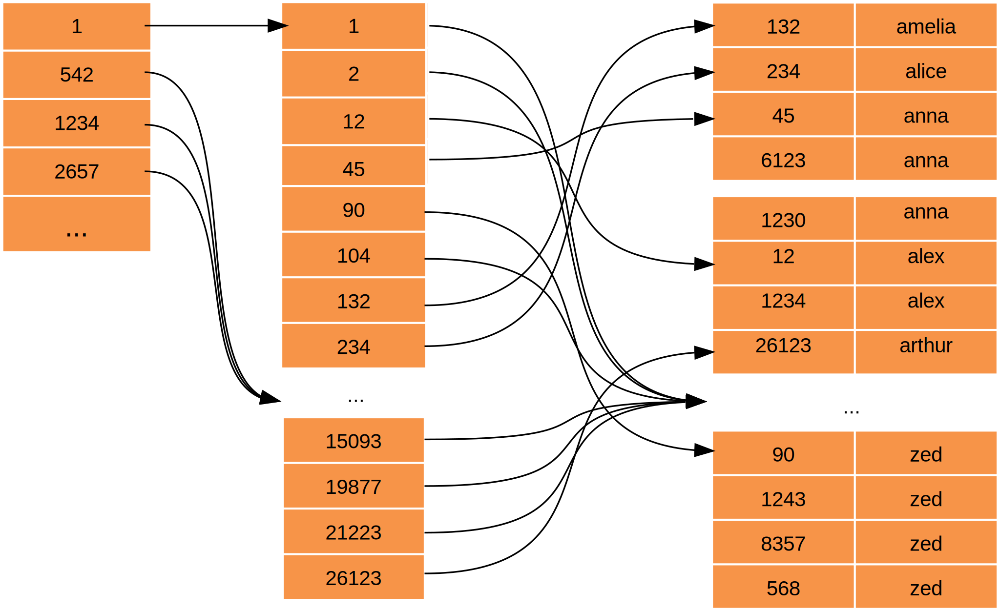
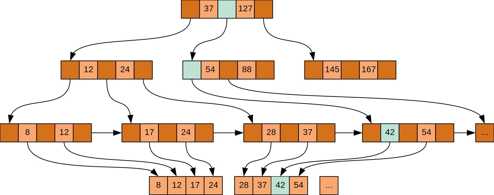
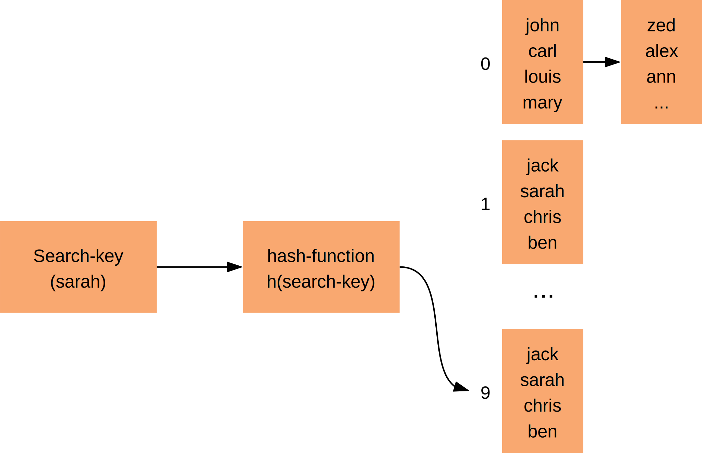

name: inverse
layout: true
class: center, middle, inverse
.indexlink[[<i class="fa fa-arrow-circle-o-up"></i>](#) [<i class="fa fa-list-ul"></i>](#index) [<i class="fa fa-tint"></i>](../change-color.php)[<i class="fa fa-file-pdf-o"></i>](download)]

---

name: normal
layout: true
class: left, middle
.indexlink[[<i class="fa fa-arrow-circle-o-up"></i>](#) [<i class="fa fa-list-ul"></i>](#index) [<i class="fa fa-tint"></i>](../change-color.php)[<i class="fa fa-file-pdf-o"></i>](download)]

---

template:inverse
# Database Performace
## Indexes
<a href="http://www.fe.up.pt/~arestivo">André Restivo</a>

---

template:inverse
name:index
# Index

.indexlist[
1. [Introduction](#intro)
1. [Indexes](#indexes)
1. [Ordered Indexes](#ordered)
1. [B+ Tree](#btree)
1. [Hash Indexes](#hash)
1. [PostgreSQL](#postgresql)
]

---

template:inverse
name:intro
# Introduction

---

# Blocks

* Data is read or written from the hard disk a whole block at a time.
* Each block can contain several tuples.

---

# Indicators

Some important values that we will use throughout this presentation:

* Number of tuples: **t**
* Block size: **B** bytes
* Tuple size: **T** bytes

Typically B >= T

Some important indicators:

* Blocking Factor: **bfr** = B / T
* Block Number: **b** = t / bfr

---

# Performance

* Biggest obstacle to database performance is **hard disk access**.

* Hard disk is accessed **block by block**.

* Block fetch requires about 5 to 10 milliseconds (10-3), versus about 100 nanoseconds (10-9) for memory access.

* It is important to **minimize** the number of blocks accessed.

* On many different operations: search, insert, delete, update, sort, ranges, ...

---

# Example

.pull-right[

]

* **t** = 30000 tuples
* **B** = 1024 bytes
* **T** = 100 bytes
* **bfr** = 1024 / 100 = 10 tuples/block
* **b** = 30000 / 10 = 3000 blocks

---

# Unordered Sequential File

.pull-right[

]

* File has no special order between tuples.
* Inserting and updating is very fast.
* Searching and ordering very slow.

--

* Searching:
  * Keys: b / 2 = **500** blocks
  * Non-keys: b = **1000** blocks

---

# Ordered Sequential File

.pull-right[

]

* File **ordered** by **primary key**.
* Inserting and updating is slow. Unless sequentially or some space wasted.
* Searching and ordering very slow except on primary key.

--

* Searching:
  * Primary Keys: log2b  = **12** blocks
  * Other Keys: b / 2 = **500** blocks
  * Non-keys: b = **1000** blocks

---

template:inverse
name:indexes
# Indexes

---

# Indexes

* Mechanisms used to speed up data access.
* An index file typically consists of entries having a **search-key** and a **pointer**.
* Index files are typically much smaller than the original file.
* Two basic kinds: **ordered** and **hashed**.
* Index evaluation: genericity, performance and overhead.

---

template:inverse
name:ordered
# Ordered Indexes

---

# Ordered Indexes

In a ordered index, entries are sorted by their **search-key**.

* Primary indexes: In a ordered file, an index having a **search-key** in the same order as the file. Only one per file. Also called **clustering index**.

* Secondary indexes: An index having a **search-key** in a different order as the file. Many per file are possible.

---

# Dense or Sparse

**Dense** indexes have **one index entry** for each **search-key value** in the indexed file.

.pull-left[
Dense index: file ordered by key

]

.pull-right[
Dense index: file ordered by non-key

]

---

# Dense or Sparse

**Sparse** indexes contain entries for **only some** search-key
values. Only applicable when entries are ordered on search-key.

* Advantages: Less space and less maintenance.
* Disadvantages: Slower than dense indexes.

**Trade-off**: One entry per block.

---

# Dense or Sparse

* **Search-key**: 9 bytes
* **Pointer**: 6 bytes (2.8 * 1014 tuples)

.pull-left[
**Dense** Index

* **ti**: 30000 (same as t)
* **Ti**: 15 bytes (9 + 6)
* **bfri**: 68 tuples/block (1024 / 15)
* **bi**: 442 blocks (30000 / 68)
]

.pull-left[
**Sparse** Index

* **ti**: 3000 (same as b)
* **Ti**: 15 bytes (9 + 6)
* **bfri**: 68 tuples/block (1024 / 15)
* **bi**: 45 blocks (3000 / 68)
]

--

Search on **dense**: log2442 + 1 = **10** blocks

Search on **sparse**: log245 + 1 = **7** blocks

But search isn't everything...

---

# Secondary Indexes

* Always have to be dense.
* Entries point to a bucket of pointers to the actual tuples.

---

# Multi-Level Indexes

If an index does not fit in memory, access can become expensive.

Solution is to keep primary index (inner index) on disk and construct a sparse index on it (outer index).

If even outer index is too large to fit in main memory, yet
another level of index can be created, and so on.

---

# Multi-Level Indexes

* **bi2**: 30000/68 = 442 blocks

* **bi1**: 442/68 = 7 blocks

* **bi0**: 7/68 = 1 blocks

--

Search: **4** blocks

One for each index + 1 for the block containing the tuple.

---

template:inverse
name:btree
# B+ Tree Indexes

---

# B+ Tree Indexes

Uses a tree-like data structure where each tree node has:

* **q** pointers to another node
* **q – 1** values

The last level nodes (leafs) have:

* **q – 1** pointers to tuples/blocks
* **q – 1** values
* **1** pointer to the next leaf node

Allows searching, sorting, range search.

---

# B+ Tree Indexes

---

# B+ Tree Indexes

* Use partially full blocks to speed insertions and deletions.

* When a level is too full, create a new level.

* In a B+ Tree that is 70% full in each level:

  *  34 value-pointer pairs per node.
  *  34 * 0.7 = 22 values and 23 pointers.
  *  Root: 1 node = 22 values and 23 pointers.
  *  Level 1: 23 nodes = 506 values and 529 pointers.
  *  Level 2: 529 nodes = 11638 values and 12167 pointers.
  *  Leafs: 12167 nodes = 255507 pointers to blocks.
  *  Each block has 10 tuples: 2.5 million tuples indexed

--

Search: **5** blocks.

---

# B+ Tree vs Ordered Indexes

Ordered Indexes:
  * performance degrades as file grows.
  * periodic reorganization of entire file is required.

B+ Trees:
  * automatically reorganizes itself with small local changes
  * reorganization of entire file is not required
  * extra insertion and deletion overhead, space overhead.

Summary:

* Advantages of B+ Trees outweigh disadvantages.
* B+ Trees are used extensively.

---

template:inverse
name:hash
# Hash Indexes

---

# Hash Indexes

* A bucket is a unit of storage containing one or more tuples (typically a block).
* We obtain the bucket of a tuple directly from its search
-key value using a *hash* function.
* Hash function is a function from the set of all search-key values
K to the set of all bucket addresses B.
* Tuples with different search-key values may be mapped to the
same bucket; thus entire bucket has to be searched sequentially to
locate a tuple.
* Buckets can overflow: link buckets together.

---

# Hash Function

* A hash-function receives a search key and returns the bucket for that search-key.

* An ideal hash function is **uniform**: each bucket is assigned the same number of search-key values (from all possible values).
* An ideal hash function is **random**: each bucket will have the same number of tuples (whatever tuples exist).

---

# Example

Consider we have 10 buckets.

An hash function that receives a string, calculates the binary representation of each character (a = 1, b = 2, ...) and returns the sum of those representations *modulo* 10.

~~~cpp
int h(string word) {
  int sum = 0;
  for (int i = 0; i < word.length(); i++)
    sum += word[i] - 'a';
  return sum % 10;
}
~~~

h(john) = 3; h(carl) = 0; h(gustafsson) = 1; ...

---

# Hash Indexes

* The overflow buckets of a given bucket are chained together in a linked list.

* Hash indexes are always secondary indices.

* Hash Indexes do not allow sorting or range searches.

---

template:inverse
name:postgresql
# Indexes in PostgreSQL

---

# Indexes in PostgreSQL

* PostgreSQL provides several index types: B-tree, Hash, GiST and GIN.
* Hash indexes are not recommended at the moment (or ever).

~~~sql
CREATE INDEX name ON table (column); -- btree by default
CREATE INDEX name ON table USING btree (column);
CREATE INDEX name ON table USING hash (column);
~~~

---

# Multicolumn Indexes

An index can be defined on more than one column of a table.

~~~sql
CREATE INDEX name ON table (column_a, column_b);
~~~

Works well on queries searching for values in columns a and b simultanously and just on column a; but not just on column b.

---

# Unique Indexes

Indexes can also be used to enforce uniqueness of a column's value, or the uniqueness of the combined values of more than one column.

~~~sql
CREATE UNIQUE INDEX name ON table (column);
~~~

Unique indexes are automatically created on unique and primary key constraints.

---

# Indexes on Expressions

An index column need not be just a column of the underlying table, but can be a function computed from one or more columns of the table.

~~~sql
CREATE INDEX idx_name ON employees (lower(name));
~~~

This can be used to enforce constraints that are not definable as simple unique constraints:

~~~sql
CREATE UNIQUE INDEX idx_mail ON employees (lower(email));
~~~

---

# Partial Indexes

A partial index is an index built over a subset of a table.

One reason for using a partial index is to avoid indexing common values.

~~~sql
CREATE INDEX idx_type ON employees (type) WHERE type <> 'normal';
~~~

Another possible use for partial indexes is to enforce constraints in a subset of the table:

~~~sql
CREATE UNIQUE INDEX idx_mail ON employees (mail) WHERE type <> 'admin';
~~~
