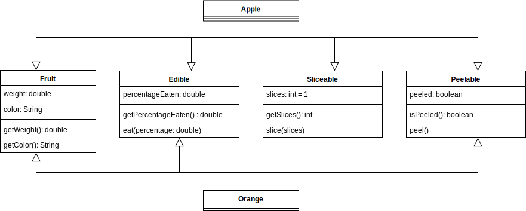
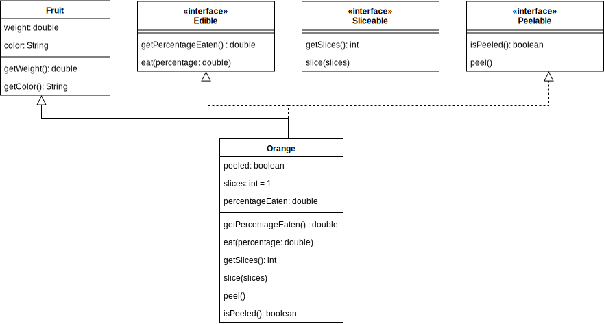
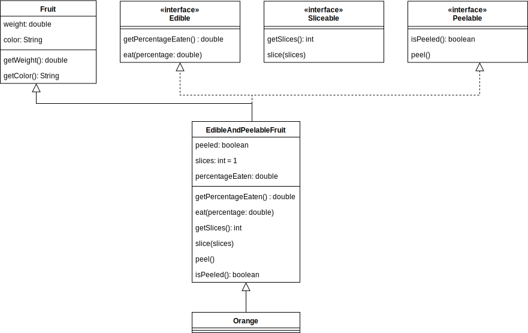
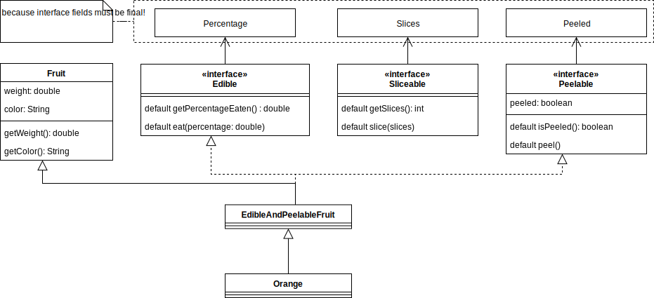
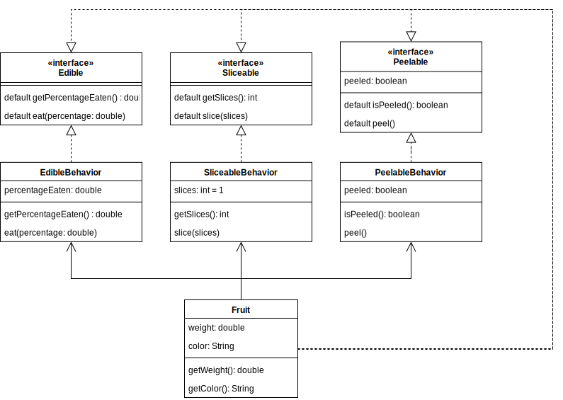

name: inverse
layout: true
class: center, middle, inverse
.indexlink[[<i class="fa fa-arrow-circle-o-up"></i>](#) [<i class="fa fa-list-ul"></i>](#index) [<i class="fa fa-tint"></i>](../change-color.php)[<i class="fa fa-file-pdf-o"></i>](download)]

---

name: normal
layout: true
class: left, middle
.indexlink[[<i class="fa fa-arrow-circle-o-up"></i>](#) [<i class="fa fa-list-ul"></i>](#index) [<i class="fa fa-tint"></i>](../change-color.php)[<i class="fa fa-file-pdf-o"></i>](download)]

---

template:inverse
# Inheritance vs. Composition
<a href="http://www.fe.up.pt/~arestivo">André Restivo</a>

---

template: inverse
name:index
# Index

.indexlist[
1. [Motivation](#motivation)
2. [Multiple Inheritance](#inheritance)
3. [Interfaces](#interfaces)
4. [Combination Classes](#combination-classes)
5. [Java Defaults](#defaults)
6. [Composition](#composition)
7. [Delegation](#delegation)
]

---

template: inverse
name:motivation
# Motivation

---

# Motivation

We want to create a system where we have several different types of **fruits**.

Some fruits are **edible**, some are **peelable** and some are **sliceable**.

Examples:
* An **orange** is *edible* and *peelable* but not *sliceable*. 
* An **apple** is *edible*, *peelable* and *sliceable*. 
* A **watermelon** is *edible* and *sliceable* but not *peelable*. 
* A **poisonberry** (a real thing) is neither *edible*, *sliceable* or *peelable*.

---

# Motivation

All fruits have a **weight** and a **color**.

And we want something like this to be possible:

~~~java
public static void main(String[] args) {
    Fruit orange = new Orange(0.5);
    peelAndEat(orange);
}

private static void peelAndEat(Fruit fruit) {
    fruit.peel();
    while (fruit.getPercentageEaten() != 1)
        fruit.eat(0.2);
}
~~~

---

# First Approach

We can start by imagining that we need classes **similar** to this:

---

# Code (Fruit)

~~~java
public class Fruit {
    private final double weight;
    private final String color;

    Fruit(double weight, String color) {
        this.weight = weight;
        this.color = color;
    }

    public double getWeight() {
        return weight;
    }

    public String getColor() {
        return color;
    }
}
~~~

---

# Code (Edible)

~~~java
public class Edible {
    private double percentageEaten;

    public Edible() {
        this.percentageEaten = 0;
    }

    public void eat(double percentage) {
        percentageEaten += percentage;
        percentageEaten = Math.max(percentageEaten, 1);
    }

    public double getPercentageEaten() {
        return percentageEaten;
    }
}
~~~

---

# Code (Peelable)

~~~java
public class Peelable {
    private boolean peeled;

    public Peelable() {
        this.peeled = false;
    }

    public boolean isPeeled() {
        return peeled;
    }

    public void peel() {
        this.peeled = true;
    }
}
~~~

---

# Code (Sliceable)

~~~java
public class Sliceable {
    private int pieces;

    public Sliceable() {
        this.pieces = 1;
    }

    public void slice(int pieces) {
        this.pieces = pieces;
    }

    public int getPieces() {
        return pieces;
    }
}
~~~

---

template: inverse
name:inheritance
# Multiple Inheritance

---

# Multiple Inheritance

One possible approach would be to use **multiple inheritance**.

Unfortunately multiple inheritance is **not supported** in many languages (including **Java**).

The argument behind this *controversial* decision, is that multiple inheritance adds **complexity** and suffers from **ambiguity** problems (namely the famous **diamond problem**).

---

# Disambiguation

Languages that **allow** *multiple inheritance* must have a **mechanism** to **disambiguate** which method should be called if two *super-classes* declare a method with the same signature.

This can be done in different ways:

* Not allowing multiple inheritance.
* Following the order they are declared.
* Explicitly by the developer.

---

# Using Multiple Inheritance

---

# Problems

Even if we could use *multiple inheritance*, this would not be possible:

~~~java
public static void main(String[] args) {
    Fruit orange = new Orange(0.5);
    peelAndEat(orange);
}

private static void peelAndEat(Fruit fruit) {
    fruit.peel();
    while (fruit.getPercentageEaten() != 1)
        fruit.eat(0.2);
}
~~~

As **not all** fruits are **peelable** and **edible**.

---

template: inverse
name:interfaces
# Interfaces

---

# Interfaces

The alternative to *multiple inheritance* is to use **interfaces**.

Interfaces are structures that force classes to **implement** certain methods.

Methods in interfaces **don't have bodies**. 

In Java, all variables declared inside interfaces are implicitly **public**, **static**, and **final**.

---

# Using Interfaces

---

# Problems

As **each class** must provide their own **implementation** of methods declared by the interfaces they implement, we end up with lots of **duplicate code**.

And we still **can't do** this:

~~~java
public static void main(String[] args) {
    Fruit orange = new Orange(0.5);
    peelAndEat(orange);
}

private static void peelAndEat(Fruit fruit) {
    fruit.peel();
    while (fruit.getPercentageEaten() != 1)
        fruit.eat(0.2);
}
~~~

---

template: inverse
name:combination-classes
# Combination Classes

---

# Combination Classes

One solution would be to have abstract classes for all (or only those that we need) combinations of the *edible*, *peelable* and *sliceable* interfaces:

* EdibaleFruit, PeelableFruit and SliceableFruit.
* EdibaleAndPeelableFruit, EdibaleAndSliceableFruit and PeelableAndSliceableFruit.
* EdibalePeelableAndSliceableFruit.

---

# Using Combination Classes

---

# Problems

As the number of interfaces that we want to implement grows, this quickly becomes impractical.

But at least we can do this:

~~~java
public static void main(String[] args) {
    Orange orange = new Orange(0.5);
    peelAndEat(orange);
}

private static void peelAndEat(EdibleAndPeelableFruit fruit) {
    fruit.peel();
    while (fruit.getPercentageEaten() != 1)
        fruit.eat(0.2);
}
~~~

---

template: inverse
name:defaults
# Defaults

---

# Defaults

Since Java 8, interfaces can have **default** implementations. 

This means that interfaces **can** now **declare** method **bodies** that will be inherited by any classes implementing them.

But attributes still need to be **public**, **static**, and **final** (and this kind of defeats the purpose of having code in interfaces).

---

# Using Defaults

---

# Problems

We can **get around** the problem of all attributes being **final** by using **wrapper** classes.

But the only way to solve the **static** problem would be to have *maps* saving the data for each different instance. Which is overkill...

---

template: inverse
name:composition
# Composition

---

# Composition

**Composition over inheritance** is the principle that classes should achieve **polymorphic** behavior and **code reuse** by their **composition** rather than by inheritance.

Instead of fruits inheriting from the *Edible*, *Peelable* and *Sliceable* base classes/interfaces, we can **inject** that behavior directly into them.

---

# Using Composition

---

# Composition Code

~~~java
public static void main(String[] args) {
  Orange orange = new Orange(0.5);
  peelAndEat(orange);
}

private static void peelAndEat(Fruit fruit) {
  fruit.getPeelableBehavior().peel();
  while (fruit.getEdibleBehavior().getPercentageEaten() != 1)
      fruit.getEdibleBehavior().eat(0.2);
}
~~~

---

# Edible Behavior

The behavior of fruits that are Edible:

~~~java
public class EdibleBehavior implements Edible {
  private double percentageEaten;

  public EdibleBehavior() {
    this.percentageEaten = 0;
  }

  public void eat(double percentage) {
    percentageEaten += percentage;
    percentageEaten = Math.max(percentageEaten, 1);
  }

  public double getPercentageEaten() {
    return percentageEaten;
  }
}
~~~

---

# Different Behaviors

Fruits can have different behaviors. One can be not to be Edible: 

~~~java
public class NotEdibleBehavior implements Edible {
  public void eat(double percentage) throws FruitNotEdibleBehavior {
    throw new FruitNotEdibleBehavior();
  }

  public double getPercentageEaten() {
    return 0;
  }
}
~~~

---

# Orange Class

An orange is Edible, Peelable but isn't Sliceable:

~~~java
public class Orange extends Fruit {
    Orange(double weight) {
        super(weight, "orange", 
          new EdibleBehavior(), 
          new PeelableBehavior(), 
          new NotSliceableBehavior());
    }
}
~~~

---

# Problems

* Might be overly **complex** for most cases.
* There is no **type-safety**. We can only know if a *Fruit* is *Edible* in **runtime**.
* We are calling the method on the behavior instead of on the class itself.

---

template: inverse
name:delegation
# Delegation

---

# Delegation

By having the *Fruit* class implement the different behaviors and *delegating* each method call to the corresponding one, we still get the benefits of *composition* but we now can **call** the methods **directly**. 

All other **drawbacks** of simple composition are **still present**.

---

# Using Delegation

---

template: inverse
name:delegation
# Other Methods

---

# Other Methods

* Monkey Patching (Javascript, Python, ...)
* [Traits and Mixins](https://www.baeldung.com/scala/class-composition-mixins) (Scala, Ruby, ...)
* [Extension Methods](https://kotlinlang.org/docs/extensions.html) (C#, Kotlin, ...)
* Type Classes (Haskell, Scala, Rust)