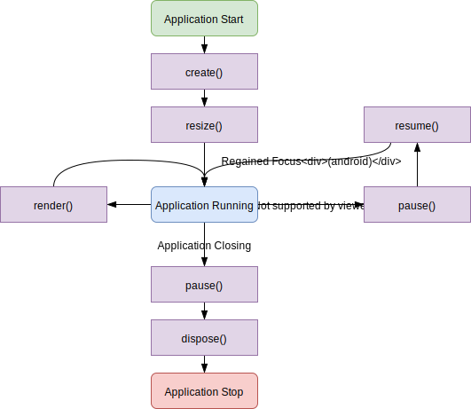

name: inverse
layout: true
class: center, middle, inverse
.indexlink[[<i class="fa fa-arrow-circle-o-up"></i>](#) [<i class="fa fa-list-ul"></i>](#index) [<i class="fa fa-tint"></i>](../change-color.php)[<i class="fa fa-file-pdf-o"></i>](download)]

---

name: normal
layout: true
class: left, middle
.indexlink[[<i class="fa fa-arrow-circle-o-up"></i>](#) [<i class="fa fa-list-ul"></i>](#index) [<i class="fa fa-tint"></i>](../change-color.php)[<i class="fa fa-file-pdf-o"></i>](download)]

---

template:inverse
# libGDX
<a href="http://www.fe.up.pt/~arestivo">André Restivo</a>

---

template:inverse
name:index
# Index

.indexlist[
1. [Introduction](#intro)
]

---

template:inverse
name:intro
# Introduction

---

# libGDX

A Java game development framework providing a unified API that works across several different platforms:

* Desktop: Windows, Linux, Mac OS X
* Mobile: Android, BlackBerry, iOS
* Web: Java Applet, Javascript/WebGL

It does not force a specific design on you.

---

# Environment Setup

TBD

---

template:inverse
name:modules
# Core Modules

---

# Core Modules

TBD:

* Input
* Graphics
* Files
* Audio
* Networking

---

template:inverse
name:life-cycle
# Application Life-Cycle

---

# Starter Classes
## and configuration

---

# ApplicationListener

An *ApplicationListener* allows you to handle application events. This allows you to execute code during certain events within the game life-cycle.

~~~java
public interface ApplicationListener {

  public void create ();  // When the game is created
  public void render ();  // When the game should render a frame
  public void resize (int width, int height); // When the game is resized
  public void pause ();   // When the game loses focus (android only)
  public void resume ();  // When the game regains focus (android only)
  public void dispose (); // When the games is closed

}
~~~

---

# Life Cycle

---

# ApplicationAdapter

An abstract class that implements the *ApplicationListener* interface. Allows the developer to implement the *ApplicationListener* interface without overriding every method.

~~~java
public abstract class ApplicationAdapter implements ApplicationListener {

  /* ... */

}
~~~

---

# Game

A *Game* is an *ApplicationListener* that supports multiple screens. You can create multiple screens and switch between em using *setScreen*. Game events are delegated to the current screen.

~~~java
public abstract class Game implements ApplicationListener {

  public void setScreen(Screen screen);
  public Screen getScreen();
  /* ... */

}
~~~

---

# Screen

Represents one of many application screens, such as a main menu, a settings menu, the game screen and so on.

~~~java
public interface Screen {

  public void	dispose();
  public void	hide();
  public void	pause();
  public void	render(float delta); // delta in seconds since the last render.
  public void	resize(int width, int height);
  public void	resume();
  public void	show();

}
~~~

---

# ScreenAdapter

An abstract class that implements the *Screen* interface. Allows the developer to implement the *Screen* interface without overriding every method.

~~~java
public abstract class ScreenAdapter implements Screen {

  /* ... */

}
~~~

---

# Proposed Usage

---

template:inverse
name:2dgraphics
# 2D Graphics

---

# SpriteBatch

It is very common to draw a texture mapped to rectangular geometry. It is also very common to draw the same texture or various regions of that texture many times. It would be inefficient to send each rectangle one at a time to the GPU to be drawn. Instead, many rectangles for the same texture can be described and sent to the GPU all at once. This is what the SpriteBatch class does.

---

# Texture

The Texture class decodes an image file and loads it into GPU memory. 

---

# TextureRegion

The *TextureRegion* class describes a rectangle inside a texture and is useful for drawing only a portion of the texture.

---

# Sprite

The *Sprite* class describes both a *texture region*, the *geometry* where it will be drawn, and the *color* it will be drawn.

---

# AssetManager

---

template:inverse
name:camera
# Camera

---

# Orthographic Camera

---

template:inverse
name:maps
# Maps

---

template:inverse
name:scenes
# Scenes

---

template:inverse
name:scenes
# Input Handling

---

template:inverse
name:scenes
# Sound

