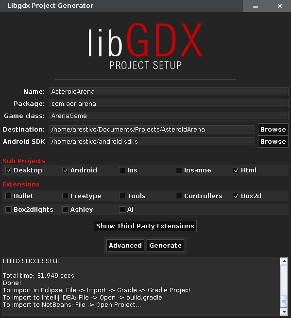
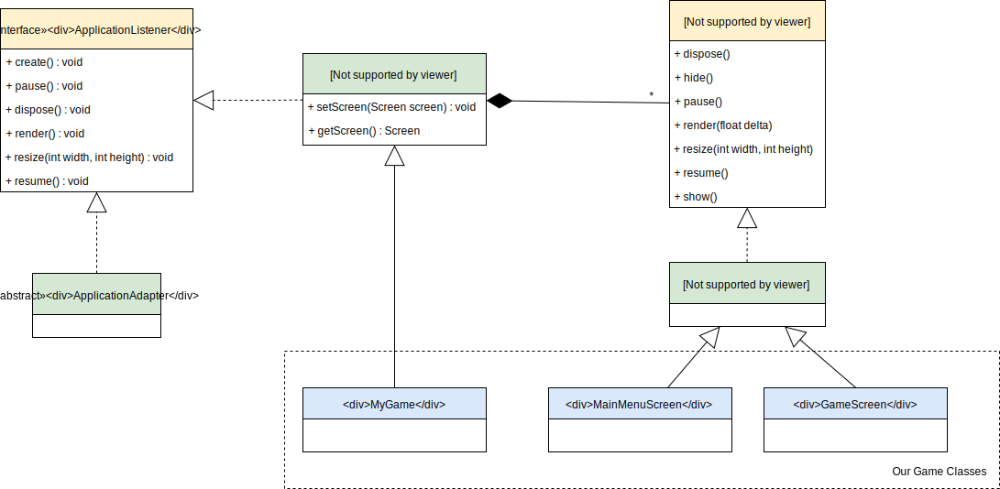
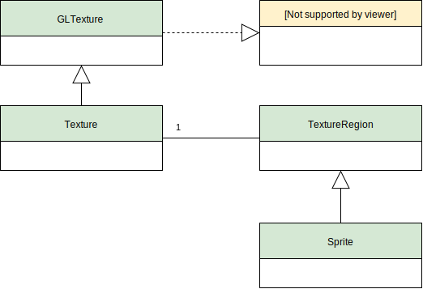
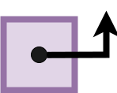
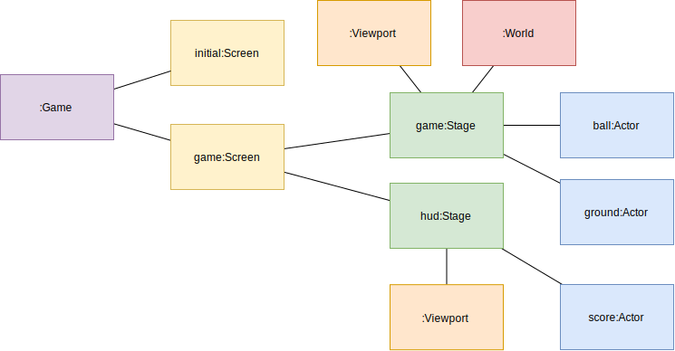
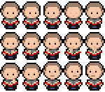

name: inverse
layout: true
class: center, middle, inverse
.indexlink[[<i class="fa fa-arrow-circle-o-up"></i>](#) [<i class="fa fa-list-ul"></i>](#index) [<i class="fa fa-tint"></i>](../change-color.php)[<i class="fa fa-file-pdf-o"></i>](download)]

---

name: normal
layout: true
class: left, middle
.indexlink[[<i class="fa fa-arrow-circle-o-up"></i>](#) [<i class="fa fa-list-ul"></i>](#index) [<i class="fa fa-tint"></i>](../change-color.php)[<i class="fa fa-file-pdf-o"></i>](download)]

---

template:inverse
# LibGDX
<a href="http://www.fe.up.pt/~arestivo">André Restivo</a>

---

template:inverse
name:index
# Index

.indexlist[
1. [Introduction](#intro)
1. [Core Modules](#modules)
1. [Life-Cycle](#life-cycle)
1. [2D Graphics](#2dgraphics)
1. [Camera](#camera)
1. [Physics](#physics)
1. [Input Handling](#input)
1. [Scene 2d](#scene2d)
1. [Collisions](#collisions)
1. [Sound](#sound)
1. [Animations](#animations)
1. [Testing](#testing)
]

---

template:inverse
name:intro
# Introduction

---

# LibGDX

A Java game development framework providing a unified API that works across several different platforms:

* Desktop: Windows, Linux, Mac OS X
* Mobile: Android, BlackBerry, iOS
* Web: Java Applet, Javascript/WebGL

Can be used in many different ways as it does not force a specific design on you.

---

# Environment Setup

* Start by downloading the [LibGDX Setup App](https://libgdx.badlogicgames.com/download.html).
* To open it, double-click the downloaded *.jar* file or use .code[java -jar gdx-setup.jar] from the command line.
* If you want to have Android support, you must also have the Android SDK installed. The easiest way is to install [Android Studio](https://developer.android.com/studio/index.html).

---

# Setup App

.smaller[

]

---

# Assets

* The setup app creates a different project for each selected platform plus a *Core* project where you will write the bulk of your code.

* In order to share assets between the different projects, only one assets folder is created.

* If you select *Android* as a supported platform, this folder will be located in the *Android* project.

* If not, it will be located in the *Core* project.

* You might have to change the working directory of each project to the assets folder in your IDE of choice.

---

template:inverse
name:modules
# Core Modules

---

# Core Modules

The Gdx class provides a unified interface to all the supported platforms:

* **Input** - Provides an input model and handler for all platforms (keyboard, touchscreen, accelerometer, mouse, ...). .code[Gdx.input.getAccelerometerX()]
* **Graphics** - Enables the drawing of images to the screen using the hardware provided OpenGL ES implementation. .code[Gdx.graphics.isFullscreen()] .code[Gdx.gl.glClearColor();
]
* **Files** - Abstracts file access on all platforms by providing convenient methods for read/write operations. .code[Gdx.files.internal()]
* **Audio** - Facilitates sound recording and playback on all platforms. .code[Gdx.audio.newSound()]
* **Networking** - Provides methods to perform networking operations, such as simple HTTP get and post requests, and TCP server/client socket communication. .code[Gdx.net.newServerSocket()]

---

# Core Modules

Core modules are not only used by the app being developed, but also by the internal LibGDX code.

---

template:inverse
name:life-cycle
# Application Life-Cycle

---

# Starter Classes

For each target platform, a starter class is automatically generated by the setup application.

Normally we don't have to modify these classes unless we want to change some configuration items.

Example **desktop** starter class:

~~~java
public class Main {
   public static void main(String[] args) {
      LwjglApplicationConfiguration cfg = new LwjglApplicationConfiguration();
      cfg.title = "My Game";
      cfg.useGL30 = false;
      cfg.width = 480;
      cfg.height = 320;

      new LwjglApplication(new MyGame(), cfg);
   }
}
~~~

---

# ApplicationListener

An *ApplicationListener* allows you to handle application events. This allows you to execute code during certain events within the game life-cycle.

~~~java
public interface ApplicationListener {

  public void create ();  // When the game is created
  public void render ();  // When the game should render a frame
  public void resize (int width, int height); // When the game is resized
  public void pause ();   // When the game loses focus (android only)
  public void resume ();  // When the game regains focus (android only)
  public void dispose (); // When the games is closed

}
~~~

---

# Life Cycle

---

# ApplicationAdapter

An abstract class that implements the *ApplicationListener* interface. Allows the developer to implement the *ApplicationListener* interface without overriding every method.

~~~java
public abstract class ApplicationAdapter implements ApplicationListener {

  /* ... */

}
~~~

---

# Game

A *Game* is an *ApplicationListener* that supports multiple screens. You can create multiple screens and switch between them using *setScreen*. Game events are delegated to the current screen.

~~~java
public abstract class Game implements ApplicationListener {

  public void setScreen(Screen screen);
  public Screen getScreen();
  /* ... */

}
~~~

---

# Screen

Represents one of many application screens, such as a main menu, a settings menu, the game screen and so on.

~~~java
public interface Screen {

  public void	dispose();
  public void	hide();
  public void	pause();
  public void	render(float delta); // delta in seconds since the last render.
  public void	resize(int width, int height);
  public void	resume();
  public void	show();

}
~~~

---

# ScreenAdapter

An abstract class that implements the *Screen* interface. Allows the developer to implement the *Screen* interface without overriding every method.

~~~java
public abstract class ScreenAdapter implements Screen {

  /* ... */

}
~~~

---

# Proposed Usage

.large[

]

---

template:inverse
name:2dgraphics
# 2D Graphics

---

# SpriteBatch

* It is very common to draw a texture mapped to rectangular geometry.
* It is also very common to draw the same texture or various regions of that texture **many times**.
* It would be **inefficient** to send each rectangle one at a time to the GPU to be drawn.
* Instead, many rectangles for the same texture can be described and sent to the GPU **all at once**.

This is what the SpriteBatch class does.

~~~java
public class SpriteBatch implements Batch {
  public void begin ();
  public void draw(Texture texture, float x, float y); // and many other like this
  public void end();
  public void dispose();
}
~~~

---

# Texture

The Texture class decodes an image file and loads it into GPU memory.

~~~java
public class Texture extends GLTexture {

}
~~~

Loading a texture into memory:

~~~java
Texture heroTexture = new Texture (Gdx.files.internal("hero.png"));
~~~

Textures should be disposed once they are not needed:

~~~java
heroTexture.dispose();
~~~

---

# TextureRegion

The *TextureRegion* class describes a rectangle inside a texture and is useful for drawing only a portion of the texture.

~~~java
public class TextureRegion {
  public TextureRegion (TextureRegion region,
    int x, int y,
    int width, int height);

  public void setRegion (int x, int y, int width, int height);

  public static TextureRegion[][] split (Texture texture,
      int tileWidth, int tileHeight);
}
~~~

The *split* method is an helper method that splits a *Texture* into *TextureRegion*s according to a tile width and height.

---

# Sprite

The *Sprite* class describes both a *texture region* and the *geometry* where it will be drawn.

~~~java
public class Sprite extends TextureRegion {
  public Sprite (TextureRegion region);

  public void setPosition (float x, float y);
  public void setCenter(float x, float y);
  public void setRotation (float degrees);
  public void setScale (float scaleXY);

  public void draw (Batch batch);
}
~~~

---

# Texture Classes

---

# AssetManager

* *Texture*s take a lot of precious memory.
* The same texture is typically used more than once.
* The AssetManager can manage our textures keeping only one copy of each in memory.
* It also handles asynchronous loading.

~~~java
public class AssetManager implements Disposable {
	public <T> void load (String fileName, Class<T> type);
	public <T> T get (String fileName);

	public boolean update(); // true if finished loading
	public void finishLoading (); // waits for all assets to load
}
~~~

---

# Render

To render our *Screen* we can do something like:

~~~java
// In our screen class:
public void render(float delta) {
    super.render(delta);

    // Clear the screen
    Gdx.gl.glClearColor( 103/255f, 69/255f, 117/255f, 1 );
    Gdx.gl.glClear( GL20.GL_COLOR_BUFFER_BIT | GL20.GL_DEPTH_BUFFER_BIT );

    // Draw the texture
    game.getBatch().begin();
    game.getBatch().draw(texture, 100, 100);
    game.getBatch().end();
}
~~~

Delta is the time in seconds since the last render.

---

# Example

As an example lets checkout the *texture* branch on this example project:

https://github.com/arestivo/BouncingBalls/tree/texture

In particular the [BouncingScreen](https://github.com/arestivo/BouncingBalls/blob/texture/core/src/com/aor/bouncing/BouncingScreen.java) class.

---

template:inverse
name:camera
# Camera

---

# Units

* Every device has a different screen size and ratio.
* This means that we cannot think in terms of pixels to define the size of our objects.

A sugestion for dealing with this problem:

~~~java
public static int WORLD_WIDTH = 100; // Arbitrary world size (e.g. meters)
public static int WORLD_HEIGHT = 50;

// The ammount of world we want to show in our screen
public static int VIEWPORT_WIDTH = 50;
public static int VIEWPORT_HEIGHT = 25; // Can be calculated from screen ratio

// How to transform from pixels to our unit
public static int PIXEL_TO_METER = .05f;

float ratio = ((float)Gdx.graphics.getHeight() / (float)Gdx.graphics.getWidth());

~~~

---

# Example

For example:
* A world of 100x50(m).
* On a 1280x720(px) screen.
* With a viewport 50m wide.
* And showing a 50x50(px) texture.
* Where a pixel is equal to .05m.

We would get:

* The world would have 2560x2048 pixels.
* The screen ratio would be 1.78.
* The viewport would be 1280x720(px) or 50x28.1(m).
* The texture would represent 2.5x2.5(m).
* The texture would be drawn as 64x64(px) (2.5/50*1280).

---

# Orthographic Camera

* The viewport into our game.
* Implements a parallel (orthographic) projection.

~~~java
public class OrthographicCamera extends Camera {
  public OrthographicCamera (float viewportWidth, float viewportHeight);
  public void update (); // Updates the transformation matrix
}
~~~

Setting the camera position:

~~~java
camera.position.set(new Vector3(x, y, 0));
~~~

---

# Example

As an example lets checkout the *camera* branch on this example project:

https://github.com/arestivo/BouncingBalls/tree/camera

In particular the [BouncingScreen](https://github.com/arestivo/BouncingBalls/blob/camera/core/src/com/aor/bouncing/BouncingScreen.java) class.

---

template:inverse
name:physics
# Physics

---

# World

The *World* class manages all physics entities using [Box2D](http://box2d.org/).

~~~java
public final class World implements Disposable {
  public World (Vector2 gravity, boolean doSleep);
  public Body createBody (BodyDef def);
  public void destroyBody (Body body);
}
~~~

The world uses SI units (meters, Newtons, seconds, radians, ...)

---

# Body

In *Box2D* the physical objects are called bodies.

Bodies can be of three types:

* **Dynamic**: move around and are affected by forces and other dynamic, kinematic and static objects (example: hero, enemies, ...).
* **Static**: do not move and are not affected by forces (but affect dynamic objects (examples: ground, platform, wall, ...).
* **Kinematic**: do not react to forces, but have the ability to move (example: a moving plaform).

---

# Body Definition

* To create a body we first must create a body definition.

* A body definition holds all the data needed to construct a rigid body. You can safely re-use body definitions.

~~~java
BodyDef bodyDef = new BodyDef();
bodyDef.type = BodyDef.BodyType.DynamicBody;

bodyDef.angle = (float) (Math.PI / 4); // radians
bodyDef.position.set(10f, 5f);         // meters
bodyDef.linearVelocity.set(5f, 0f);    // meters/s
bodyDef.angularVelocity.set(Math.PI);  // PI radians/s

Body body = world.createBody(bodyDef);
~~~

---

# Fixtures

* Each body is made up of one or more *fixtures*, which have a fixed position and orientation within the body.
* Fixtures give bodies their shape, mass and properties.

~~~java
// Create shape
CircleShape circle = new CircleShape();
circle.setRadius(0.22f);       //22cm

// Create fixture
FixtureDef fixtureDef = new FixtureDef();
fixtureDef.shape = circle;
fixtureDef.density = .5f;      // how heavy is the fixture kg/m^2
fixtureDef.friction = .5f;     // how slippery is the fixture [0,1]
fixtureDef.restitution = .5f;  // how bouncy is the fixture [0,1]

// Attach ficture to body
body.createFixture(fixtureDef);
~~~

---

# Shapes

There are 4 types of shapes that can be used to create fixtures:

* Circle: A circle with a radius.
* Edge: A line segment.
* Chain: A chain of line segments.
* Polygon: A convex polygon.

---

# Circle Shape

Circles have a radius:

~~~java
CircleShape circle = new CircleShape();
circle.setRadius(0.11f);
~~~

---

# Polygon Shape

 * Polygon shapes must be convex and can have 8 vertexes at most.
 * They can be combined to create more complex shapes.

~~~java
public class PolygonShape extends Shape {
  public void set (Vector2[] vertices);
}
~~~

Creating a rectangular shape is easy with the *setAsBox* method.

~~~java
PolygonShape rectangle = new PolygonShape();
rectangle.setAsBox(1f, 0.5f);
~~~

---

# Updating the world

* To update our simulation we need to tell our world to step.
* Stepping updates the world objects through time.
* The best place to call our step function is at the end of our *render* loop.

~~~java
public final class World implements Disposable {
  public void step (
    float timeStep,          // time since last update
    int velocityIterations,  // accuracy for velocity constraints (6)
    int positionIterations); // accuracy for position constraints (2)
}

~~~

---

# Example

As an example lets checkout the *physics* and *ground* branches on this example project:

https://github.com/arestivo/BouncingBalls/tree/physics

https://github.com/arestivo/BouncingBalls/tree/ground

In particular the [BouncingScreen](https://github.com/arestivo/BouncingBalls/blob/physics/core/src/com/aor/bouncing/BouncingScreen.java) (physics) and [BouncingScreen](https://github.com/arestivo/BouncingBalls/blob/ground/core/src/com/aor/bouncing/BouncingScreen.java) (ground) classes.

---

# Direct Movement

We can change the position, angle and speed of a body directly:

~~~java
  public void setTransform (Vector2 position, float angle); // meters, radians
  public void setLinearVelocity (Vector2 velocity);         // meters/second
  public void setAngularVelocity (float omega);             // radians/second
~~~

---

# Forces and Impulses

But normally, to move things around, we will apply forces or impulses to a body.

* Forces act gradually over time to change the velocity of a body.
* Impulses change a body's velocity immediately.

~~~java
public class Body {
  public void applyForce (Vector2 force, Vector2 point, boolean wake); // Newtons
  public void applyForceToCenter (Vector2 force, boolean wake);        // Newtons
  public void applyLinearImpulse (Vector2 impulse, Vector2 point, boolean wake);
  //Newtons*second
}
~~~

---

# Torque

Angular movement can also be controlled:

* Torques act gradually over time to change the angular velocity of a body.
* Impulses change a body's angular velocity immediately.

~~~java
public class Body {
	public void applyTorque (float torque, boolean wake);          //Newton*meter
	public void applyAngularImpulse (float impulse, boolean wake); //kg*m²/second
}
~~~

[More on Box2D](https://github.com/libgdx/libgdx/wiki/box2d)

---

template:inverse
name:input
# Input Handling

---

# Keyboard

In each step of our simulation we can check if some key of the keyboard has been pressed using the *Input* interface.

~~~java
public interface Input {
	public boolean isKeyPressed (int key);
	public boolean isKeyJustPressed (int key);
}
~~~

The Input interface also has keycodes for every key:

~~~java
  Input.isKeyPressed( Input.Key.NUM_0 );
  Input.isKeyPressed( Input.Key.A );
  Input.isKeyPressed( Input.Key.LEFT );
  /* ... */
~~~

---

# Touch

We can also checked if the screen has been touched or clicked:

~~~java
public interface Input {
	public boolean isTouched ();
	public boolean justTouched ();
}
~~~

And get the touch coordinates:

~~~java
public interface Input {
	public int getX ();
	public int getY ();
	public int getDeltaX ();
	public int getDeltaY ();
}
~~~

---

# Example

As an example lets checkout the *input* branch on this example project:

https://github.com/arestivo/BouncingBalls/tree/inputs

In particular the [BouncingScreen](https://github.com/arestivo/BouncingBalls/blob/inputs/core/src/com/aor/bouncing/BouncingScreen.java) class.

---

template:inverse
name:scene2d
# Scene2d

---

# Scene2d

Scene2d is a 2D scene graph for building applications and UIs using a hierarchy of actors:

* Rotation and scale is applied to all child actors.
* Each actor draws in its own un-rotated and unscaled coordinate system where 0,0 is the bottom left corner.
* Hit (touch, mouse) detection of rotated and scaled actors.
* Routing of input and other events to the appropriate actor.
* Action system for easy manipulation of actors over time.

---

#Stage

The *Stage* class has a camera, *SpriteBatch*, and a root group and handles drawing the actors and distributing input events.

~~~java
public class Stage extends InputAdapter implements Disposable {
  public Stage (Viewport viewport);
  public void act (float delta);
  public void draw ();
}
~~~

---

#Viewport

Manages a *Camera* and determines how world coordinates are mapped to and from the screen.

Many types of viewports can be used:

* *StretchViewport*
* *FitViewport*
* *FillViewport*
* *ScreenViewport*

---

# StrechViewport

* The *StretchViewport* supports working with a virtual screen size.
* The virtual viewport will always be stretched to fit the screen.
* No black bars, but the aspect ratio may not be the same.

---

# FitViewport

* The *FitViewport* supports working with a virtual screen size.
* It will always maintain the aspect ratio of the virtual screen size, while scaling it as much as possible to fit the screen.
* One disadvantage with this strategy is that there may appear black bars.

---

# FillViewport

* The *FillViewport* supports working with a virtual screen size.
* Keeps the aspect ratio of the virtual screen size.
* It will always fill the whole screen.
* Parts of the viewport might be cut off.

---

# ScreenViewport

* The *ScreenViewport* does not have a constant virtual screen size.
* It will always match the window size.
* No scaling happens and no black bars appear.
* A player with a bigger screen might see more of the game, than a player with a smaller screen size.

---

# Actor

The Actor class is a node in the graph which has a position, rectangular size, origin, scale, rotation, and color.

~~~java
public class Actor {
	public void draw (Batch batch, float parentAlpha);
	public void act (float delta);
	protected void setStage (Stage stage);
}
~~~

---

#Group

The Group class is an actor that may have child actors.

~~~java
public class Group extends Actor {
	public void addActor (Actor actor);
	public boolean removeActor (Actor actor);
}
~~~

---

# Widgets

LibGDX has a set of predefined actors ready to be used:

* Image - An image
* Label - A text label
* List - A list of textual items with current selection support
* ProgressBar - The progress of some activity or a value within a range
* SelectBox - A dropdown list
* TextField - A single-line input field
* Touchpad - A virtual joystick

~~~java
  scoreLabel = new Label("0", new Label.LabelStyle(new BitmapFont(), null));
  scoreLabel.setColor(Color.WHITE);
  addActor(scoreLabel);
~~~

---

# Usage

---

# Events

*Stage* is an *InputProcessor*. When it receives input events, it fires them on the appropriate actors.

Events are propagated in two phases:
* The *capture* phase from the root down to the target actor.
* And the *normal* phase from the target up to the root.

~~~java
public class Actor {
	public boolean addListener (EventListener listener);
	public boolean removeListener (EventListener listener);
	public void setTouchable (Touchable touchable);
	public void setVisible (boolean visible);
}
~~~

---

# ClickListener

Listens to mouse and touch events.

~~~java
public ClickListener () {
  public void touchDown(InputEvent e, float x, float y, int pointer, int button);
  public void touchUp(InputEvent e, float x, float y, int pointer, int button);

  public void clicked(InputEvent e, float x, float y);

  public int getTapCount();
}
~~~
---

# ActorGestureListener

For more complex touch events.

~~~java
public ActorGestureListener () {
 public void touchDown(InputEvent e, float x, float y, int pointer, int button);

 public void touchUp(InputEvent e, float x, float y, int pointer, int button);

 public void tap(InputEvent e, float x, float y, int count, int button);

 public boolean longPress(Actor actor, float x, float y);

 public void fling(InputEvent e, float velocityX, float velocityY, int button);

 public void pan(InputEvent e, float x, float y, float deltaX, float deltaY);

 public void zoom(InputEvent e, float initialDistance, float distance);

 public void pinch(InputEvent e, Vector2 iPointer1, Vector2 iPointer2,
                                 Vector2 pointer1, Vector2 pointer2);
}
~~~

---

# Example

As an example lets checkout the *stage* branch on this example project:

https://github.com/arestivo/BouncingBalls/tree/stage

In particular the [BouncingScreen](https://github.com/arestivo/BouncingBalls/blob/stage/core/src/com/aor/bouncing/BouncingScreen.java), [GameStage](https://github.com/arestivo/BouncingBalls/blob/stage/core/src/com/aor/bouncing/GameStage.java), [BallActor](https://github.com/arestivo/BouncingBalls/blob/stage/core/src/com/aor/bouncing/BallActor.java) and [GroundActor](https://github.com/arestivo/BouncingBalls/blob/stage/core/src/com/aor/bouncing/GroundActor.java) classes.

---

# Actions

* Actions can be attached to actors in order to execute a certain operation on the actor for a certain time.

* When a action finishes, the action is automatically removed from the actor.

~~~java
abstract public class Action {
	abstract public boolean act (float delta);
}
~~~

Many actions are already implemented in libGDX but more can be added easily:

~~~java
MoveToAction action = new MoveToAction();
action.setPosition(x, y);
action.setDuration(duration);
actor.addAction(action);
~~~

Actions can be composed together to create more complex actions.

---

# Example

As an example lets checkout the *action* branch on this example project:

https://github.com/arestivo/BouncingBalls/tree/action

In particular the [GameStage](https://github.com/arestivo/BouncingBalls/blob/action/core/src/com/aor/bouncing/GameStage.java) and [BallActor](https://github.com/arestivo/BouncingBalls/blob/action/core/src/com/aor/bouncing/BallActor.java) classes.

---

template:inverse
name:collisions
# Collisions

---

# Collisions

To detect collisions between body in the physical world we can
implement a *ContactListener* interface:

~~~java
public interface ContactListener {
	public void beginContact (Contact contact);
	public void endContact (Contact contact);
}
~~~

To use it, just set and implement the contact listener of the physical world:

~~~java
world.setContactListener(new ContactListener() {
  @Override
  public void beginContact(Contact contact) {
  }

  @Override
  public void endContact(Contact contact) {
  }
}
~~~

---

# Contact

When a collision is detected, the ContactListener receives a
Contact class with information about the contact. We can easily get the fixtures that collided:

~~~java
public class Contact {
	public Fixture getFixtureA ();
	public Fixture getFixtureB ();
}
~~~

And also the bodies:

~~~java
world.setContactListener(new ContactListener() {
    @Override
    public void beginContact(Contact contact) {
      Body bodyA = contact.getFixtureA().getBody();
      Body bodyB = contact.getFixtureB().getBody();
    }
}
~~~

The order of the fixtures (and bodies) is not guaranteed!

---

# Body User Data

User data can be attached to a body to help identify the colliding bodies:

~~~java
public class Body {
	public Object getUserData ();
	public void setUserData (Object userData);
}
~~~

For example:

~~~java
  body.setUserData(actor);
~~~

And then:

~~~java
  Actor actor = (Actor)body.getUserData();
~~~

---

# Example

As an example lets checkout the *collision* branch on this example project:

https://github.com/arestivo/BouncingBalls/tree/collision

In particular the [GameStage](https://github.com/arestivo/BouncingBalls/blob/collision/core/src/com/aor/bouncing/GameStage.java) class.

---

template:inverse
name:sound
# Sound

---

# Sound

LibGDX supports two main types of sound:

* **Music**: represents a streamed audio file. The interface supports pausing, resuming and so on.
* **Sound** a short audio clip that can be played numerous times in parallel.

~~~java
Sound sound = Gdx.audio.newSound(Gdx.files.internal("kick.wav"));
Music music = Gdx.audio.newMusic(Gdx.files.internal("music.mp3"));
~~~

All sounds and musics should be disposed when no longer needed:

~~~java
sound.dispose();
music.dispose();
~~~

---

# Sound Manager

We can use the *AssetManager* to manage our sounds and musics just
like we do with textures:

~~~java
assetManager.load("kick.wav", Sound.class);
assetManager.load("music.mp3", Music.class);
~~~

And then:

~~~java
Sound sound = assetManager.get("kick.wav");
Music music = assetManager.get("music.mp3");
~~~

---

# Playing

To play a sound we can use

~~~java
public interface Sound extends Disposable {
  public long play ();
	public long play (float volume); // Volume = [0,1]
}
~~~

To play a music:

~~~java
public interface Music extends Disposable {
  public void setVolume (float volume);
  public void setLooping (boolean isLooping);

  public void play ();
  public void pause ();
  public void stop ();

  public boolean isPlaying ();
}
~~~

---

template:inverse
name:animations
# Animations

---

# Animation

An animation consists of multiple frames which are shown in a sequence at set intervals.

To create a animation we start by getting a texture and spliting it into *TextureRegion*s:

~~~java
  Texture texture = game.getAssetManager().get("animation.png
  TextureRegion[][] thrustRegion = TextureRegion.split(
    texture,
    texture.getWidth() / 5,    // 5 columns
    texture.getHeight() / 3);  // 3 lines
~~~

---

# Frames

We then need to transform the resulting bi-dimensional array
into a uni-dimensional array. The easiest way to do it, is
to use the *System.arraycopy* method:

~~~java
public static void arraycopy(
  Object src, int srcPos,
  Object dest, int destPos,
  int length);
~~~

Like this:

~~~java
TextureRegion[] frames = new TextureRegion[10];
System.arraycopy(thrustRegion[0], 0, frames, 0, 10);
~~~

---

# Current Frame

We then create the animation:

~~~java
  // 0.25 seconds per frame
  Animation animation = new Animation<TextureRegion>(.25f, frames);
~~~

The current frame is a *TextureRegion* and we can get it
like this:

~~~java
public class Animation {
	public TextureRegion getKeyFrame (
    float stateTime, // current time
    boolean looping  // should the animation loop
  );
}
~~~

---

# Example

As an example lets checkout the *animation* branch on this example project:

https://github.com/arestivo/BouncingBalls/tree/animation

In particular the [BallActor](https://github.com/arestivo/BouncingBalls/blob/animation/core/src/com/aor/bouncing/BallActor.java) class.

---

template:inverse
name:testing
# Testing

---

# Testing

LigGDX promotes the mixing of the graphical interface with the
model and logic rules of the game.

This makes testing harder:

* Because our classes start by loading their textures, a OpenGL driver must be in use, which may not be possible.
* A world must be created if physics is being used.
* Testing units separately is difficult.

---

# Model-View-Controller

A better way to organize our code is to use the high-level
archictural design pattern known as *Model-View-Controller* (MVC):

---

# Proposed Architecture

The MVC pattern is more suited for gui-driven applications than to games, that normally use a render-loop pattern.

For these we propose a slightly different approach:

---

# Example

As an example lets checkout the *sprites* and *physics*
branch on this example project:

https://github.com/arestivo/AsteroidArena/tree/sprites

https://github.com/arestivo/AsteroidArena/tree/physics
