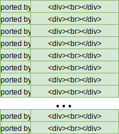
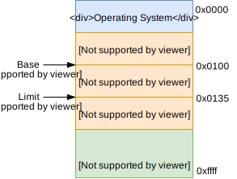
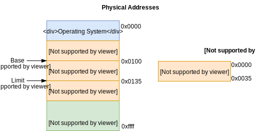
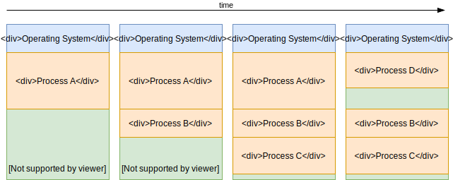
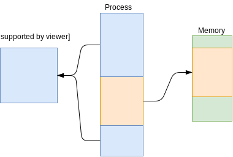
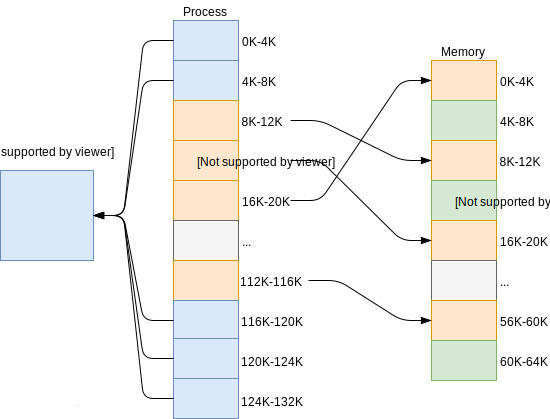

name: inverse
layout: true
class: center, middle, inverse
.indexlink[[<i class="fa fa-arrow-circle-o-up"></i>](#) [<i class="fa fa-list-ul"></i>](#index) [<i class="fa fa-tint"></i>](../change-color.php)[<i class="fa fa-file-pdf-o"></i>](download)]

---

name: normal
layout: true
class: left, middle
.indexlink[[<i class="fa fa-arrow-circle-o-up"></i>](#) [<i class="fa fa-list-ul"></i>](#index) [<i class="fa fa-tint"></i>](../change-color.php)[<i class="fa fa-file-pdf-o"></i>](download)]

---

template:inverse
# Memory
<a href="http://www.fe.up.pt/~arestivo">André Restivo</a>

---

template:inverse
name:index
# Index

.indexlist[
1. [Introduction](#intro)
1. [Physical Addresses](#physical)
1. [Logical Addresses](#logical)
1. [Virtual Addresses](#virtual)
1. [Process Memory](#process)
1. [Memory In C++](#cpp)
]

---

template:inverse
name:intro
# Introduction

---

# Memory

* Memory is not infinite.
* There is a hierarchy:
  * Cache: Volatile, Limited size, Expensive, Temporary use, Very fast...
  * Primary: Volatile, Fast, ...
  * Secondary: Non-volatile, slow, cheap, ...
* The memory management function of the OS creates an abstraction
that simplifies the usage of memory.

---

# Word Size

* The number of binary digits that a CPU can process at one time.
* In modern computers also the size of the address space.
* For example: a **byte**-addressable **32-bit** computer can address: 232 bytes of memory (4GiB).

---

template:inverse
name:physical
# Physical Addresses

---

# Physical Address

* Each physical memory location has an address.
* Physical addresses start at zero.
* Example for a 32-bit computer with 16MiB of memory:

---

# Single Contiguous Allocation

* The simplest memory management technique. 
* All the memory is available to a **single** application.
* With the exception of a small portion reserved for the operating system.
* Examples: MS-DOS, Embedded Systems, ...

---

# Multitasking

* With a single CPU, only one task (process) is said to be running at any point in time. 
* Multitasking solves the problem by scheduling which task is running at any given time.
* Reassigning a CPU from one task to another one is called a **context switch**.
* Parallelism is achieved when context switches occur frequently enough.

---

# Static Relocation

* In a single contiguous allocation enviroment, the CPU is forced to swap the memory contents every time a context switch occurs.
* A better solution is to allocate a part of the memory to each process.
* Access to the memory is protected using *base* and *limit* registers (hardware protection): base &leq; address < base + limit.

---

template:inverse
name:logical
# Logical Addresses

---

# Address Binding

When code is compiled from a high level language into machine code, the address of variables can be bound to:
* **Absolute** addresses (if we know where a process will be located in memory). 
* **Relocatable** addresses (if we want to be able to have the process in any memory location).

---

# Logical Addresses

Address binding is the process of translating logical addresses into their corresponding physical addresses:

* Address relocation: physical = logical + base
* Memory protection: base &leq; physical < base + limit

---

# Swapping

Sometimes there is not enough space to keep all processes in memory at the same time.

Swapping is a mechanism in which a process can be swapped temporarily out of main memory to secondary storage (disk) and make that memory available to other processes.

---

# Fragmentation

The problem of having contiguous memory allocation is that as processes are swapped in and out of memory, the memory becomes fragmented:

Fragmentation can be fixed by using a memory compaction technique.

---

template:inverse
name:virtual
# Virtual Addresses

---

# Virtual Memory

Gives the illusion of access to a larger memory space than exists by storing part of the process data into secondary storage.

---

# Paging

Most virtual memory systems are implemented using a memory management technique called paging:

.pull-left[
* The process address space is broken into blocks of the same size called pages.
* The main memory is divided into small fixed-sized blocks of memory called frames (usually the same size as a page).
* At any given time, pages can be loaded into memory or stored in secondary storage.
]

.pull-right[

]

---

# Advantages

* Simple to implement.

* Paging reduces fragmentation.

* Paging is an efficient memory management technique.

* Due to equal size of the pages and frames, swapping becomes very easy.

---

# Page Tables

* A virtual address is composed by a page number and an offset.
* A physical address is composed by a frame number and an offset.

* From the standpoint of the process, memory is contiguous.
* Page tables are used to translate the virtual addresses seen by the application into physical addresses used by the hardware.

---

# Thrashing

---

template:inverse
name:process
# Process Memory

---

# Heap and Stack

---

# Multiple Instances

---

template:inverse
name:cpp
# Memory In C++

---

# Static Alocation

~~~cpp
/* Data read is 1 3 5 7*/
void main() {
  int a[4];

  for (int i = 0; i < 4; i++)
    cin >> a[i]; // reads from stdin
}
~~~

.large[

]

---

# Dynamic Alocation

~~~cpp
/* Data read is 3 1 3 5*/
void main() {
  int n, *a;
  
  cin >> n;

  a = (int *) malloc(n ∗ sizeof(int)) ;

  for (int i = 0; i < n; i++)
    cin >> a[i]; // reads from stdin

  free(a);
}
~~~

.large[

]

