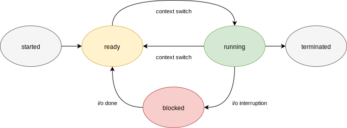
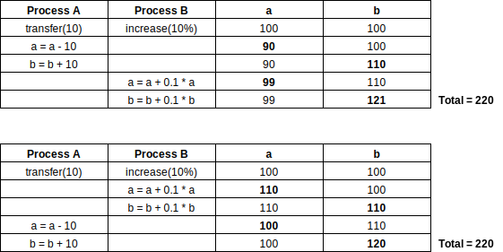

name: inverse
layout: true
class: center, middle, inverse
.indexlink[[<i class="fa fa-arrow-circle-o-up"></i>](#) [<i class="fa fa-list-ul"></i>](#index) [<i class="fa fa-tint"></i>](../change-color.php)[<i class="fa fa-file-pdf-o"></i>](download)[<i id="laser" class="fa fa-circle"></i>](#)]

---

name: normal
layout: true
class: left, middle
.indexlink[[<i class="fa fa-arrow-circle-o-up"></i>](#) [<i class="fa fa-list-ul"></i>](#index) [<i class="fa fa-tint"></i>](../change-color.php)[<i class="fa fa-file-pdf-o"></i>](download)[<i id="laser" class="fa fa-circle"></i>](#)]

---

template:inverse
# Processes and Threads
<a href="http://www.fe.up.pt/~arestivo">André Restivo</a>

---

template:inverse
name:index
# Index

.indexlist[
1. [Processes](#processes)
1. [Processes in C++](#processes-cpp)
1. [Scheduling](#scheduling)
1. [Threads](#threads)
1. [Threads in C++](#threads-cpp)
1. [Synchronization](#synchronization)
1. [Mutexes in C++](#mutexes-cpp)
]

---

template:inverse
name:processes
# Processes

---

# Process

* A computer **program** is a collection of instructions performing a specific task.

* A **process** is an instance of a computer program that is being currenlty executed. 

* The same program can be have several processes associated to it.

---

# Process Management

Process management is an important part of any modern operaing system. 

The OS must be able to:

* allocate **resources** to processes
* enable processes to **share** and exchange information
* **protect** the resources of each process
* enable **synchronisation** between processes

---

# Multitasking

* A multitasking OS is capable of executing many processes **concurrently**.

* This is achieved by **allocating** the CPU to each one of the processes for a **period of time**.

* Processes can lose control of the CPU either because:
  * they issued a **system call** (e.g. I/O operation)
  * a **hardware interrupt** occurred (e.g. timer, keyboard, ...)

* When a process loses control of the CPU, the OS must have a way to easily **restart** it. This is called a **context switch**.

---

# Process Table Entry

The process table entry is where the OS keeps information needed
to restart a process. It normally contains at least:

* process **state**: the current state of the process
* process **privileges**: access to system resources
* process **id**: unique identification
* **parent** id: this process parent if any
* **program counter**: address of the next instruction
* **registers**: CPU register contents when process was swapped out
* **scheduling**: priority and scheduling information
* **memory**: page table, memory limits, ...
* **accounting**: amount of CPU used
* **IO status**: I/O devices allocated

---

# Processes State

When a process executes, it passes through different states:

---

template:inverse
name:processes-cpp
# Processes in C++

---

# Fork

The **fork** function is the primitive for creating a process. It is declared in the header file *unistd.h*.

When executed it creates an exact copy of the current process. If succesful, it always returns:

* In the **parent** process: the process id of the child process
* In the **child** process: zero (0)

~~~cpp
#include <unistd.h>
#include <iostream>

using namespace std;

int main() {
  pid_t id = fork();
  if (id < 0) cout << "Error creating process" << endl;
  else if (id > 0) cout << "Parent process (" << id << ")" << endl;
  else if (id == 0) cout << "Child process" << endl;
}
~~~

---

# Wait

The **wait** and **waitpid** functions are used to wait for state changes in a child of the calling process.

~~~cpp
pid_t wait(int *wstatus);
pid_t waitpid(pid_t pid, int *wstatus, int options);
~~~

State changes can be: terminated, stopped or resumed.

~~~cpp
#include <unistd.h>
#include <iostream>
#include <sys/wait.h>

using namespace std;

int main() {
  pid_t id = fork();
  if (id < 0) cout << "Error creating process" << endl;
  else if (id > 0) {
    int status;
    cout << "Waited for " << wait(&status) << endl;
    cout << "Parent process (" << id << ")" << endl;
  }
  else if (id == 0) cout << "Child process" << endl;
}
~~~

---

template:inverse
name:scheduling
# Scheduling

---

# Scheduling

* It is the method by which the OS picks the next process to be run.

* There are several different scheduling algorithms.

* Some scheduling algorithms objectives:

  * throughput (the total amount of work completed per time unit)
  * fairness (same cpu time for each process)
  * starvation (processes should not wait forever)

* Objectives depend on the OS environment.

---

# OS Environments

There are several type of OS environments that have different
scheduling needs:

* Real Time (time guarantee)

* Desktop (interactive)

* Batch (non-interactive)

---

# Common Scheduling Algorithms

Some of the most common scheduling algorithms:

* First-Come, First-Served (FCFS) Scheduling
* Shortest-Job-Next (SJN) Scheduling
* Priority Scheduling
* Shortest Remaining Time
* Round Robin(RR) Scheduling

---

template:inverse
name:threads
# Threads

---

# Thread

* A thread of execution is the smallest sequence of programmed instructions that can be managed independently by a scheduler.

* Multiple threads can exist within one process, executing concurrently and sharing resources

---

# Processes vs. Threads

* Processes are independent while threads are part of processes.
* Processes have more state information. A thread shares the state of the process, heap space and other resources.
* Processes have separate address spaces, while threads share their address space.
* Processes interact only through OS provided communication mechanisms.
* Context switching between threads in the same process is typically faster.

---

template:inverse
name:threads-cpp
# Threads in C++

---

# Compilation

To compile a program in C or C++ using threads we must include the *pthread.h* header file and compile it using the following command:

~~~bash
g++ thread.cpp -o thread -pthread
~~~

---

# Creating

Threads are created by the *pthread_create* function:

~~~cpp
int pthread_create(
  pthread_t *thread, 
  *attr, 
  void* (*function)(void *), 
  void* arg
);
~~~

This functions receives:
* A thread identifier
* A structure with thread attributes
* A function to be run by the thread
* The arguments to be passed by the thread

Because the function has to have the same signature for all calls to *pthread_create*, it receives a void* and returns a void* that can be anything.

---

# Waiting

To wait for a thread to finish executing, we use the *pthread_join* function:

~~~cpp
int pthread_join(pthread_t thread, void **retval);
~~~

The *thread_wait* function receives the thread identifier to wait for and an optional place to store the return value.

---

# Example

~~~cpp
#include <pthread.h>
#include <iostream>

using namespace std;

int counter = 0;

void* thread_function(void* args) {
  int id = *(int*)args;
  for (int i = 0; i < 10; i++)
    cout << id << "(" << counter++ << ") " << endl;
}

int main() {
  int id1 = 1, id2 = 2;
  pthread_t thread1, thread2;

  pthread_create(&thread1,NULL,thread_function, &id1);
  pthread_create(&thread2,NULL,thread_function, &id2);

  pthread_join(thread1, NULL);
  pthread_join(thread2, NULL);
  
  return 0;
}
~~~

---

template:inverse
name:synchronization
# Synchronization

---

# Need for synchronization

* Concurrent access to shared data may result in data inconsistency.

* Sometimes, process must wait for one another

---

# Critical Section Problem

* A critical section is a code segment that
accesses shared variables and has to be executed as
an atomic action.

* The critical section problem refers to the problem
of how to ensure that at most one process is
executing its critical section at a given time. 

---

# Example

Two threads running at the same time and accessing the same data:

~~~cpp
  int a = 100, b = 100;

  void transfer (int qty) {
    a = a - qty;
    b = b - qty;
  }

  void increase (float percentage) {
    a = a + a * percentage;
    b = b + b * percentage;
  }
~~~

What happens if two threads call the transfer and increase functions at the same time?

---

# Example

One threads at a time:

Different but consistent results.

---

# Example

Multi-thread cenario:

Inconsistent result!

---

# Semaphores

A computational instrument representing the number of available resources having two operations:

* **wait**: If the value of semaphore variable is not negative, decrement it by 1. If the semaphore variable is now negative, the process/thread executing wait is blocked until the value is greater or equal to 1. 
* **signal**: Increments the value of semaphore variable by 1. If other processes/threads are blocked, one is chosen and unblocked.

Wait and signal are implemented as atomic operations by the CPU.

---

# Mutexes

* A special type of semaphore with an initial value of one (1).
* Implemented using two operations: *lock* and *unlock*.
* Easily protects critical sections.

---

# Deadlocks

* A lock occurs when multiple processes try to access the same resource at the same time.

* One process loses out and must wait for the other to finish.

* A deadlock occurs when the waiting process is still holding on to another resource that the first needs before it can finish.

**Example:**
  * X starts to use resource A.
  * X and Y try to start using resource B.
  * Y gets access to resource B.
  * Y asks to use resource A.
  * A is locked by X, which is waiting for Y.

Lock order is important!

---

template:inverse
name:mutexes-cpp
# Mutexes in C++

---

# Mutexes

Mutexes are created and destroyed using the *pthread_mutex_init* and *pthread_mutex_destroy* functions.

~~~cpp
int pthread_mutex_init(pthread_mutex_t *mutex, *attr);
int pthread_mutex_destroy(pthread_mutex_t *mutex);
~~~

To use mutexes, we use the *pthread_mutex_lock* and *pthread_mutex_unlock* functions:

~~~cpp
int pthread_mutex_lock(pthread_mutex_t *mutex);
int pthread_mutex_unlock(pthread_mutex_t *mutex);
~~~

---

# Example

~~~cpp

pthread_mutex_t lock;

void transfer (int qty) {
  pthread_mutex_lock(&lock);
  a = a - qty;
  b = b - qty;
  pthread_mutex_unlock(&lock);
}

void increase (float percentage) {
  pthread_mutex_lock(&lock);
  a = a + a * percentage;
  b = b + b * percentage;
  pthread_mutex_unlock(&lock);
}

int main() {
  pthread_mutex_init(&lock, NULL)

  /* ... */

  pthread_mutex_destroy(&lock);
}
~~~
