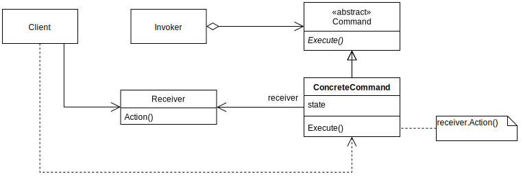
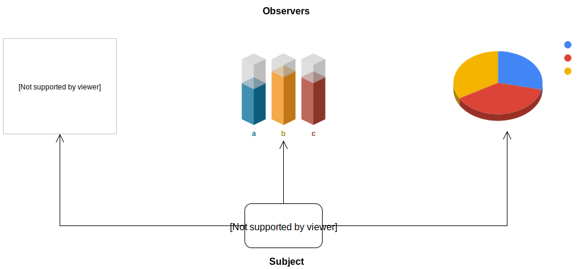

name: inverse
layout: true
class: center, middle, inverse
.indexlink[[<i class="fa fa-arrow-circle-o-up"></i>](#) [<i class="fa fa-list-ul"></i>](#index) [<i class="fa fa-tint"></i>](../change-color.php)[<i class="fa fa-file-pdf-o"></i>](download)]

---

name: normal
layout: true
class: left, middle
.indexlink[[<i class="fa fa-arrow-circle-o-up"></i>](#) [<i class="fa fa-list-ul"></i>](#index) [<i class="fa fa-tint"></i>](../change-color.php)[<i class="fa fa-file-pdf-o"></i>](download)]

---

template:inverse
# Design Patterns
<a href="http://www.fe.up.pt/~arestivo">André Restivo</a>

---

template: inverse
name:index
# Index

.indexlist[
1. [Introduction](#introduction)
1. [Factory Method](#factory-method)
1. [Composite](#composite)
1. [Command](#command)
1. [Observer](#observer)
1. [Strategy](#strategy)
]

---

# Reference

---

template: inverse
name:introduction
# Introduction

---

# Patterns

  <table>
    <tr><td>
       <ul>
        <li>Hello</li>
       </ul>
    </td><td>
    
    </td>
  </table>

---

# (Software) Design Patterns

  <table>
    <tr><td>
       <ul>
        <li>Hello</li>
       </ul>
    </td><td>
    
    </td>
  </table>

---

# Types of Patterns

---

# GoF Patterns

The twenty-three design patterns described by the Gang of Four:

.simple[
| Creational 	       | Structural 	 | Behavioral 	           |
|--------------------|---------------|-------------------------|
| Abstract Factory   | Adapter       | Chain of Responsibility |
| Builder            | Bridge        | **Command**             |
| **Factory Method** | **Composite** | Interpreter             |
| Prototype          | Decorator     | Iterator                |
| Singleton          | Facade        | Mediator                |
|                    | Flyweight     | Memento                 |
|                    | Proxy         | **Observer**            |
|                    |               | State                   |
|                    |               | **Strategy**            |
|                    |               | Template Method         |
|                    |               | Visitor                 |
]

---

# Documentation

.simple[
|                                 | |
|---------------------------------|-|
| Pattern Name | Classification |
| **Intent** | Collaboration
| Also Known As| **Consequences**
| **Motivation**| **Implementation**
| **Applicability**| Sample Code
| **Structure**| Known Uses
| Participants| Related Patterns
]

---

template: inverse
name:factory-method
# Factory Method

---

# Factory Method

> "Define an interface for creating an object, but let sub-classes decide which class to instantiate."

## Motivation

A framework for applications that can present multiple documents to the user.

---

# Applicability

Use the **factory method** pattern when:

* a class can't anticipate the class of objects it must create.
* a class wants the subclasses to specify the objects it creates.
* classes delegate responsibility to one of several helper classes, and you want to localize the knowledge of which helper subclass is the delegate.

# Consequences

Factory methods eliminate the need to bind application-specific classes into your code. The code only needs to deal with the Product *interface*; therefore it can work with any user-defined ConcreteProduct classes.

---

# Structure

---

# Variations

* **Creator** might **not be abstract** and provide a **default implementation** for the **FactoryMethod**.
* **Factory Method** might take a **parameter** specifying the **type of product** to create.
* Using **Generics/Templates** to avoid *subclassing* the **Creator**.

---

template: inverse
name:composite
# Composite

---

# Composite

> "Compose objects into tree structures to represent part-whole hierarchies. Composite lets clients treat individual objects and compositions uniformly."

# Motivation

A graphics application where shapes can be composed into groups.

---

# Applicability

Use the **composite** pattern when:

* you want to represent part-whole hierarchies of objects.
* you want clients to be able to ignore the difference between compositions of objects and individual objects.

# Consequences

* Primitive objects can be composed into more complex objects.
* Clients can be kept simple.
* Easier to add new types of components.

---

# Structure

---

# Variations

* Maintaining **references** from **child** components to their **parents**.
* **Sharing** components.
* Child **ordering**.
* **Caching** to improve performance.

---

template: inverse
name:command
# Command

---

# Command

> "Encapsulate a request as an object thereby letting you parameterize clients with different requests, queue or log requests, and support undoable operations."

# Motivation

---

# Applicability

Use the **command** pattern when:

* **parameterize** objects by an action to perform.
* **specify**, **queue**, and **execute** requests at different times.
* support **undo/redo** operations.
* support **logging** changes so they can be reapplied.
* **structure** a system around **high-level** operations built on **primitive** operations.

# Consequences

* Decouples the object that invokes the operation from the one that knows how to perform it.
* Commands can be extended and manipulated like any other object.
* You can create **Composite** commands.
* It's easy to add new commands.
  
---

# Structure

---

# Variations

* Commands only **delegating** to Receiver actions or doing **all the work** by themselves.
* Support **undo/redo** instead of only action.
* Avoiding **error accumulation** in undo operations.

---

template: inverse
name:observer
# Observer

---

# Observer

> "Define a one-to-many dependency between objects so that when one object changes status all its dependents are notified and updated automatically."

# Motivation

---

# Applicability

Use the **observer** pattern when:

* When an abstraction has two aspects one dependent on the other.
* When a change to one object requires changing others.
* When an object should be able to notify other objects without making assumptions about who those objects are.

# Consequences

* Abstract coupling between subject and observer.
* Support for broadcast communication.
* Unexpected updates.

---

# Structure

---

# Variations

* Observing more than one subject.
* Who triggers the update (client or subject)?
* Push and pull models.
* Specifying "events of interest" explicitly.

---

template: inverse
name:strategy
# Strategy

---

# Strategy

> "Define a family of algorithms, encapsulate each one, and make them interchangeable. Strategy lets the algorithm vary depending from clients that use it."

# Motivation

---

# Applicability

Use the **strategy** pattern when:

* many related classes differ only in their behavior.
* you need different variants of an algorithm.
* an algorithm uses data that clients should not know about.
* a class defines many behaviors that appear in multiple conditional statements.

# Consequences

* An alternative to subclassing.
* Eliminates conditional statements.
* Provides different implementations.
* Clients must be aware of different strategies.

---

# Structure

---

# Variations

* Strategy and Context must have well defined interfaces for exchanging any needed data.
* Strategy can be optional if context has default behavior. 

---

template: inverse
name:state
# State

---

template: inverse
name:adapter
# Adapter

---

template: inverse
name:singleton
# Singleton

---
