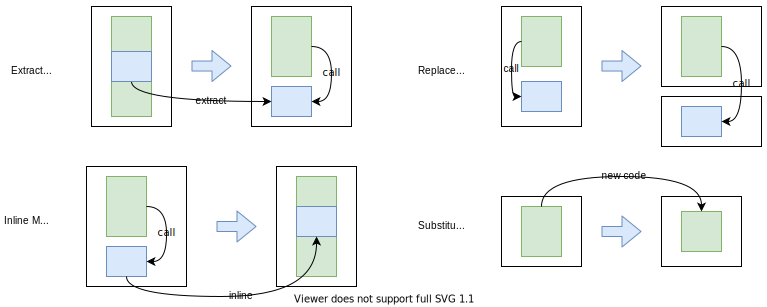
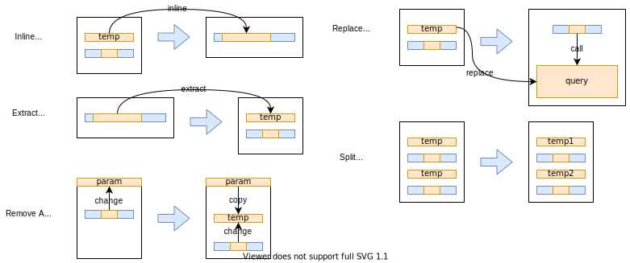
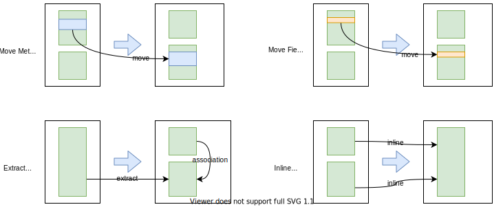
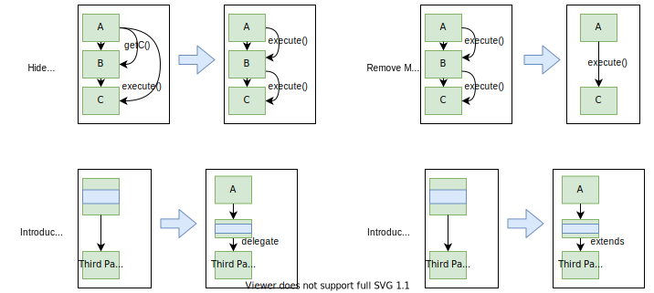

name: inverse
layout: true
class: center, middle, inverse
.indexlink[[<i class="fa fa-arrow-circle-o-up"></i>](#) [<i class="fa fa-list-ul"></i>](#index) [<i class="fa fa-tint"></i>](../change-color.php)[<i class="fa fa-file-pdf-o"></i>](download)]

---

name: normal
layout: true
class: left, middle
.indexlink[[<i class="fa fa-arrow-circle-o-up"></i>](#) [<i class="fa fa-list-ul"></i>](#index) [<i class="fa fa-tint"></i>](../change-color.php)[<i class="fa fa-file-pdf-o"></i>](download)]

---

template:inverse
# Refactoring
<a href="http://www.fe.up.pt/~arestivo">André Restivo</a>

---

template: inverse
name:index
# Index

.indexlist[
1. [Introduction](#introduction)
1. [Code Smells](#smells)
1. [Refactoring](#refactoring)
]

---

# Reference

* Fowler, Martin. [Refactoring: Improving the design of existing code](https://scholar.google.pt/scholar?q=Refactoring%3A+Improving+the+Design+of+Existing+Code). Addison-Wesley Professional, 1999. And also the accompanying [website](https://refactoring.com/) and online [catalog](https://refactoring.com/catalog/).
* Kerievsky, Joshua. [Refactoring to Patterns](https://scholar.google.pt/scholar?q=Refactoring+to+Patterns). Pearson Deutschland GmbH, 2005.
* [Refactoring Guru](https://refactoring.guru)
  
---

template: inverse
name:introduction
# Introduction

---

# Refactoring

* Refactoring is a **controlled** technique for **improving** the **design** of an **existing** code base. 
* Its essence is applying a series of **small behavior-preserving transformations**, each of which "*too small to be worth doing*". 
* However the **cumulative** effect of each of these transformations is quite **significant**.

---

# Two Hats

> A methaphor by Kent Beck

When your are developing, you divide your time into **two distinct activities**:

* When you are **adding** functionalities, you **shouldn't** be **changing code**.
* When you are **refactoring**, you **shouldn't** be adding **new capabilities**.

---

# Why Refactor?

* It **improves** the design of software. It prevents the design of software from decaying.
* It makes software easier to **understand**.
* It helps you find **bugs**. Refactoring forces you to think deeply about your code.
* It helps you program **faster**. A good design is essential to maintaining speed in software development. 

---

# Importance of Testing

* Refactoring is intended to improve **nonfunctional** attributes of the software. 
* Having a good **testing suite** is of paramount importance **before** refactoring to ensure the code still behaves as expected.

---

template: inverse
name:smells
# Code Smells

---

# Code Smells

* A code smell is a **surface indication** that usually corresponds to a **deeper problem** in the system.
* A code smell is something that's **quick to spot** (*sniffable*).
* A code smell **doesn't always** indicate a **problem**. Smells aren't inherently bad on their own, they are often an **indicator** of a **problem** rather than the problem themselves. 

---

# 1. Bloaters

Code, methods and classes that are so large and complex that they are hard to work with.

* **Long Method** A method that contains too many lines of code.
* **Large Class** A class that contains many fields/methods/lines of code.
* **Primitive Obsession** Use of primitives instead of small objects for simple tasks.
* **Long Parameter List** More than three or four parameters for a method.
* **Data Clumps** Different parts of the code containing identical groups of variables.

---

# 2. Object-Orientation Abusers

Incorrect application of object-oriented programming.

* **Switch Statements** Complex switch/if operators.
* **Temporary Field** Temporary fields that get their values only under certain circumstances. 
* **Refused Bequest** If a subclass uses only some of the methods and properties inherited from its parents.
* **Alternative Classes with Different Interfaces** Two classes perform identical functions but have different method names.

---

# 3. Change Preventers

Make changing the code harder.

* **Divergent Change** Changing many unrelated methods when you make changes to a class.
* **Shotgun Surgery** Many small changes to many different classes.
* **Parallel Inheritance Hierarchies** Whenever you create a subclass for a class, you find yourself needing to create a subclass for another class.

---

# 4. Dispensables

Things that would make the code cleaner if they didn't exist.

* **Comments** A method is filled with explanatory comments.
* **Duplicate Code** Two code fragments look almost identical.
* **Lazy Class** Classes that don't do much.
* **Data Class** Class that contains only fields and crude methods for accessing them.
* **Dead Code** A variable, parameter, field, method or class that is no longer used.
* **Speculative Generality** There’s an unused class, method, field or parameter that was created to support anticipated future features

---

# 5. Couplers

Excessive coupling between classes.

* **Feature Envy** A method accesses the data of another object more than its own data.
* **Inappropriate Intimacy** One class uses the internal fields and methods of another class.
* **Message Chains** In code you see a series of calls resembling: <code>a->b()->c()->d()</code>.
* **Middle Man** If a class only delegates work to another class, why does it exist at all?

---

template: inverse
name:refactorings
# Refactoring
## Some Examples

---

# Categories

The *Refactoring* book by Martin Fowler, divides refactoring into **7** categories:

1. **Composing** Methods
2. **Moving** Features Between Objects
3. **Organizing** Data
4. **Simplifying** Conditional Expressions
5. Making Methods Calls **Simpler**
6. Dealing With **Generalization**
7. **Big** Refactorings

In total, the book presents **70** different refactorings.

---

# Refactoring Structure

* **Name**: so we can build a vocabulary of refactorings.
* **Summary**: the situation in which you need the refactoring and what it does.
* **Motivation**: why the refactoring should be done (and when it shouldn't).
* **Mechanics**: concise instructions on how to do the refactoring.
* **Example**: simple and normally with before and after code.

Normally with code smells that are resolved using the refactoring and other related refactorings.

---

# 1. Composing Methods (I)

**Streamlining** methods, removing **code duplication** and making **future improvements** easier. 

These ones deal with **classes** and **methods**:

* **Extract Method** You have a code fragment that can be grouped together.
* **Inline Method** When a method body is more obvious than the method itself.
* **Replace Method with Method Object** You have a long method that uses local variables in such a way that you cannot apply *Extract Method*.
* **Substitute Algorithm** You want to replace an algorithm with one that is clearer.

---

# 1. Composing Methods (II)

**Streamlining** methods, removing **code duplication** and making **future improvements** easier. 

These ones deal with **methods** and **temporary** variables:

* **Inline Temp** You have a temporary variable that is assigned the result of a simple expression and nothing more.
* **Extract Variable** You have an expression that is hard to understand.
* **Split Temp Variable** You have a local variable that is used to store various intermediate values inside a method.
* **Replace Temp with Query** You place the result of an expression in a local variable for later use in your code.
* **Remove Assignments to Parameters** Some value is assigned to a parameter inside method’s body.

---

# 1. Composing Methods (III)

These ones deal with **classes** and **methods**.

---

# 1. Composing Methods (IV)

These ones deal with **methods** and temporary **variables**.

---

# 1. Composing Methods: Extract Method

~~~java
void printOwing() {
  printBanner();

  // Print details.
  System.out.println("name: " + name);
  System.out.println("amount: " + getOutstanding());
}
~~~

--

Refactored into:

~~~java
void printOwing() {
  printBanner();
  printDetails(getOutstanding());
}

void printDetails(double outstanding) {
  System.out.println("name: " + name);
  System.out.println("amount: " + outstanding);
}
~~~

Can be used to eliminate: **Duplicate Code**, **Long Method**, **Feature Envy**, **Switch Statements**, **Message Chains**, **Comments** and **Data Class**.

---

# 1. Composing Methods: Inline Method

~~~java
class PizzaDelivery {
  // ...
  int getRating() {
    return moreThanFiveLateDeliveries() ? 2 : 1;
  }
  boolean moreThanFiveLateDeliveries() {
    return numberOfLateDeliveries > 5;
  }
}
~~~

--

Refactored into:

~~~java
class PizzaDelivery {
  // ...
  int getRating() {
    return numberOfLateDeliveries > 5 ? 2 : 1;
  }
}
~~~

Can be used to eliminate: **Speculative Generality**.

---

# 1. Composing Methods: Extract Variable

You have an expression that’s hard to understand.

.small[
~~~java
void renderBanner() {
  if ((platform.toUpperCase().indexOf("MAC") > -1) &&
       (browser.toUpperCase().indexOf("IE") > -1) &&
        wasInitialized() && resize > 0 )
  {
    // do something
  }
}
~~~
]

--

Refactored into:

.small[
~~~java
void renderBanner() {
  final boolean isMacOs = platform.toUpperCase().indexOf("MAC") > -1;
  final boolean isIE = browser.toUpperCase().indexOf("IE") > -1;
  final boolean wasResized = resize > 0;

  if (isMacOs && isIE && wasInitialized() && wasResized) {
    // do something
  }
}
~~~
]

Can be used to eliminate: **Comment**.

---

# 1. Composing Methods: Split Temporary Variable

~~~java
double temp = 2 * (height + width);
System.out.println(temp);

temp = height * width;
System.out.println(temp);
~~~

--

Refactored into:

~~~java
final double perimeter = 2 * (height + width);
final double area = height * width;

System.out.println(perimeter);
System.out.println(area);
~~~

---

# 2. Moving Features between Objects (I)

Move **functionality** between classes, create new classes, and hide implementation details from public access.

These ones are about **moving** methods, fields and classes to their **correct** place:

* **Move Method** A method is used more in another class than in its own class.
* **Move Field** A field is used more in another class than in its own class.
* **Extract Class** When one class does the work of two, awkwardness results.
* **Inline Class** A class does almost nothing and is not responsible for anything, and no additional responsibilities are planned for it.

---

# 2. Moving Features between Objects (II)

Move **functionality** between classes, create new classes, and hide implementation details from public access.

These ones are about **untangling** class associations by changing the way they are organized:

* **Hide Delegate** The client gets object B from a field or method of object А. Then the client calls a method of object B.
* **Remove Middle Man** A class has too many methods that simply delegate to other objects.
* **Introduce Foreign Method** A utility class does not contain the method that you need and you cannot add the method to the class.
* **Introduce Local Extension** Add the method to a client class and pass an object of the utility class to it as an argument.

---

# 2. Moving Features between Objects (III)

---

# 2. Moving Features between Objects (IV)

---

# 3. Organizing Data (I)

Helping with data handling by replacing primitives with rich class functionality.

* **Self Encapsulate Field** You use direct access to private fields inside a class.
* **Replace Data Value with Object** A class contains a data field that has its own behavior and associated data.
* **Change Value to Reference** You have many identical instances of a single class that you need to replace with a single object.
* **Change Reference to Value** You have a reference object that is too small and infrequently changed to justify managing its life cycle.

---

# 3. Organizing Data (II)

Helping with data handling by replacing primitives with rich class functionality.

* **Replace Array with Object** You have an array that contains various types of data.
* **Duplicate Observed Data** Is domain data stored in classes responsible for the GUI?
* **Change Unidirectional Association to Bidirectional** You have two classes that each need to use the features of the other, but the association between them is only unidirectional.
* **Change Bidirectional Association to Unidirectional** You have a bidirectional association between classes, but one of the classes does not use the other’s features.

---

# 3. Organizing Data (III)

Helping with data handling by replacing primitives with rich class functionality.

* **Replace Magic Number with Symbolic Constant** Your code uses a number that has a certain meaning to it.
* **Encapsulate Field** You have a public field.
* **Encapsulate Collection** A class contains a collection field and a simple getter and setter for working with the collection.
* **Replace Type Code with Class** A class has a field that contains type code. The values of this type are not used in operator conditions and do not affect the behavior of the program.

---

# 3. Organizing Data (IV)

Helping with data handling by replacing primitives with rich class functionality.

* **Replace Type Code with Subclasses** You have a coded type that directly affects program behavior (values of this field trigger various code in conditionals).
* **Replace Type Code with State/Strategy** You have a coded type that affects behavior but you cannot use subclasses to get rid of it.
* **Replace Subclass with Fields** You have subclasses differing only in their (constant-returning) methods.

---

# 4. Simplifying Method Calls (I)

* **Rename Method** The name of a method does not explain what the method does.
* **Add Parameter** A method does not have enough data to perform certain actions.
* **Remove Parameter** A parameter is not used in the body of a method.
* **Separate Query from Modifier** Do you have a method that returns a value but also changes something inside an object?

---

# 4. Simplifying Method Calls (II)

* **Parameterize Method** Multiple methods perform similar actions that are different only in their internal values, numbers or operations.
* **Replace Parameter with Explicit Methods** A method is split into parts, each of which is run depending on the value of a parameter.
* **Preserve Whole Object** You get several values from an object and then pass them as parameters to a method.
* **Replace Parameter with Method Call** Before a method call, a second method is run and its result is sent back to the first method as an argument. But the parameter value could have been obtained inside the method being called.

---

# 4. Simplifying Method Calls (III)

* **Introduce Parameter Object** Your methods contain a repeating group of parameters.
* **Remove Setting Method** The value of a field should be set only when it is created, and not change at any time after that.
* **Hide Method** A method is not used by other classes or is used only inside its own class hierarchy.

---

# 4. Simplifying Method Calls (IV)

* **Replace Constructor with Factory Method** You have a complex constructor that does something more than just setting parameter values in object fields.
* **Replace Error Code with Exception** A method returns a special value that indicates an error?
* **Replace Exception with Test** You throw an exception in a place where a simple test would do the job?

---

# 5. Simplifying Conditional Expressions (I)

* **Decompose Conditional** You have a complex conditional (if-then/else or switch).
* **Consolidate Conditional Expression** You have multiple conditionals that lead to the same result or action.
* **Consolidate Duplicate Conditional Fragments** Identical code can be found in all branches of a conditional.
* **Remove Control Flag** You have a boolean variable that acts as a control flag for multiple boolean expressions.

---

# 5. Simplifying Conditional Expressions (II)

* **Replace Nested Conditional with Guard Clauses** You have a group of nested conditionals and it is hard to determine the normal flow of code execution.
* **Replace Conditional with Polymorphism** You have a conditional that performs various actions depending on object type or properties.
* **Introduce Null Object** Since some methods return null instead of real objects, you have many checks for null in your code.
* **Introduce Assertion** For a portion of code to work correctly, certain conditions or values must be true.

---

# Decompose Conditional

~~~java
if (date.before(SUMMER_START) || date.after(SUMMER_END)) {
  charge = quantity * winterRate + winterServiceCharge;
}
else {
  charge = quantity * summerRate;
}
~~~

--

Refactored into:

~~~java
if (isSummer(date)) {
  charge = summerCharge(quantity);
}
else {
  charge = winterCharge(quantity);
}
~~~

Can be used to eliminate: **Long Method**.

---

# Introduce Null Object

~~~java
if (customer == null) {
  plan = BillingPlan.basic();
}
else {
  plan = customer.getPlan();
}
~~~

--

Refactored into:

~~~java
class NullCustomer extends Customer {
  boolean isNull() {
    return true;
  }
  Plan getPlan() {
    return new NullPlan();
  }
}

customer = (order.customer != null) ?
  order.customer : new NullCustomer();

plan = customer.getPlan();
~~~

Can be used to eliminate: **Switch Statements** and **Temporary Field**.

---

# Replace Nested Conditional with Guard Clauses

<table>
<tr>
<td>
<pre><code class="java hljs remark-code">
public double getPayAmount() {
  double result;
  if (isDead){
    result = deadAmount();
  }
  else {
    if (isSeparated){
      result = separatedAmount();
    }
    else {
      if (isRetired){
        result = retiredAmount();
      }
      else{
        result = normalPayAmount();
      }
    }
  }
  return result;
}
</code></pre>
</td><td>
<pre><code class="java hljs remark-code">
public double getPayAmount() {
  if (isDead){
    return deadAmount();
  }
  if (isSeparated){
    return separatedAmount();
  }
  if (isRetired){
    return retiredAmount();
  }
  return normalPayAmount();
}
</code></pre>
</td></tr>

---

# Consolidate Duplicate Conditional Fragments

~~~java
if (isSpecialDeal()) {
  total = price * 0.95;
  send();
}
else {
  total = price * 0.98;
  send();
}
~~~

--

Refactored into:

~~~java
if (isSpecialDeal()) {
  total = price * 0.95;
}
else {
  total = price * 0.98;
}
send();
~~~

Can be used to eliminate: **Duplicate Code**.

---

# 6. Dealing with Generalization (I)

* **Pull Up Field** Two classes have the same field.
* **Pull Up Method** Your subclasses have methods that perform similar work.
* **Pull Up Constructor Body** Your subclasses have constructors with code that is mostly identical.

---

# 6. Dealing with Generalization (II)

* **Push Down Method** Is behavior implemented in a superclass used by only one (or a few) subclasses?
* **Push Down Field** Is a field used only in a few subclasses?

---

# 6. Dealing with Generalization (III)

* **Extract Subclass** A class has features that are used only in certain cases.
* **Extract Superclass** You have two classes with common fields and methods.
* **Extract Interface** Multiple clients are using the same part of a class interface. Another case: part of the interface in two classes is the same.

---

# 6. Dealing with Generalization (IV)

* **Collapse Hierarchy** You have a class hierarchy in which a subclass is practically the same as its superclass.
* **Form Template Method** Your subclasses implement algorithms that contain similar steps in the same order.
**Replace Inheritance with Delegation** You have a subclass that uses only a portion of the methods of its superclass (or it’s not possible to inherit superclass data).
* **Replace Delegation with Inheritance** A class contains many simple methods that delegate to all methods of another class.