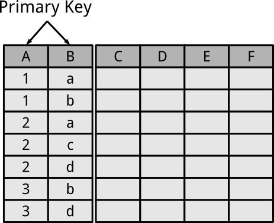
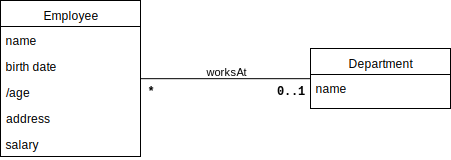

name: inverse
layout: true
class: center, middle, inverse
.indexlink[[<i class="fa fa-arrow-circle-o-up"></i>](#) [<i class="fa fa-list-ul"></i>](#index) [<i class="fa fa-tint"></i>](../change-color.php)[<i class="fa fa-file-pdf-o"></i>](download)]

---

name: normal
layout: true
class: left, middle
.indexlink[[<i class="fa fa-arrow-circle-o-up"></i>](#) [<i class="fa fa-list-ul"></i>](#index) [<i class="fa fa-tint"></i>](../change-color.php)[<i class="fa fa-file-pdf-o"></i>](download)]

---

template:inverse
# Relational Model
<a href="http://www.fe.up.pt/~arestivo">André Restivo</a>

---

template:inverse
name:index
# Index

.indexlist[
1. [Introduction](#intro)
1. [Constraints](#constraints)
1. [Operations](#operations)
1. [Conversion](#uml-to-mr)
1. [Example](#example)
]

---

template: inverse
name: intro
# Introduction

---

# Relational Model

* A simple **Database model** based on first-order predicate logic.
* First formulated and proposed in **1969** by Edgar F. **Codd**.
* But still the most used model for databases.
* Other models include *hierarchical* and *network* models.

---

# Principles

* Relational Model:

  * Set of relations: **tables**;
  * Composed by *tuples* (*records*) and *attributes*: **rows** and **columns**.

* Each relation:

  * Has a **name**;
  * Contains **attributes**;
  * Subject to **constraints**.

---

# Relation

---

# Tuples

 * The **lines** of a relation;
 * **Ordered** sequence of values;
 * Tuples do not have a specific order between them;
 * Tuple values are **atomic** (no composite or multi-value).

---

# Notation

| | |
|-|-| 
| R (A1, A2, ..., An) | Relation schema R of degree n |
| Q, R, S | Relation names |
| t, u, v | Tuples |
| t (a1, a2, ..., an) | Tuple *t* of a relation |
| t[Ai] | The value of the attribute *Ai* in the tuple *t* |
| t[Ai, Aj, Ak] | value of the attributes *Ai, Aj ,Ak* in the tuple *t* |

Example for an employee:

.relational_example[
Employee (id, name, address, telephone)
]
---

name: constraints
template: inverse
# Constraints

---

# Domain

* The set of **possible** values for a given **attribute**.
* Can be considered a **constraint** on the value of the attribute.
* Examples:

 * integer values;
 * email addresses;
 * any text under 140 characters;
 * true or false.

---

# Not Null Constraint

For certain attributes, **null** can be a possible value. Others don't allow the null value.

Notation for **not null** attributes [NN]:

.relational_example[
Employee (id, name [NN], address, telephone)
]

---

# Key Constraints

* No two tuples can have the same combination of values for
all their attributes;
* **Superkey**: set of attributes in a relation R such that no 2
different tuples will have the same values for that set of
attributes;
* **Key**: minimal set of attributes in relation R such that no 2
tuples have the same values;
* **Candidate key**: any key. 

---

# Primary Key

Key chosen to be used to **identify** tuples in a relation:

* Other candidate keys are **unique** keys;
* Every relation schema **must have** a primary key;
* The attribute values of the primary key **cannot** be *null*.

---

# Table with a Primary Key

---

# Notation

Notation for primary keys (underlined):

.relational_example[
Relation (<u>primary key</u>, attribute 1, attribute 2, ..., attribute n)
]

Example for an employee:

.relational_example[
Employee (<u>id</u>, name [NN], address, telephone)
]

---

# Table with a Double Primary Key

---

# Unique Keys

 * Unique keys are **similar to primary keys** but **allow null** values.
 * A relation can have **several** unique keys.

---

# Table with an Unique Key

---

# Notation

Notation for unique keys [UK]:

.relational_example[
Relation (<u>primary</u>, attribute 1 [UK], attribute 2, ..., attribute n)
]

Example for an employee:

.relational_example[
Employee (<u>id</u>, name [NN], address, telephone [UK])
]

---

# Foreign Keys

* An **attribute** (or set of attributes) that uniquely identifies a tuple of another, or the same, relation.
* Can be used to **cross-reference** relations.
* Possible to use the values of attributes in the referenced relation to restrict the domain of one or more attributes in the referencing relation.

---

## Table with a Foreign Key

The domain of the foreign key (column F) is the set of values of the primary key in the referenced table.

---

## Notation

Notation for foreign keys (# and arrow):

.relational_example[
Relation (<u>primary_key</u>, attribute, #foreign_key &rarr; Referenced Relation)
]

Example for an employee and a department:

.relational_example[
Employee (<u>id</u>, name [NN], telephone [UK], #num &rarr; Department)

Department (<u>num</u>, name [NN])
]

---

# Constraints
## Summary

* **Primary key** values **cannot be null**.
* **Key values** (primary and unique) **cannot have repeated** values.
* **Values** have to belong to the attribute **domain**.
* Attributes with a **not null** constraint **cannot have null** values.
* **Foreign key** attributes can **only** have values that **exist** in the primary key of the **referenced** relation.

---

template: inverse
name: operations
# Operations

---

# List of Operations

* **Insertion**: Inserts a new tuple into a relation.
* **Deletion**: Deletes one or more tuples from a relation.
* **Update**: Updates one or more tuples.

---

template: inverse
name: uml-to-mr

# UML to Relational

---

# Class

--

* A relation representing the class;
* Derived attribute can be ommited and calculated when needed;
* If no good candidate key exists, a primary key can be created.

.relational_example[
Person (<u>id</u>, birth_date, name, address, salary)
]

---

# Many-to-one Association (partial)

--

* Foreign key from the many to the one side;
* Can have null values as employee might not have a department.

.relational_example[
Employee (<u>id</u>, birth_date, name, address, salary, #num &rarr; Department)

Department (<u>num</u>, name)
]

---

# Many-to-one Association (total)

--

* Foreign key from the many to the one side;
* Cannot have null values as employee must have a department.

.relational_example[
Employee (<u>id</u>, bdate, name, address, salary, #num &rarr; Department [NN])

Department (<u>num</u>, name)
]

---

# One-to-one Association (partial)

--

* Foreign key from the partial to the total side;
* Cannot have null values as passport must belong to someone;
* Unique key, as every passport must belong to a different person.

.relational_example[
Person (<u>id</u>, birth_date, name, address)

Passport (<u>number</u>, date, #id &rarr; Person [UK,NN])
]

---

# One-to-one Association (total)

--

* Foreign key in either side;
* Cannot have null values as person must have a passport;
* Unique key, as every passport must belong to a different person;
* Relations can be merged. Same number of tuples in both sides.

.relational_example[
Person (<u>id</u>, birth_date, name, address, #number &rarr; Passport [UK,NN])

Passport (<u>number</u>, date)
]

---

# Many-to-many Association

--

* A new relation containing foreign keys to both relations;
* Primary key formed by both foreign keys.

.relational_example[
Book (<u>isbn</u>, title, date)

Author (<u>number</u>, name, nationality)

Wrote (<u>#isbn &rarr; Book</u>, <u>#number &rarr; Author</u>)

]

---

# Association Class

--

Attributes from the association class go to the same relation as the newly created foreign keys.

.relational_example[
Student (<u>number</u>, name)

Course (<u>code</u>, name, year)

Enrolled (<u>#number &rarr; Student</u>, <u>#code &rarr; Course</u>, grade)
]

---

# Aggregation

--

* One-to-many relationship;
* Diamond side has an implicit 0..1 cardinality.

.relational_example[
Computer (<u>number</u>, location)

Part (<u>code</u>, name, type, #number &rarr; Computer)
]

---

# Composition

--

* One-to-many relationship;
* Diamond side has an implicit 1 cardinality.

.relational_example[
Computer (<u>number</u>, location)

Part (<u>code</u>, name, type, #number &rarr; Computer [NN])
]

---

# Qualified Associations

--

* Primary key ensures that each member can only be once in each club.
* Unique key ensures the unicity of the qualified attribute.

.relational_example[
Club (<u>code</u>, title)

Member (<u>id</u>, name, address, phone)

Joined (<u>#code &rarr; Club</u>, <u>#id &rarr; Member</u>, number [NN]) 
{UK: code, number}
]

---

# Ternary Associations (\* \* \*)

--

Similar to a many-to-many relationship. All combinations are possible.

.small.relational_example[
Team (<u>name</u>)

Season (<u>year</u>)

Player (<u>id</u>, name)

Played (<u>#name &rarr; Team</u>, <u>#year &rarr; Season</u>, <u>#id &rarr; Player</u>, minutes, goals)
]

---

# Ternary Associations (\* \* 1)

--

Players can only play for one team each season.

.small.relational_example[
Team (<u>name</u>)

Season (<u>year</u>)

Player (<u>id</u>, name)

Played (#name &rarr; Team, <u>#year &rarr; Season</u>, <u>#id &rarr; Player</u>, minutes, goals)
]

---

# Generalizations (method #1)

--

* Some queries are more complex (e.g. name of all heart surgeons);
* No way to ensure disjoint generalization;
* Type attribute optional.

.small.relational_example[
Person (<u>num</u>, name, type)

Doctor (<u>#num &rarr; Person</u>, speciality)

Patient (<u>#num &rarr; Person</u>, ensurance)

Appointment (<u>id</u>, #numd &rarr; Doctor [NN], #nump &rarr; Patient [NN], date)

]

---

# Generalizations (method #2)

* Some queries require more work (e.g. person named John);
* No way to ensure disjoint generalization;
* Can become complex if generic class has many attributes and associations.

.small.relational_example[
Doctor (<u>num</u>, name, speciality)

Patient (<u>num</u>, name, ensurance)

Appointment (<u>id</u>, #numd &rarr; Doctor [NN], #nump &rarr; Patient [NN], date)

]

---

# Generalizations (method #3)

* Needs extra code to ensure an appointment is between a doctor and a patient, only doctors have a speciality and patients an ensurance;
* Easy to ensure disjoint generalization;
* Can become complex if specialized classes have many attributes and associations.

.small.relational_example[
Person (<u>num</u>, name, speciality, ensurance, type)

Appointment (<u>id</u>, #numd &rarr; Person [NN], #nump &rarr; Person [NN], date)

]

---

# Generalizations (method #4)

Same as previous but for overlapped generalizations.

.small.relational_example[
Person (<u>num</u>, name, speciality, ensurance, isdoctor, ispatient)

Appointment (<u>id</u>, #numd &rarr; Person [NN], #nump &rarr; Person [NN], date)

]

---

template: inverse
name: example

# Example

---

# Example

---

# Solution

.relational_example[
Speciality (<u>cod</u>, name)

Person (<u>num</u>, name, address)

Doctor (<u>#num &rarr; Person</u>, phone, #cod &rarr; Speciality)

Patient (<u>#num &rarr; Person</u>, birth_date)

Appointment (<u>id</u>, #numd &rarr; Doctor [NN], #nump &rarr; Patient [NN], date)

Laboratory (<u>name</u>, address)

Drug (<u>ref</u>, name, #lab &rarr; Laboratory [NN])

Prescribed (<u>#id &rarr; Appointment</u>, <u>#ref &rarr; Drug</u>, dosage)

Company (<u>name</u>)

Ensurance (<u>#num &rarr; Patient</u>, <u>#company &rarr; Company</u>, number) {UK: company, number}

]

