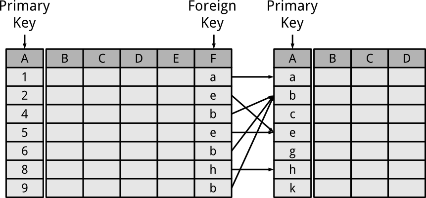
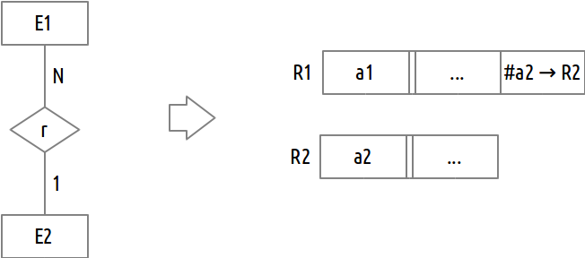
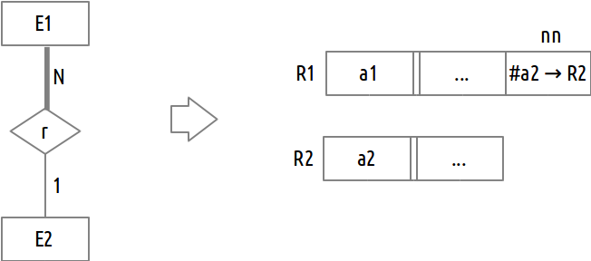
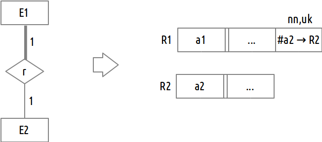
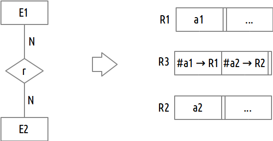
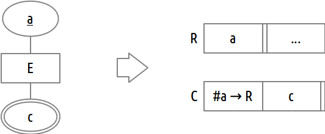

name: inverse
layout: true
class: center, middle, inverse
.indexlink[[<i class="fa fa-arrow-circle-o-up"></i>](#) [<i class="fa fa-list-ul"></i>](#index) [<i class="fa fa-tint"></i>](../change-color.php)[<i class="fa fa-file-pdf-o"></i>](download)]

---

name: normal
layout: true
class: left, middle
.indexlink[[<i class="fa fa-arrow-circle-o-up"></i>](#) [<i class="fa fa-list-ul"></i>](#index) [<i class="fa fa-tint"></i>](../change-color.php)[<i class="fa fa-file-pdf-o"></i>](download)]

---

template:inverse
# Relational Model
<a href="http://www.fe.up.pt/~arestivo">André Restivo</a>

---

template:inverse
name:index
# Index

.indexlist[
1. [Introduction](#intro)
1. [Values](#values)
1. [Primary Keys](#pks)
1. [Unique Keys](#uks)
1. [Foreign Keys](#fks)
1. [Constraints](#constraints)
1. [Operations](#operations)
1. [Conversion](#er-to-mr)
1. [Example](#example)
]

---

template: inverse
name: intro
# Introduction

---

# Relational Model

* A simple **Database model** based on first-order predicate logic.
* First formulated and proposed in **1969** by Edgar F. **Codd**.
* But still the most used model for databases.

---

# Principles

* Relational Model:
  * Set of relations: **tables**
  * Composed by *tuples* and *attributes*: **rows** and **columns**
* Relation:
  * Has **name**
  * Contains **attributes**
  * Subject to **constraints**

---

# Relation

---

# Tuples

 * The **lines** of a relation.
 * **Ordered** sequence of values.
 * Tuples do not have a specific order between them.
 * Tuple values are **atomic** (no composite or multi-value).

---

# Notation

The notation used to represent a basic relation is the following:

.box_example[
.relation[
	|||
	|-:|-|
	|Relation Name|attribute_1|attribute_2|...|attribute_n
]
]

Example for an employee:

.box_example[
.relation[
|||
|-:|-|
|Employee|id|name|address|telephone
]]

---

name: values
template: inverse
# Values

---

# Domain

* The set of possible values for a given attribute.
* Can be considered a **constraint** on the value of the attribute.
* Examples:
 * integer values
 * email addresses
 * text
* For certain attributes, **null** can be a possible value. Others don't allow the null value (not null constraint).

---

# Notation

Notation for **not null** attributes:

.box_example[
.relation[
|||
|-:|-|
|Relation Name|attribute_1|attribute_2 (NN)|...|attribute_n
]]

---

template: inverse
name: pks
# Primary Keys

---

# Definition

 * Primary keys are a set of **one or more** attributes that uniquely define a tuple within a relation.
 * They **cannot have repeated** values.
 * They **cannot have null** values.
 * There can **only** be **one** primary key in each relation.

---

# Table with a Primary Key

---

# Notation

Notation for primary keys:

.box_example[
.relation[
|||
|-:|-|
|Relation Name|.pk[primary_key]|attribute_1|...|attribute_n
]]

Example for an employee:

.box_example[
.relation[
|||
|-:|-|
|Employee|.pk[id]|name|address|telephone
]]

---

# Double Primary Key

---

# Notation

Notation for double primary keys:

.box_example[
.relation[
|||
|-:|-|
|Relation Name|primary_key_1|.pk[primary_key_2]|attribute_1|...|attribute_n
]]

Example for a phone list:

.box_example[
.relation[
|||
|-:|-|
|Phone|person|.pk[number]|type
]]

---

template: inverse
name: uks
# Unique Keys

---

# Definition

 * Unique keys are **similar to primary keys** but **allow null** values.
 * A relation can have several unique keys.

---

## Table with an Unique Key

---

# Notation

Notation for unique keys:

.box_example[
.relation[
|||
|-:|-|
|Relation Name|.pk[primary_key]|attribute_1 (UK)|...|attribute_n
]]

Example for an employee:

.box_example[
.relation[
|||
|-:|-|
|Employee|.pk[id]|name|username (UK)|phone|address
]]

---

template:inverse
name:fks

# Foreign Keys

---

# Definition

* An **attribute** (or set of attributes) that **always matches a key** attribute in **another** relation.
* Can be used to **cross-reference** relations.
* Possible to use the values of attributes in the referenced relation to restrict the domain of one or more attributes in the referencing relation.

---

## Table with a Foreign Key

---

## Notation

Notation for foreign keys:

.box_example[
.relation[
|||
|-:|-|
|Relation Name|.pk[primary_key]|attribute_1|attribute_2|#foreign_key &rarr; referenced_relation
]]

Example for an employee and a department:

.box_example[
.relation[
|||
|-:|-|
|Employee|.pk[id]|name|address|phone|#dep_id &rarr; Department
]
 
.relation[
|||
|-:|-|
|Department|.pk[id]|name (UK)
]]

---

template: inverse
name: constraints
# Constraints

---

# Summary of Constraints

* **Primary key** values **cannot be null**.
* **Key values** (primary and unique) **cannot have repeated** values.
* **Values** have to belong to the attribute **domain**.
* Attributes with a **not null** constraint **cannot have null** values.
* **Foreign key** attributes can only have values that **exist in the referenced relation**.

---

template: inverse
name: operations
# Operations

---

# List of Operations

* **Insertion**: Inserts a new tuple into a relation.
* **Deletion**: Deletes one or more tuples from a relation.
* **Update**: Updates one or more tuples.

---

template: inverse
name: er-to-mr

# Entity Relationship to Relational

---

# Step 1. Entity to Relation

* **Every entity** in the entity-relationship model **becomes a relation** in the relational model.
* **Composite attributes** are **separated** into several attributes.
* **Key attributes** become **primary keys**.
* Multi-valued attributes (see step 5).

---

# Step 1. Entity to Relation

---

# Step 2. Many-to-one relationships

* Add a foreign key **from** the relation in the **many side** of the relationship **to the** relation in the **one side**.
* If the participation of the entity on the **many side** of the relationship is **total**, add a **not null** constraint to the **foreign key**.

---

# Step 2. Many-to-one relationships

Foreign key always in the **many** side

---

# Step 2. Many-to-one relationships

If the **many** side has **total participation** in the relationship

---

# Step 3. One-to-one relationships

* Add a foreign key **from one** of the relations **to the other**.
  * If one of the entities has total participation in the relationship, add the foreign key to that relation and add a not null constraint to it.
  * If none of the entities has a total participation, pick the one expected to have less tuples.
* **Add a unique key** constraint to the **foreign key**.

---

# Step 3. One-to-one relationships

When **none** of the entities has a total participation in the relationship choose either one. Normally we choose the one with less rows.

---

# Step 3. One-to-one relationships

When **one** of the entities has a total participation in the relationship choose that one.

---

# Step 4. Many-to-many relationships

* Add a **new relation** to the model.
* Add **foreign keys** to the new relation **referencing both relations**.
* Select **both foreign keys** as the (double) **primary key** of the new relation.

---

# Step 4. Many-to-many relationships

Always create a new relation with a double foreign key

---

# Step 5. Multi-valued attributes

* For each multi-valued attribute create **a new relation**.
* Add the multi-valued **attribute** and a **foreign key**, referencing the relation containing the attribute, to the new relation.
* **Both attributes** (foreign key and attribute) become the **primary key** of the new relation.

---

# Step 5. Multi-values attributes

Always create a new relation with a double foreign key

---

template: inverse
name: example
# Example

---

## Example

.small[
Employee (.key[id], name, address (city, street, number, appartment), {phone}) 
Department (.key[number], name) 
Project (.key[number], name) 
Car (.key[plate]) 
Model (.key[make], .key[model])
  
manages (Employee, Department, date) 1:1 p/p 
uses (Employee, Car) 1:1 p/t 
belongsTo (Employee, Department) N:1 t/p 
controls (Employee, Project) 1:N p/p 
itsA (Car, Model) N:1 t/p 
worksAt (Employee, Project, hours) N:N p/p 
]

---

## Example

.small[
.selected[Employee (.key[id], name, address (city, street, number, appartment), {phone})] 
Department (.key[number], name) 
Project (.key[number], name) 
Car (.key[plate]) 
Model (.key[make], .key[model])
  
manages (Employee, Department, date) 1:1 p/p 
uses (Employee, Car) 1:1 p/t 
belongsTo (Employee, Department) N:1 t/p 
controls (Employee, Project) 1:N p/p 
itsA (Car, Model) N:1 t/p 
worksAt (Employee, Project, hours) N:N p/p 
]

.relation.selected[
|||
|-:|-|
|Employee|.pk[id]|name|city|street|number|apartment
]

---

## Example

.small[
Employee (.key[id], name, address (city, street, number, appartment), {phone}) 
.selected[Department (.key[number], name)] 
Project (.key[number], name) 
Car (.key[plate]) 
Model (.key[make], .key[model])
  
manages (Employee, Department, date) 1:1 p/p 
uses (Employee, Car) 1:1 p/t 
belongsTo (Employee, Department) N:1 t/p 
controls (Employee, Project) 1:N p/p 
itsA (Car, Model) N:1 t/p 
worksAt (Employee, Project, hours) N:N p/p 
]

.relation[
|||
|-:|-|
|Employee|.pk[id]|name|city|street|number|apartment
]

.relation.selected[
|||
|-:|-|
|Department|.pk[number]|name
]

---

## Example

.small[
Employee (.key[id], name, address (city, street, number, appartment), {phone}) 
Department (.key[number], name) 
.selected[Project (.key[number], name)] 
Car (.key[plate]) 
Model (.key[make], .key[model])
  
manages (Employee, Department, date) 1:1 p/p 
uses (Employee, Car) 1:1 p/t 
belongsTo (Employee, Department) N:1 t/p 
controls (Employee, Project) 1:N p/p 
itsA (Car, Model) N:1 t/p 
worksAt (Employee, Project, hours) N:N p/p 
]

.relation[
|||
|-:|-|
|Employee|.pk[id]|name|city|street|number|apartment
]

.relation[
|||
|-:|-|
|Department|.pk[number]|name
]

.relation.selected[
|||
|-:|-|
|Project|.pk[number]|name
]

---

## Example

.small[
Employee (.key[id], name, address (city, street, number, appartment), {phone}) 
Department (.key[number], name) 
Project (.key[number], name) 
.selected[Car (.key[plate])] 
Model (.key[make], .key[model])
  
manages (Employee, Department, date) 1:1 p/p 
uses (Employee, Car) 1:1 p/t 
belongsTo (Employee, Department) N:1 t/p 
controls (Employee, Project) 1:N p/p 
itsA (Car, Model) N:1 t/p 
worksAt (Employee, Project, hours) N:N p/p 
]

.relation[
|||
|-:|-|
|Employee|.pk[id]|name|city|street|number|apartment
]

.relation[
|||
|-:|-|
|Department|.pk[number]|name
]

.relation[
|||
|-:|-|
|Project|.pk[number]|name
]

.relation.selected[
|||
|-:|-|
|Car|.pk[plate]
]

---

## Example

.small[
Employee (.key[id], name, address (city, street, number, appartment), {phone}) 
Department (.key[number], name) 
Project (.key[number], name) 
Car (.key[plate]) 
.selected[Model (.key[make], .key[model])]
  
manages (Employee, Department, date) 1:1 p/p 
uses (Employee, Car) 1:1 p/t 
belongsTo (Employee, Department) N:1 t/p 
controls (Employee, Project) 1:N p/p 
itsA (Car, Model) N:1 t/p 
worksAt (Employee, Project, hours) N:N p/p 
]

.relation[
|||
|-:|-|
|Employee|.pk[id]|name|city|street|number|apartment
]

.relation[
|||
|-:|-|
|Department|.pk[number]|name
]

.relation[
|||
|-:|-|
|Project|.pk[number]|name
]

.relation[
|||
|-:|-|
|Car|.pk[plate]
]

.relation.selected[
|||
|-:|-|
|Model|make|.pk[model]
]

---

## Example

.small[
Employee (.key[id], name, address (city, street, number, appartment), {phone}) 
Department (.key[number], name) 
Project (.key[number], name) 
Car (.key[plate]) 
Model (.key[make], .key[model])
  
.selected[manages (Employee, Department, date) 1:1 p/p] 
uses (Employee, Car) 1:1 p/t 
belongsTo (Employee, Department) N:1 t/p 
controls (Employee, Project) 1:N p/p 
itsA (Car, Model) N:1 t/p 
worksAt (Employee, Project, hours) N:N p/p 
]

.relation[
|||
|-:|-|
|Employee|.pk[id]|name|city|street|number|apartment
]

.relation[
|||
|-:|-|
|Department|.pk[number]|name|.selected[\#manager &rarr; Employee (UK)]|.selected[date]
]

.relation[
|||
|-:|-|
|Project|.pk[number]|name
]

.relation[
|||
|-:|-|
|Car|.pk[plate]
]

.relation[
|||
|-:|-|
|Model|make|.pk[model]
]

---

## Example

.small[
Employee (.key[id], name, address (city, street, number, appartment), {phone}) 
Department (.key[number], name) 
Project (.key[number], name) 
Car (.key[plate]) 
Model (.key[make], .key[model])
  
manages (Employee, Department, date) 1:1 p/p 
.selected[uses (Employee, Car) 1:1 p/t] 
belongsTo (Employee, Department) N:1 t/p 
controls (Employee, Project) 1:N p/p 
itsA (Car, Model) N:1 t/p 
worksAt (Employee, Project, hours) N:N p/p 
]

.relation[
|||
|-:|-|
|Employee|.pk[id]|name|city|street|number|apartment
]

.relation[
|||
|-:|-|
|Department|.pk[number]|name|\#manager &rarr; Employee (UK)|date
]

.relation[
|||
|-:|-|
|Project|.pk[number]|name
]

.relation[
|||
|-:|-|
|Car|.pk[plate]|.selected[\#used_by &rarr; Employee (UK, NN)]
]

.relation[
|||
|-:|-|
|Model|make|.pk[model]
]

---

## Example

.small[
Employee (.key[id], name, address (city, street, number, appartment), {phone}) 
Department (.key[number], name) 
Project (.key[number], name) 
Car (.key[plate]) 
Model (.key[make], .key[model])
  
manages (Employee, Department, date) 1:1 p/p 
uses (Employee, Car) 1:1 p/t 
.selected[belongsTo (Employee, Department) N:1 t/p] 
controls (Employee, Project) 1:N p/p 
itsA (Car, Model) N:1 t/p 
worksAt (Employee, Project, hours) N:N p/p 
]

.relation[
|||
|-:|-|
|Employee|.pk[id]|name|city|street|number|apartment|.selected[\#number &rarr; Department (NN)]
]

.relation[
|||
|-:|-|
|Department|.pk[number]|name|\#manager &rarr; Employee (UK)|date
]

.relation[
|||
|-:|-|
|Project|.pk[number]|name
]

.relation[
|||
|-:|-|
|Car|.pk[plate]|\#used_by &rarr; Employee (UK, NN)
]

.relation[
|||
|-:|-|
|Model|make|.pk[model]
]

---

## Example

.small[
Employee (.key[id], name, address (city, street, number, appartment), {phone}) 
Department (.key[number], name) 
Project (.key[number], name) 
Car (.key[plate]) 
Model (.key[make], .key[model])
  
manages (Employee, Department, date) 1:1 p/p 
uses (Employee, Car) 1:1 p/t 
belongsTo (Employee, Department) N:1 t/p 
.selected[controls (Employee, Project) 1:N p/p] 
itsA (Car, Model) N:1 t/p 
worksAt (Employee, Project, hours) N:N p/p 
]

.relation[
|||
|-:|-|
|Employee|.pk[id]|name|city|street|number|apartment|\#number &rarr; Department (NN)
]

.relation[
|||
|-:|-|
|Department|.pk[number]|name|\#manager &rarr; Employee (UK)|date
]

.relation[
|||
|-:|-|
|Project|.pk[number]|name|.selected[\#controled &rarr; Employee]
]

.relation[
|||
|-:|-|
|Car|.pk[plate]|\#used_by &rarr; Employee (UK, NN)
]

.relation[
|||
|-:|-|
|Model|make|.pk[model]
]

---

## Example

.small[
Employee (.key[id], name, address (city, street, number, appartment), {phone}) 
Department (.key[number], name) 
Project (.key[number], name) 
Car (.key[plate]) 
Model (.key[make], .key[model])
  
manages (Employee, Department, date) 1:1 p/p 
uses (Employee, Car) 1:1 p/t 
belongsTo (Employee, Department) N:1 t/p 
controls (Employee, Project) 1:N p/p 
.selected[itsA (Car, Model) N:1 t/p] 
worksAt (Employee, Project, hours) N:N p/p 
]

.relation[
|||
|-:|-|
|Employee|.pk[id]|name|city|street|number|apartment|\#number &rarr; Department (NN)
]

.relation[
|||
|-:|-|
|Department|.pk[number]|name|\#manager &rarr; Employee (UK)|date
]

.relation[
|||
|-:|-|
|Project|.pk[number]|name|\#controled &rarr; Employee
]

.relation[
|||
|-:|-|
|Car|.pk[plate]|\#used_by &rarr; Employee (UK, NN)|.selected[\#(make, model) &rarr; Model (NN)]
]

.relation[
|||
|-:|-|
|Model|make|.pk[model]
]

---

## Example

.small[
Employee (.key[id], name, address (city, street, number, appartment), {phone}) 
Department (.key[number], name) 
Project (.key[number], name) 
Car (.key[plate]) 
Model (.key[make], .key[model])
  
manages (Employee, Department, date) 1:1 p/p 
uses (Employee, Car) 1:1 p/t 
belongsTo (Employee, Department) N:1 t/p 
controls (Employee, Project) 1:N p/p 
itsA (Car, Model) N:1 t/p 
.selected[worksAt (Employee, Project, hours) N:N p/p]
]

.relation[
|||
|-:|-|
|Employee|.pk[id]|name|city|street|number|apartment|\#number &rarr; Department (NN)
]

.relation[
|||
|-:|-|
|Department|.pk[number]|name|\#manager &rarr; Employee (UK)|date
]

.relation[
|||
|-:|-|
|Project|.pk[number]|name|\#controled &rarr; Employee
]

.relation[
|||
|-:|-|
|Car|.pk[plate]|\#used_by &rarr; Employee (UK, NN)|\#(make, model) &rarr; Model (NN)
]

.relation[
|||
|-:|-|
|Model|make|.pk[model]
]

.relation.selected[
|||
|-:|-|
|WorksAt|\#id &rarr; Employee|.pk[\#number &rarr; Project]|hours
]

---

## Example

.small[
Employee (.key[id], name, address (city, street, number, appartment), .selected[{phone}]) 
Department (.key[number], name) 
Project (.key[number], name) 
Car (.key[plate]) 
Model (.key[make], .key[model])
  
manages (Employee, Department, date) 1:1 p/p 
uses (Employee, Car) 1:1 p/t 
belongsTo (Employee, Department) N:1 t/p 
controls (Employee, Project) 1:N p/p 
itsA (Car, Model) N:1 t/p 
worksAt (Employee, Project, hours) N:N p/p]

.relation[
|||
|-:|-|
|Employee|.pk[id]|name|city|street|number|apartment|\#number &rarr; Department (NN)
]

.relation[
|||
|-:|-|
|Department|.pk[number]|name|\#manager &rarr; Employee (UK)|date
]

.relation[
|||
|-:|-|
|Project|.pk[number]|name|\#controled &rarr; Employee
]

.relation[
|||
|-:|-|
|Car|.pk[plate]|\#used_by &rarr; Employee (UK, NN)|\#(make, model) &rarr; Model (NN)
]

.relation[
|||
|-:|-|
|Model|make|.pk[model]
]

.relation[
|||
|-:|-|
|WorksAt|\#id &rarr; Employee|.pk[\#number &rarr; Project]|hours
]

.relation.selected[
|||
|-:|-|
|Phone|\#id &rarr; Employee|.pk[phone]|
]

