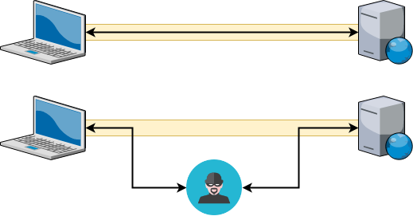
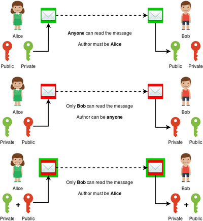
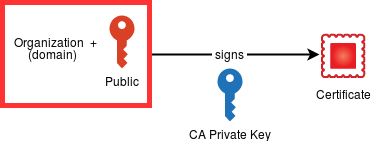
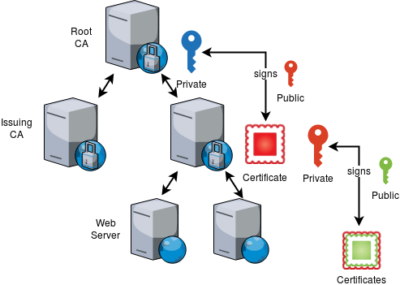
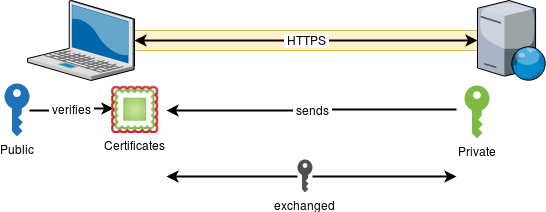

name: inverse
layout: true
class: center, middle, inverse
.indexlink[[<i class="fa fa-arrow-circle-o-up"></i>](#) [<i class="fa fa-list-ul"></i>](#index) [<i class="fa fa-tint"></i>](../change-color.php)[<i class="fa fa-file-pdf-o"></i>](download)]

---

name: normal
layout: true
class: left, middle
.indexlink[[<i class="fa fa-arrow-circle-o-up"></i>](#) [<i class="fa fa-list-ul"></i>](#index) [<i class="fa fa-tint"></i>](../change-color.php)[<i class="fa fa-file-pdf-o"></i>](download)]

---

template:inverse
# Web Security
<a href="http://www.fe.up.pt/~arestivo">André Restivo</a>

---

template: inverse
name:index
# Index

.indexlist[
1. [Introduction](#intro)
1. [Path Traversal](#path)
1. [SQL Injection](#sql)
1. [Account Lockout](#lockout)
1. [Cross-site Scripting](#xss)
1. [Cross-site Request Forgery](#csrf)
1. [Man in the Middle](#maninthemiddle)
1. [Credential Storage](#credential)
1. [Passwords](#passwordright)
1. [Session Fixating](#fixating)
1. [Session Hijacking](#hijacking)
1. [Sessions in PHP](#sessionphp)
1. [Denial of Service](#dos)
]

---

name:intro
template:inverse

# Introduction

---

# Attacks and Vulnerabilities

* A **vulnerability** is a hole or a weakness in the application, which can be a design flaw or an implementation bug, that allows an attacker to cause harm to the stakeholders of an application.

* **Attacks** are the techniques that attackers use to exploit the vulnerabilities in applications.

Reference: [Open Web Application Security Project](https://www.owasp.org/)

---

# OWASP Top 10 (2013)

* Injection
* Broken Authentication and Session Management
* Cross-Site Scripting (XSS)
* Insecure Direct Object References
* Security Misconfiguration
* Sensitive Data Exposure
* Missing Function Level Access Control
* Cross-Site Request Forgery (CSRF)
* Using Components with Known Vulnerabilities
* Unvalidated Redirects and Forwards

[OWASP Top 10 - 2013](https://www.owasp.org/index.php/Top_10_2013-Table_of_Contents)

---

# OWASP Top 10 (2017)

* Injection
* Broken Authentication
* Sensitive Data Exposure
* XML External Entities
* Broken Access Control
* Security Misconfiguration
* Cross-Site Scripting (XSS)
* Insecure Deserialization
* Using Components with Known Vulnerabilities
* Insufficient Logging & Monitoring

[OWASP Top 10 - 2017](https://www.owasp.org/images/7/72/OWASP_Top_10-2017_%28en%29.pdf.pdf)

---

# Security Impact

* Financial losses
* Intelectual property theft
* Brand reputation compromise
* Fraud
* Legal exposure
* Extortion

---

template: inverse
name: path
# Path Traversal Attack

---

# Path Traversal Attack

Using the **..** and **/** characters to gain access to files and directories that are not intended to be accessed.

```http
http://www.example.com/../../foo.txt
```

Normally web servers are well protected against this types of attacks but the application can also be targeted:

```http
http://www.example.com/page.php?page=../../foo.txt
```

```http
http://www.example.com/viewimage.php?path=viewimage.php
```

---

# Preventing

```http
http://www.example.com/index.php?page=news
```

Replace:

```php
  include('header.php');
  include($_GET['page']);
  include('footer.php');
```

With:

```php
  include('header.php');
  if ($page == 'news') include('news.php');
  if ($page == 'login') include('login.php');
  include('footer.php');
```

---

template: inverse
name: sql
# SQL Injection

---

# SQL Injection

Insertion of a SQL query via the **input data** from the client to the application.

SQL injection attacks allow attackers to:

* spoof identity
* tamper with existing data
* allow the complete disclosure of all data on the system
* become administrators of the database server

---

# Disclosure of data

```php
// $username has the name of the logged in user
$conn->query("SELECT * FROM items WHERE owner = '" . $username . "'");
```

Create account with username: "johndoe' OR 1 = 1--"

```sql
SELECT * FROM items WHERE owner = 'johndoe' OR 1 = 1--'
```

---

# Spoof identity

```php
// verifies if username and password are correct
$conn->query("SELECT * FROM users WHERE " .
      "username = '" . $username . "' AND password ='" . $password . "'");
```

Navigate to URL:

```http
http://www.example.com/login.php?username=johndoe&password=' OR 1 = 1; --
```

```sql
SELECT * users WHERE username = 'johndoe' AND password = '' OR 1 = 1; --'
```

---

# Gain privileges

```php
// searches for specific item
$conn->query("SELECT * FROM items WHERE title = '" . $title . "'");
```

Navigate to URL:

```http
http://www.example.com/search.php?title='; INSERT INTO users VALUES
('johndoe', 'password', true); --
```

Third parameter has admin status of user:

```sql
SELECT * FROM items WHERE title = ''; INSERT INTO users VALUES
('johndoe', 'password', true); --'
```

---

# SQL Injection


---

# SQL Injection


---

# Preventing

* Use of Prepared Statements (Parameterized Queries)
* Use of Stored Procedures
* Escaping all User Supplied Input

```php
$stmt = $conn->prepare('SELECT * FROM items WHERE title = ?');
$stmt->execute(array($title));
$items = $stmt->fetchAll();
```

---

template: inverse
name: lockout
# Account Lockout

---

# Account Lockout

* The web application contains an **account lockout protection** mechanism, but the mechanism is too restrictive and can be triggered too easily. These mechanisms are used against **brute force** attacks.
* This allows attackers to **deny service** to legitimate users by causing their accounts to be locked out.

> A famous example of this type an attack is the eBay attack. eBay always displays the user id of the highest bidder. In the final minutes of the auction, one of the bidders could try to log in as the highest bidder three times. After three incorrect log in attempts, eBay password throttling would kick in and lock out the highest bidder's account for some time. An attacker could then make their own bid and their victim would not have a chance to place the counter bid because they would be locked out. Thus an attacker could win the auction.

---

# Preventing

* Implement more intelligent password throttling mechanisms such as those which take **IP address** into account, in addition to the login name.
* Consider **alternatives** to account lockout that would still be effective against password brute force attacks, such as presenting the user machine with a puzzle to solve.

---

template: inverse
name: xss
# Cross-site Scripting (XSS)

---

# Cross-site Scripting (XSS)

Cross-Site Scripting (XSS) attacks are a type of **injection**, in which **malicious scripts** are injected into otherwise benign and trusted web sites.

---

#Types

* **Persistent** XSS generally occurs when user input is stored on the target server, such as in a database, in a message forum, visitor log, comment field, ...
* **Reflected** XSS occurs when user input is immediately returned by a web application in an error message, search result, or any other response that includes some or all of the input provided by the user as part of the request, without that data being made safe to render in the browser, and without permanently storing the user provided data.
* **DOM Based** XSS occurs when the data flow never leaves the browser. For example, the malicious script could be in the URL and the page inserts it into the DOM adding malicious code.

---

# Cross-site Scripting (XSS)

## Persistent

```php
<?php
  $stmt = $conn->prepare("INSERT INTO comment VALUES (DEFAULT, ?, ?, ?)");
  $stmt->execute(array($_POST['post_id'], $_POST['text'], $_SESSION['username']));
?>
```

```php
<?php
  $stmt = $conn->prepare("SELECT * FROM comment WHERE post_id = ?");
  $stmt->execute(array($_POST['post_id']));
  $comments = $stmt->fetchAll();

  foreach($comments as $comment) {
    echo "<div class=\"comment\">" . $comment['text'] . "</div>";
  }
?>
```

Comment text can contain malicious code that becomes persistently stored in the database and shown to all users.

---

# Cross-site Scripting (XSS)

## Reflected

```php
<?php
echo "You searched for: " . $_GET["query"];
// List search results
?> 
```

```http
http://example.com/search.php?query=<script>alert("hacked")</script>
```

---

# Cross-site Scripting (XSS)

## DOM Based

```javascript
var pos=document.URL.indexOf("language=") + 8;
var language = document.URL.substring(pos,document.URL.length));
$("#language").html(language);
```

```http
http://www.example.com/index.php?language=<script>alert("hacked")</script>
```

Or even:

```http
http://www.example.com/index.php#language=<script>alert("hacked")</script>
```

Fragment identifier is not sent to the server making it impossible to detect the attack there.

---

# Preventing

Never put untrusted data:

* directly in a **script**
* inside an **HTML comment**
* in an **attribute name**
* in a **tag name**
* directly in **CSS**
* inside **non safe attribute** values

---

# Preventing

## Validate

If input contains unexpected characters reject it:

```php
if ( !preg_match ("/^[a-zA-Z\s]+$/", $_GET['name'])) {
  // ERROR: Name can only contain letters and spaces
}
```

---

# Preventing

## Encode

* **Entity encoding** - Encode special characters as HTML entities:
```html
  <script>alert("hacked")</script>
  &#x3C;script&#x3E;alert(&#x22;hacked&#x22;)&#x3C;/script&#x3E;
```
* **URL encoding** - Encode URLs:
```http
http://example.com/search.php?q=<script>alert("h")</script>
http://example.com/search.php?q%3D%3Cscript%3Ealert(%22h%22)%3C%2Fscript%3E
```

---

# Preventing

Some rules for writing untrusted data:

* **Text** inside **HTML** Body: HTML **entity encoding**
* **HTML** inside **HTML** Body: **HTML cleaner**
* Safe HTML **Attributes**: HTML **entity encoding**
* GET Parameter: **URL encoding**

But this is not enough.

---

# Preventing in Javascript

HTML Escape Before Inserting Untrusted Data into HTML Element Content

```javascript
var entityMap = {
  "&": "&amp;",
  "<": "&lt;",
  ">": "&gt;",
  '"': '&quot;',
  "'": '&#39;',
  "/": '&#x2F;'
};

function escapeHtml(string) {
  return String(string).replace(/[&<>"'\/]/g, function (s) {
    return entityMap[s];
  });
}
```

Not enough. Use context aware encoders. For example: [OWASP ESAPI for Javascript](https://code.google.com/p/owasp-esapi-js/).

---

# Preventing in PHP

* Using [strip_tags](http://php.net/manual/en/function.strip-tags.php) and [htmlentities](http://php.net/manual/en/function.htmlentities.php) is [not enough](http://blog.isis.poly.edu/archive/vulnerabilities/2013/07/03/php-strip_tags-not-a-complete-protection-against-xss-repost-from-archive/).
* Instead use context aware encoders. For example: [OWASP ESAPI for PHP](http://code.google.com/p/owasp-esapi-php/).
* If some must be allowed you can use, for example, [HTML purifier](http://htmlpurifier.org/).

---

# Read More

* [OWASP XSS Prevention Cheat Sheet](http://goo.gl/rXJXg2)
* [OWASP DOM Based XSS Prevention Cheat Sheet](https://www.owasp.org/index.php/DOM_based_XSS_Prevention_Cheat_Sheet)
* [OWASP XSS Filter Evasion Cheat Sheet](https://www.owasp.org/index.php/XSS_Filter_Evasion_Cheat_Sheet)

---

template:inverse
name: csrf
# Cross-site Request Forgery (CSRF)

---

# Cross-site Request Forgery (CSRF)

The application allows a user to submit a state changing request that does not include anything secret.

```http
http://example.com/transferFunds.php?amount=1500&destination=4673243243
```

The attacker constructs a request that will transfer money from the victim’s account to the attacker’s account, and then embeds this attack in an image request stored on various sites under the attacker’s control:

```html

```

If the victim visits any of the attacker’s sites while already authenticated to example.com, these forged requests will automatically include the user’s session info, authorizing the attacker’s request.

---

# Preventing (NOT)

* Using a Secret Cookie
* Only Accepting POST Requests
* Multi-Step transactions
* URL Rewriting

These methods **DO NOT WORK**

---

# Preventing

* **Generate** a random token per session
* **Store** this token as a session variable
* **Send** this token as part of every (sensitive) request
* **Verify** the token is correct in every page

---

# Preventing

```php
session_start();
if (!isset($_SESSION['csrf_token'])) {
  $_SESSION['csrf']) = generate_random_token();
}
```

```php
<form action="transferfunds.php">
  <input type="hidden" name="csrf" value="<?=$_SESSION['csrf_token'])?>">
</form>
```

```php
session_start();
\\...
if ($_SESSION['csrf'] !== $_POST['csrf']) {
  // ERROR: Request does not appear to be legitimate
}
```

---

template: inverse
name:maninthemiddle
# Man in the Middle Attack

---

# Man in the Middle Attack

* **Intercept** a communication between two systems.
* Using different techniques, the attacker **splits** the original TCP connection into 2 new connections, one between the client and the attacker and the other between the attacker and the server
* Once the TCP connection is intercepted, the attacker acts as a proxy, being able to read, insert and modify the data in the intercepted communication.

.smaller[
  
]

---

# Public-key Cryptography

Also known as **asymmetric** cryptography, is a class of cryptographic algorithms which requires two separate keys, one of which is private and one of which is public.

* If the sender **signs** a message with his private key, any receiver can **verify** that the message was sent by him.
* If a sender **encrypts** a message with a public key, **only** the receiver having the private key can read that message.
* Let's see how this works without going too deep into the [math](https://www.onebigfluke.com/2013/11/public-key-crypto-math-explained.html) behind it.

---

# Public-key Cryptography

.smaller[
  
]

---

# Man in the Middle (again)

* Using encryption is **not enough** because every encryption method requires an additional exchange or transmission of information over a secure channel (e.g. the public key).

.smaller[
  
]

* The solution is to use public keys that have been signed by a **certificate authority** (CA).

---

# Digital Signature

* Digital signatures are a scheme that allows the demonstration of a message's authenticity.
* For efficiency reasons, normally only a hash of the original message is signed.

.smaller[
  
]

---

# Certificates

* Certificates are small data files that digitally bind a cryptographic key to an organization.
* By signing a certificate, a Certificate Authority (CA) states that it verified the organization's information.

.smaller[
  
]

---

# Certificate Authority

* Web browsers **trust** websites based on CAs that come **pre-installed** (Verisign/Comodo/Microsoft/...).
* The user trusts the CA to **vouch** only for **legitimate websites**.
* The website **provides** a **valid** certificate, which means it was signed by a trusted authority.
* The certificate **correctly identifies** the website.
* The user trusts that the protocol's encryption layer (TLS/SSL) is sufficiently **secure** against eavesdroppers.

---

# Chain of Thrust

.smaller[
  
]

---

# HTTPS

* **H**yper**t**ext **T**ransfer **P**rotocol **S**ecure (HTTPS) is just HTTP on top of the **SSL/TLS** protocol.
* The browser uses the pre-installed CAs certificates to verify the authenticity of the server's public key.
* Public key cryptography is used only initially to exchange a symmetric key to be used for communicating.

.smaller[
  
]

---

template: inverse
name: credential
# Credential Storage

---

# Password Transmission

Passwords have to be sent from the browser to the server. But they should **never**:

* Be sent over **http** (only https) to prevent man in the middle attacks or eavesdropping.
* Be sent using **GET** parameters as they will be displayed in the URL.
* Be encrypted in the browser. Being able to capture the encrypted password would be the same as capturing the plain text password.

---

# Hashing

In the case of a database breach, having passwords stored in **clear text**, allows the attacker to have **instant** access to **all** user passwords.

* Hash algorithms are one way functions. They turn any amount of data into a **fixed-length** *fingerprint* that **cannot** be reversed.
* Small changes in the original text originate completely different hashes.

---

# Hashing Workflow

* The user **creates** an account by entering a username and password.
* Their password is **hashed** and **stored** in the database.
* When the user attempts to login, the **hash** of the password they entered is **checked** against the **hash** of their real password.
* If the hashes **match**, the user is granted **access**. If not, the user is told they entered invalid login credentials.

```php
<?php
  $stmt = $db->prepare(INSERT INTO users VALUES (?, ?))';
  $stmt->execute(array($username, md5($password)));
```

```php
<?php
  $stmt = $db->prepare('SELECT * FROM users WHERE username = ? and password = ?');
  $stmt->execute(array($username, md5($password)));
  if ($stmt->fetch() !== false) {
    $_SESSION['username'] = $username;
  }  
```

---

# Cracking Hashes

* **Brute Force Attacks** - Try every possible combination of characters up to a given length.
* **Dictionary Attack** - Try every password and variants from a file. These files come from dictionaries and real password databases.
* **Lookup Tables** - Pre-compute the hashes of the passwords in a password dictionary.
* **Reverse Lookup Tables** - Start by creating a lookup table of hashes in the database. Effective because many users use the same password.
* **Rainbow Tables** - Rainbow tables are a time-memory trade-off technique. Slower but can store more hashes. [Examples](https://www.freerainbowtables.com/en/tables2/)

---

# Using Salt

## Everything is better with salt &trade;

* Lookup tables and rainbow tables only work because each password is hashed the **exact same way**.
* We can prevent this by **appending** a string to each password making pre-existing rainbow tables useless.

---

# Salt Reuse

Using the same salt for every user is ineffective:

* Two users with the **same password** will still have the same hash (**reverse lookup**).
* The attacker can generate a **rainbow table** for that specific salt.
* Finding the salt is relatively easy (especially if the salt is short).

---

# Double Hashing

Double hashing passwords, sometimes with different hashing algorithms, can make hashes **less secure**.

---

# Hashing Algorithm

* There are several hashing algorithms available. Some of them are currently considered **weaker** (MD5, SHA1).
* More secure hashing functions should be used like SHA256, SHA512 or bcrypt (blowfish).

---

# Slow Hash Functions

* High-end graphics cards (GPUs) and custom hardware can compute **billions of hashes per second** making brute force attacks still very effective.
* The goal is to make the hash function **slow enough** to impede attacks, but still **fast enough** to not cause a noticeable delay for the user.
* Key stretching is implemented using a special type of **CPU-intensive** hash function (e.g. **bcrypt**).
* These algorithms take a **security factor** or iteration count as an argument. This value determines how slow the hash function will be.

---

# Secret Key

* By adding a **secret fixed key** to all passwords we prevent an attacker that only gained access to the database to even try to crack the passwords.
* This key has to be **kept secret** from an attacker even in the event of a breach.
* The key must be stored in an **external system**, such as a physically separate server dedicated to password validation.

One can even use special dedicated hardware to store this secret key (e.g. [yubihsm](https://www.yubico.com/products/yubihsm/))

---

template:inverse
name: passwordright
# Passwords Done Right

---

# Salt

* Salt should be generated using a Cryptographically Secure Pseudo-Random Number Generator (**CSPRNG**).
* The salt needs to be **unique** per-user.
* The salt needs to be **long**.

---

# Generating

* Prepend the **salt** to the **password** and **hash** it with a standard cryptographic hash function such as **bcrypt**.
* Save both the salt and the hash in the user's database record.

---

# Validating

* Retrieve the user's **salt** and **hash** from the database.
* Prepend the **salt** to the given **password** and **hash** it using the same hash function.
* Compare the **hash** of the given password with the **hash** from the database.

Read more: [Hashing Security](https://crackstation.net/hashing-security.htm)

---

# Passwords in PHP

The recommended method to hash and validate passwords in PHP is by using the [password-hash](http://php.net/manual/en/function.password-hash.php) and [password-verify](http://php.net/manual/en/function.password-verify.php) functions.

```php
string password_hash ( string $password , integer $algo [, array $options ] )
```

```php
boolean password_verify ( string $password , string $hash )
```

* These functions generate their own salt.
* The **hash** function returns the used algorithm, cost and salt as part of the hash. Therefore, all information that's needed to verify the hash is included in it.
* This allows the **verify** function to verify the hash without needing separate storage for the salt or algorithm.

---

# PHP Example

```php
<?php
  $options = ['cost' => 12];
  $stmt = $db->prepare(INSERT INTO users VALUES (?, ?))';
  $stmt->execute(array(
    $username,
    password_hash($password, PASSWORD_DEFAULT, $options))
  );
```

```php
<?php
  $stmt = $db->prepare('SELECT * FROM users WHERE username = ?');
  $stmt->execute(array($username));
  $user = $stmt->fetch();
  if ($user !== false && password_verify($password, $user['password'], )) {
    $_SESSION['username'] = $username;
  }  
```

The current default algorithm is **bcrypt**.

---

# More on Passwords

* Make sure your usernames/userids are case **insensitive** (even emails).
* Implement proper **password strength** controls.
* Do **not** apply short or no length, character set, or encoding restrictions on the entry or storage of credentials.
* Design password storage **assuming** eventual compromise.

[OWASP Authentication Cheat Sheet](https://www.owasp.org/index.php/Authentication_Cheat_Sheet)


[OWASP Password Storage Cheat Sheet](https://www.owasp.org/index.php/Password_Storage_Cheat_Sheet)

---

template: inverse
name: fixating
# Session Fixation

---

# Session Fixation

This attack consists of obtaining a valid session id, inducing a user to authenticate himself with that session id, and then hijacking the user-validated session by the knowledge of the used session id.

```http
http://example.com/<script>document.cookie="sessionid=abcd";</script>
```

```http
http://example.com/<meta http-equiv=Set-Cookie content="sessionid=abcd">
```

---

# Preventing

Regenerate the session id in each request (or each n requests):

```php
<?php
  session_start();
  session_regenerate_id(true);
```

Destroy session if referrer is suspicious

```php
<?php
  if (strpos($_SERVER['HTTP_REFERER'], 'http://example.com/') !== 0)
    session_destroy();
```

---

template: inverse
name: hijacking
# Session Hijacking

---

# Session Hijacking

Gaining control of the user session by stealing the session id.

* Cross-site scripting
* Session Sniffing
* Man-in-the-middle attack

---

# Preventing

* Anti XSS measures
* HttpOnly flag
* HTTPS

---

template:inverse
name:sessionphp
# Sessions in PHP

---

# Sessions in PHP

Set the session cookie parameters:

* **Lifetime** - If 0, cookie is destroyed when browser closes. Otherwise the specifies the lifetime of the cookie in seconds.
* **Path** - Path on the domain where the cookie will work.
* **Domain** - Domain where the cookie will work (.example.com for all example.com subdomains).
* **Secure** - If true cookie will only be sent over secure connections.
* **HTTP Only** - If true the HttpOnly flag is sent to the browser (the cookie cannot be accessed through client side script).

```php
void session_set_cookie_params ( int $lifetime [, string $path
[, string $domain [, bool $secure = false [, bool $httponly = false ]]]] )
```

```php
session_set_cookie_params (0, '/site_dir/', 'http://www.example.com/, true, true);
session_start();
session_regenerate_id(true);
```

---

template: inverse
name: dos
# Denial of Service

---

# Denial of Service

Denial-of-service (DoS) or distributed denial-of-service (DDoS) attack is an attempt to make a machine or network resource unavailable to its intended users.

There are [many ways](http://en.wikipedia.org/wiki/Denial-of-service_attack#Methods_of_attack) to make a service unavailable for legitimate users by manipulating network packets,
programming, logical, or resources handling vulnerabilities, among others.

---

template: inverse
# And Finally...

---

# NEVER TRUST YOUR USERS
