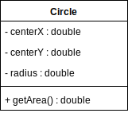
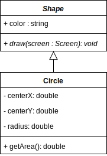
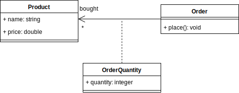
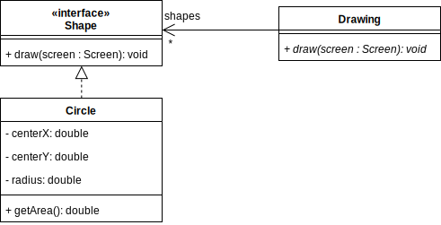

name: inverse
layout: true
class: center, middle, inverse
.indexlink[[<i class="fa fa-arrow-circle-o-up"></i>](#) [<i class="fa fa-list-ul"></i>](#index) [<i class="fa fa-tint"></i>](../change-color.php)[<i class="fa fa-file-pdf-o"></i>](download)]

---

name: normal
layout: true
class: left, middle
.indexlink[[<i class="fa fa-arrow-circle-o-up"></i>](#) [<i class="fa fa-list-ul"></i>](#index) [<i class="fa fa-tint"></i>](../change-color.php)[<i class="fa fa-file-pdf-o"></i>](download)]

---

template:inverse
# UML
## Class Diagrams

<a href="http://www.fe.up.pt/~arestivo">André Restivo</a>

---

template: inverse
name:index
# Index

.indexlist[
1. [Introduction](#introduction)
1. [Classes](#classe)
1. [Inheritance](#inheritance)
1. [Associations](#associations)
1. [Interfaces](#interfaces)
1. [Aggregation](#aggregation)
]

---

template: inverse
name:introduction
# Introduction

---

# Types of Diagrams

In UML, there are two basic categories of diagrams: 
  
* **Structure** diagrams show the static structure of the system being modeled: class, component, and or object diagrams.

* **Behavioral** diagrams show the dynamic behavior between the objects in the system: activity, use case, and sequence diagrams.

---

# Class Diagrams

Class diagrams show the classes of the system, their relationships (including inheritance, aggregation, and association), and the operations and attributes of the classes. 

Class diagrams are used for different purposes: 
  
* Conceptual **domain** modeling: 

  * Illustrates meaningful conceptual classes in problem domain.
  * Represents real world concepts, not software components.

* Detailed **design** modeling: 

  * Represents the concrete software components.

---

template: inverse
name:classes
# Classes

---

# Class

The UML representation of a class is a **rectangle** containing **three** **compartments** stacked **vertically**:

---

# Class Attribute List

The **middle** compartment lists each of the **attributes** of the class on a separate line.

Each line uses the following format:

  > name : attribute type

For example:

  > width : double

---

# Attribute Default Value

**Default** values can be specified (**optionally**) in the attribute list section by using the following **notation**:

  > name : attribute type = default value

For example:

  > width : double = 0

---

# Class Operations List

The **lowest** compartment lists each of the **operations** of the class on a separate line.

Each line uses the following format:

  > name(parameter list) : type of value returned

For example:

  > setRadius(radius : double) : void

---

# Operation Parameters

When an **operation** has **parameters**, they are put inside **parentheses**.

Each parameter uses the **format**:

 > parameter name : parameter type

They can also have a **optional** "in" or "out" marking specifying if the parameter is an **input** or **output** parameter.

For example:

  > setRadius(in radius : double) : void

---

template: inverse
name:inheritance
# Inheritance

---

# Inheritance

The ability of one class (child class) to **inherit** the identical **functionality** of another class (super class), and then **add** **new** **functionality** of its own.

Inheritance is indicated by a **solid line** with a **closed**, **unfilled** arrowhead **pointing** at the **super** **class**.

---

# Abstract classes and operations

**Abstract** operations are operations where the class only provides the operation **signature** and **not it's code**.

> They are represented in *italic*.

**Abstract** classes are classes that **contain** **abstract** operations and, therefore, cannot be instantiated.

---

template: inverse
name:associations
# Associations

---

# Bi-directional association

Associations are assumed to be **bi-directional** by default. This means that both classes are aware of each other.

A bi-directional association is indicated by a **solid line** between the two classes.

At either end of the line, you place a **role** name and a **multiplicity** value.

---

# Multiplicity

Some examples of possible **multiplicities**:

.simple[
| Multiplicity 	| Option 	| Cardinality                             	|
|--------------	|--------	|-----------------------------------------	|
| 0..0         	| 0      	| Collection must be empty                	|
| 0..1         	|        	| No instances or one instance            	|
| 1..1         	| 1      	| Exactly one instance                    	|
| 0..*         	| *      	| Zero or more instances                  	|
| 1..*         	|        	| At least one instance                   	|
| 5..5         	| 5      	| Exactly 5 instances                     	|
| m..n         	|        	| At least m but no more than n instances 	|
]

---

# Uni-directional association

In a uni-directional association, **two classes** are **related**, but **only one** class **knows** that the relationship exists.

A uni-directional association is drawn as a **solid line** with an **open** **arrowhead** pointing to the **known** class. 

---

# Association Class

An **association class** includes **information** about a **relationship**.

It is represented like a **normal class** but has a **dotted line** **connecting** it to the **association**.

---

template: inverse
name:interfaces
# Interfaces

---

# Interface

* An interface is a **description** of the **actions** that an object **can do**.

* The **combination** of all **public** **methods** and **properties** of an **object**.

* Interfaces can also be seen as **contracts** that other classes must fulfil.

In UML, an interface is depicted just like a **class** but with a **«interface» keyword**.

---

# Implementation

A class can **declare** that it **implements** a certain **interface** in a very similar way to inheritance (but with the line **dotted** and not solid).

---

template: inverse
name:aggregation
# Aggregation

---

# Aggregation

* Aggregation is a special type of **association** used to model a "**whole** to its **parts**" relationship.

* An association with an **aggregation relationship** indicates that **one** class is a **part** of **another** class.

* In an aggregation relationship, the **child** class instance can **outlive** its **parent** class.

* To represent an aggregation we use an **unfilled diamond** shape on the **parent**'s association **end**.

---

# Composition

* The **composition aggregation** relationship is another, **stronger**, form of the aggregation relationship. 

* In an **composition aggregation** relationship, the **child** class instance **cannot** **outlive** its **parent** class.

* To represent a composition aggregation we use an **filled diamond** shape on the **parent**'s association **end**.

