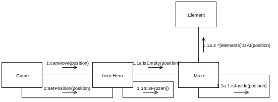

name: inverse
layout: true
class: center, middle, inverse
.indexlink[[<i class="fa fa-arrow-circle-o-up"></i>](#) [<i class="fa fa-list-ul"></i>](#index) [<i class="fa fa-tint"></i>](../change-color.php)[<i class="fa fa-file-pdf-o"></i>](download)[<i id="laser" class="fa fa-circle"></i>](#)]

---

name: normal
layout: true
class: left, middle
.indexlink[[<i class="fa fa-arrow-circle-o-up"></i>](#) [<i class="fa fa-list-ul"></i>](#index) [<i class="fa fa-tint"></i>](../change-color.php)[<i class="fa fa-file-pdf-o"></i>](download)[<i id="laser" class="fa fa-circle"></i>](#)]

---

template:inverse
# UML
## Communication Diagrams

<a href="http://www.fe.up.pt/~arestivo">André Restivo</a>

---

template: inverse
name:index
# Index

.indexlist[
1. [Introduction](#introduction)
2. [Objects](#objects)
3. [Messages](#messages)
4. [Sequence Expressions](#sequence)
]

---

template: inverse
name:introduction
# Introduction

---

# Types of Diagrams

In UML, there are two basic categories of diagrams: 
  
* **Structure** diagrams show the static structure of the system being modeled: *class*, *component*, *deployment*, *object* diagrams, ...

* **Behavioral** diagrams show the dynamic behavior between the objects in the system: *activity*, *use case*, **communication**, *state machine*, *sequence* diagrams, ...

---

# Communication Diagrams

Communication diagrams are a **simplified** version of a **sequence diagrams**.

The main difference is that **sequence** diagrams are good at showing **sequential logic** but not that good at giving you a **big picture view**.

---

template: inverse
name:objects
# Objects

---

# Objects

Objects are **named elements** which represent a **individual participants** in the interaction.

An object is represented by a rectangle that identifies the participant element.

The element can be an **anonymous** representative of a certain class, or a **named** one.

---

# Actors

An **Actor** is always something (a system or person) that is **outside** the **scope** of the system.

Actors are drawn as **stickman** figures (although they may not be users), and can be participants in communication diagrams.

---

template: inverse
name:messages
# Messages

---

# Messages

Messages are represented by a **line** with an arrow above that indicates the direction of the message (and a sequence expression).

---

template: inverse
name:sequence
# Sequence Expressions

---

# Sequence Expressions

The sequence expression is a dot (".") separated **list** of **sequence terms** followed by a colon (":") and **message name** after that:

~~~bash
term1.term2.term3:message
~~~

Each sequence term represents a **level** of procedural **nesting** within the **overall** interaction. Each sequence-term has the following syntax:

~~~bash
integer [ name ] [ recurrence ] 
~~~

---

# Sequence Order

The integer represents the sequential order of the message within the next higher level of procedural calling (**activation**). 

Messages that differ in one integer term are **sequential** at that **level of nesting**. 

---

# Sequence Name

The **name** represents a **concurrent thread** of control. Messages that differ in the final name are **concurrent** at that level of nesting. 

The hero instance send **both** requests (1.1a and 1.1b) to the Maze object **concurrently**.

---

# Sequence Recurrence

The recurrence of a sequence term can be a **guard** (a condition inside **square brackets**) or a **loop** (an **asterisk** followed by a condition inside **square brackets**).

