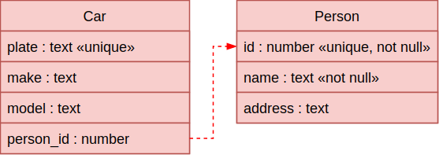
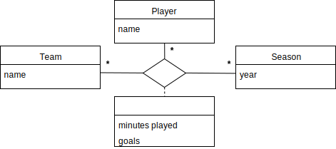

name: inverse
layout: true
class: center, middle, inverse
.indexlink[[<i class="fa fa-arrow-circle-o-up"></i>](#) [<i class="fa fa-list-ul"></i>](#index) [<i class="fa fa-tint"></i>](../change-color.php)[<i class="fa fa-file-pdf-o"></i>](download)]

---

name: normal
layout: true
class: left, middle
.indexlink[[<i class="fa fa-arrow-circle-o-up"></i>](#) [<i class="fa fa-list-ul"></i>](#index) [<i class="fa fa-tint"></i>](../change-color.php)[<i class="fa fa-file-pdf-o"></i>](download)]

---

template:inverse
# Database Modeling using UML
<a href="http://www.fe.up.pt/~arestivo">André Restivo</a>

---

template:inverse
name:index
# Index

.indexlist[
1. [Introduction](#intro)
1. [Classes and Attributes](#classes)
1. [Associations](#associations)
1. [Example](#example1)
1. [Inheritance](#inheritance)
1. [Example](#example2)
1. [Redundancy](#redundancy)
]

---

template: inverse
name:intro
# Introduction

---

# UML

**Unified Modeling Language**

* **General-purpose** modeling language;
* For **software engineering**;
* To **design** and **visualize** a system.

---

# UML: Types of Diagrams

In UML, there are two basic categories of diagrams: 
  
* **Structure** diagrams show the static structure of the system being modeled: **class**, *component*, *deployment*, *object* diagrams, ...

* **Behavioral** diagrams show the dynamic behavior between the objects in the system: *activity*, *use case*, *communication*, *state machine*, *sequence* diagrams, ...

---

# Class Diagrams

Class diagrams show the **classes** of the system, their **relationships** (including inheritance, aggregation, and association), and the **operations** and **attributes** of the classes. 

Class diagrams are used for different purposes: 
  
* Conceptual **domain** modeling: 

  * Illustrates meaningful conceptual classes in problem domain.
  * Represents real world concepts, not software components.

* Detailed **design** modeling: 

  * Represents the concrete software components.

---

template: inverse
name:classes
# UML Classes for Database Modeling

---

# UML Classes for Database Modeling

* A **classical** way to model relational databases is to use the *entity-relationship* model.
* But a **subset** of UML class diagrams can also be used.
* With **classes** representing **entities**.

---

# Classes

Object or concept from the real world with an independent existence:

.box_example[**Physical** entity: car, employee, student, ...]

.box_example[**Conceptual** entity: class, profession, type, ...]

---

# Associations and Attributes

**Associations**: represent interactions between 2 or more classes.

.box_example[
car belongs to person.
]

**Attributes**: properties that describe a class.

.box_example[
person has a name and an address.
]

---

# Attribute Domain

* In a class diagram, attributes represent the **values** that
will be stored in the database.
* An attribute should **never** be a reference to another class.
* Attribute **domain**: The set of possible values for that attribute.

.box_example[
The email address attribute can only contain valid email addresses.
]

---

template: inverse
name:classes
# Classes and Attributes

---

# Classes and Attributes

The UML representation of a class is a **rectangle** containing **three** **compartments** stacked **vertically**.

For databases we use **only two** of these: 

* The **name** of the class.
* And a list of **attributes** (with and optional domain).

---

# Derived Attributes

* Attributes that **can be calculated** from other attributes or entities.
* They **don’t need** to be a part of the database.
* Nevertheless, they are commonly represented in database model.
* They are represented using a *forward slash* (/).

.box_example[
A person’s age can be calculated from that person’s birth date.
]

---

# The Null Value

* A null value represents an **unknown** value.
* Or that the value is not **appliable**.
* It is **not the same** as an empty character string.
* Some attributes might **not allow null** values.
* We will represent these with a not null stereotype («not null»).

---

# Unique Attributes

* Some attributes do not allow repeated values.
* We will represent these with a not null stereotype («unique»).

.box_example[
Two different cars cannot have the same plate number. If we know the
plate number we can identify the car it belongs to.
]

---

template: inverse
name: associations
# Associations

---

# Associations

* An association describes a **relationship** between one or more classes.
* Should be used **instead** of having attributes that reference other classes.

.box_example[
A car belongs to a person.
]

* **Never** use an attribute of another class to *mimic* an association.

---

# Associations

* A simple association is represented by a **line** between two classes.
* Associations also have a **name** and the **multiplicity** of each participating class.

**Some Examples**:

---

# Multiplicity

Some examples of possible **multiplicities**:

.simple[
| Multiplicity 	| Shorthand 	| Cardinality                             	|
|--------------	|-----------	|-----------------------------------------	|
| 0..0         	| 0         	| Collection must be empty                	|
| 0..1         	|           	| No instances or one instance            	|
| 1..1         	| 1         	| Exactly one instance                    	|
| 0..*         	| *         	| Zero or more instances                  	|
| 1..*         	|           	| At least one instance                   	|
| 5..5         	| 5         	| Exactly 5 instances                     	|
| m..n         	|           	| At least m but no more than n instances 	|
]

---

# Association Class

* Some times associations also have **attributes**.
* This is represented with an **association class**.
* This is common in *many-to-many* associations.

* A **student** has a **grade** in a **course** he is enrolled to.
* It is **not** an attribute of the student; a student has many grades.
* It is **not** an attribute of the course; a course has many students.
* It is an attribute of the **association** between the two.

---

# Aggregation

* Aggregation is a **special** type of **association** used to model a "**whole to its parts**" relationship.
* An association with an aggregation relationship indicates that one class is a **part** of another class.
* In an aggregation relationship, the **child** class instance **can outlive** its **parent** class.
* To represent an aggregation we use an **unfilled diamond** shape on the parent's association end.

---

# Composition

* The composition aggregation relationship is another, **stronger**, form of the aggregation relationship.
* In an composition aggregation relationship, the child class instance **cannot outlive** its parent class.
* To represent a composition aggregation we use an **filled diamond** shape on the parent's association end.

This means that we **do not want** to have **courses** in our database **without** a **department**.

---

# Qualified Association

* Qualified associations define an **attribute** that is used to **distinguish** between the associated instance.

* In this example, a club can have **many members**, but **only one for each number**. 
* The members can belong to **many clubs** and there is no restriction on their number. A member can have the same number in two different clubs.

---

# Ternary Association

* It is possible to have associations between **more than two** classes.
* These can also have **association** classes.

* In this case, a team can have different players in each season.

---

# Ternary Association

* To define the **multiplicity** in a ternary association, simply **fix two** of the classes, and think about the multiplicity of those two when combined with the other.

* In this case, a player **cannot play** in more than **one team** in the **same season**.
* If we **fix** the **player** and **season**, there can only be **one team** associated with them.

---

# Ternary Association

* A **ternary** association can always be seen in terms of **binary** associations.
* If it **can not** then it **is not** a ternary association.

---

template: inverse
name: example1
# Example

---

# Example
* A company has several departments.
* Each department has a name, and a manager. The date
when the manager was assigned to the department should also be
stored.
* Each department controls several projects. Each project has a
name and a numerical identifier.
* Each employee has a name, a serial number, an address and a salary.
* An employee belongs to a department but can work in many projects
(some of them from different departments).
* The number of hours each employee is supposed to work in each
project should also be stored.
* Each employee can have a supervisor assigned to him.

---

# Solution

---

template: inverse
name: inheritance
# Inheritance

---

# Inheritance

* The ability of one class to **inherit** the **data fields** from **another** class, and then **add** extra ones.
* Represents a "**is-a**" relationship. Do not use simply because two classes share the same data fields.
* Inheritance is indicated by a **solid line** with a **closed**, **unfilled** **arrowhead** pointing at the super class.

---

template: inverse
name: example2
# Example

---

# Example

* A hospital has several doctors. Each doctor has a name, an address, and a phone number.
* Some doctors have a specialty (*e.g.*, cardiology).
* Patients have a name, an address, and a birth date.
* Patients can be insured by an insurance company (which has a name). Each patient has an insurance number for each company that must be unique for that company.
* Appointments are scheduled between patients and doctors on a specific date.
* In each appointment, one or more drugs can be prescribed by the doctor. Each drug has a name. It is essential to store the dosage prescribed for each drug in each appointment.
* Each drug is manufactured by a laboratory that has a name and an address.

---

# Solution

---

template: inverse
name: redundancy
# Redundancy
