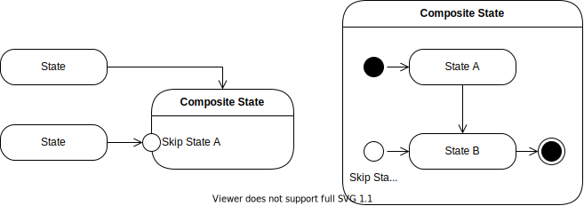
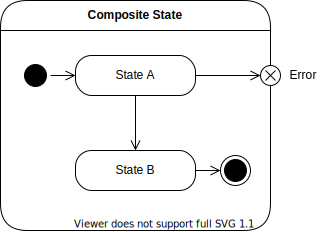

name: inverse
layout: true
class: center, middle, inverse
.indexlink[[<i class="fa fa-arrow-circle-o-up"></i>](#) [<i class="fa fa-list-ul"></i>](#index) [<i class="fa fa-tint"></i>](../change-color.php)[<i class="fa fa-file-pdf-o"></i>](download)]

---

name: normal
layout: true
class: left, middle
.indexlink[[<i class="fa fa-arrow-circle-o-up"></i>](#) [<i class="fa fa-list-ul"></i>](#index) [<i class="fa fa-tint"></i>](../change-color.php)[<i class="fa fa-file-pdf-o"></i>](download)]

---

template:inverse
# UML
## State Diagrams

<a href="http://www.fe.up.pt/~arestivo">André Restivo</a>

---

template: inverse
name:index
# Index

.indexlist[
1. [Introduction](#introduction)
1. [Basic Components](#basic)
1. [Composite States](#composite)
]

<!--1. [Pseudo States](#pseudostates)
1. [History State](#history)
1. [Concurrent Regions](#concurrent)-->

---

template: inverse
name:introduction
# Introduction

---

# Types of Diagrams

In UML, there are two basic categories of diagrams: 
  
* **Structure** diagrams show the static structure of the system being modeled: *class*, *component*, *deployment*, *object* diagrams, ...

* **Behavioral** diagrams show the dynamic behavior between the objects in the system: *activity*, *use case*, *communication*, *state machine*, **sequence** diagrams, ...

---

# State Diagrams

UML State machine diagrams are behavioral diagrams which show the discrete behavior of a part of designed system through finite state transitions. 

They are particularly useful when defining the behavior of the [State Pattern](https://web.fe.up.pt/~arestivo/presentation/patterns/#state).

While UML Sequence diagrams usually depict generic or specific instances of interactions, UML State diagrams aim to depict the **complete inner-workings** of a system.

---

template: inverse
name:basic
# Basic Components

---

# State

A state is denoted by a round-cornered rectangle with the name of the state written inside it.

---

# Initial and Final States

The initial state is denoted by a filled black circle. 

The final state is denoted by a circle with a dot inside.

Both can be labeled with a name.

---

# Transitions

Transitions from one state to the next are denoted by lines with arrowheads. 

A transition may have a trigger, a guard and an effect.

* **Trigger** is the cause of the transition, which could be a signal, an event, a change in some condition, or the passage of time.
* **Guard**" is a condition which must be true in order for the trigger to cause the transition. 
* **Effect** is an action which will be invoked directly on the object that owns the state machine as a result of the transition.

---

# Actions

If the target state has many transitions arriving at it, and each transition had the same effect associated with it, it would be better to associate the effect with the target state rather than the transitions. 

This can be done by defining an entry action for the state. There can also be exit actions, actions that happen when a certain event occurs, and actions that always occur.

---

# Self-Transitions

A state can have a transition that returns to itself. 

This is useful when an effect is associated with the transition without the state changing.

---

template: inverse
name:composite
# Composite

---

# Composite

A state machine diagram may include sub-machine diagrams.

---

# Separate Diagrams

It is also possible to simplify the diagram by showing composite states as separate diagrams.

---

# Entry Point

Sometimes you do not want to enter a sub-machine at the normal initial state. 

In those cases, you can have an alternative labeled entry point.

---

# Exit Point

It is also possible to have named alternative exit points. 

<!--

-

template: inverse
name:pseudostates
# Pseudostates

-

# Choice Pseudostate

A choice pseudo-state allows you to split a transition into multiple outgoing paths, each one with its own guard condition.

-

# Junction Pseudostate

-

template: inverse
name:history
# History

-

template: inverse
name:concurrent
# Concurrent

-
-->