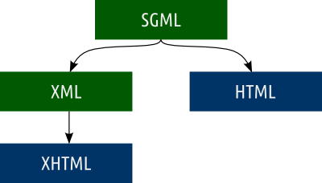

name: inverse
layout: true
class: center, middle, inverse
.indexlink[[<i class="fa fa-home"></i>](#) [<i class="fa fa-list"></i>](#index)]

---

name: normal
layout: true
class: left, middle
.indexlink[[<i class="fa fa-home"></i>](#) [<i class="fa fa-list"></i>](#index)]

---

template:inverse
# XML
<a href="http://www.fe.up.pt/~arestivo">André Restivo</a>

---

template: inverse
name:index
# Index

.indexlist[
1. [Introduction](#intro)
]

---

template: inverse
name:intro
# Introduction

---

# Markup Languages

* A **markup language** is a set of words and symbols for describing the
  identity or function of the component parts of a document.
* Programs can use markup with a **stylesheet** to transform the document into
  output for screen, print, audio, video, Braille, or reprocessable data
  formats.

---

# XML

* E**x**tensible **M**arkup **L**anguage (XML) 
* A **markup language** that defines a set of rules for encoding documents in a
  format which is both human-readable and machine-readable.
* It is **extensible** because it is not a fixed format like HTML (which is a
  single, predefined markup language).
* XML is a metalanguage which lets you design your own markup languages for 
  limitless different types of documents.
  
---

# SGML

* SGML is the **S**tandard **G**eneralized **M**arkup **L**anguage, the
  international standard for defining markup to describe the structure of
  different types of electronic document.
* SGML is very **large**, **powerful**, and **complex**.
* XML is a **lightweight** cut-down version of SGML.

---

# SGML, XML and HTML



* SGML and XML are **metalanguages**. They allow users to develop their own
  languages.
* HTML and XHTML are **concrete** languages with a fixed format.

---

template: inverse
name: xml

# XML

---

# Well Formed

An XML document is considered well formed if it:

* contains **one** or **more** elements.
* it has exactly **one root**.
* elements **nest properly** with each other.

---

# Processing Instructions

Processing instructions allow documents to contain instructions for applications

Since **XML 1.1**, all XML documents must start with a processing instruction (prolog) indicating the XML version. If not, the document is considered to be **XML 1.0**.

```xml
<?xml version="1.1" encoding="utf-8"?>
```

The encoding is **utf-8** by default.

---

# Comments

Comments start with a ```<!--``` and end with ```-->```.

```xml
<!-- This is a comment -->
```

Comments cannot contain double hyphens (```--```).

---

# CDATA

CDATA sections are used to escape blocks of text containing characters which would otherwise be recognized as markup.

They begin with the string ```<![CDATA[``` and end with the string ```]]>```.

```xml
<![CDATA[
  <warning>These tags are not markup</warning>
]]> 
```

---

# Elements

* Elements are defined by a **start tag** and an **end tag**.
* All elements **must be closed**. 
* All elements opened inside an element must be closed **before** the **parent** element is **closed**.
* Element names are case sensitive. The element **start tag** must match the element **end tag** case.
* Empty elements can use a ```/``` in the end instead of a closing tag.

```xml
<?xml version="1.1"?>
<message>
	<to>Mr. John Doe</to>
	<from>Ms. Jane Doe</from>
	<text>How are you?</text>
	<private/> <!-- this is an empty element -->
</message>	
```

---

# Attributes

* Attributes are used to associate **name-value** pairs with elements.
* Attributes only appear in element **start** tags (or empty element tags).
* Attributes must be single or double **quoted**.

```xml
<?xml version="1.1"?>
<message date="2014-12-03" private="yes">
	<to>Mr. John Doe</to>
	<from>Ms. Jane Doe</from>
	<text>How are you?</text>
</message>	
```

Attributes should be used for **metadata**.

---

template: inverse
name: valid
# Valid XML

---

# Document Type Definition

```xml
<?xml version="1.1"?>
<!DOCTYPE message SYSTEM "message.dtd">
<message>Hello, world!</message> 
```
