name: inverse
layout: true
class: center, middle, inverse
.indexlink[[<i class="fa fa-arrow-circle-o-up"></i>](#) [<i class="fa fa-list-ul"></i>](#index) [<i class="fa fa-tint"></i>](../change-color.php)[<i class="fa fa-file-pdf-o"></i>](download)]


---

name: normal
layout: true
class: left, middle
.indexlink[[<i class="fa fa-arrow-circle-o-up"></i>](#) [<i class="fa fa-list-ul"></i>](#index) [<i class="fa fa-tint"></i>](../change-color.php)[<i class="fa fa-file-pdf-o"></i>](download)]


---

template:inverse
# XPath
<a href="http://www.fe.up.pt/~arestivo">André Restivo</a>

---

template: inverse
name:index
# Index

.indexlist[
1. [Introduction](#intro)
1. [Data Types](#data)
1. [Location Path](#location)
1. [Axis](#axis)
1. [Node Tests](#tests)
1. [Predicates](#predicates)
1. [Abbreviations](#abbreviations)
1. [Examples](#examples)
1. [In Javascript](#javascript)
1. [Evaluator](#evaluator)
]

---

template: inverse
name:intro
# Introduction

---

# XPath

* XPath is a language for addressing parts of an XML document.
* XPath models an XML document as a tree of nodes.
* There are different types of nodes, including **element** nodes, **attribute** nodes and **text** nodes.

---

# Node Types

These types of nodes are used to represent a document as a tree:

* A **document** node is the root node of the tree. It will always have as its child an element node for the outermost element of the document. It may also have comment or processing instruction nodes as children, if those nodes appear outside the document.
* Each **element** node represents one XML tag.
* Attribute of an element are represented by **attribute** nodes.
* Text inside an element become **text** nodes.
* Comments are represented as **comment** nodes.
* XML's <?...?> constructs become **processing instructions** nodes.

---

template:inverse
# Resources

* References:
  * http://www.w3.org/TR/xpath/

---

template:inverse
name:data
#Data Types

---

#Data Types

XPath expressions use these data types:

* **node-set** A set of zero or more nodes.
* **boolean** A true or false value.
* **number** Numbers in XPath are represented using floating point.
* **string** A string of characters.

---

template:inverse
name:location
#Location Path

---

# Location Path

A location path selects a set of nodes relative to the **context node**.

If preceded by a **/**, a location becomes absolute and the context node is the root of the document.

A location path is composed by **location steps** separated by a **/**. Each location step has 3 parts:

* an axis.
* a node test.
* zero or more predicates.

```xpath
child::para[position()=1]
```

In this example, **child** is the axis, **para** is the node test and **position()=1** is a predicate.

---

template:inverse
name:axis

# Axis

---

# Axis

An axis specifies the tree relationship between the nodes selected by the location step and the context node.

---

#Self

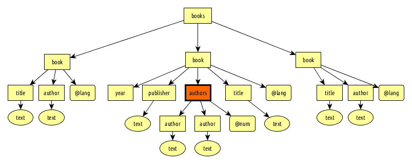

---

#Child

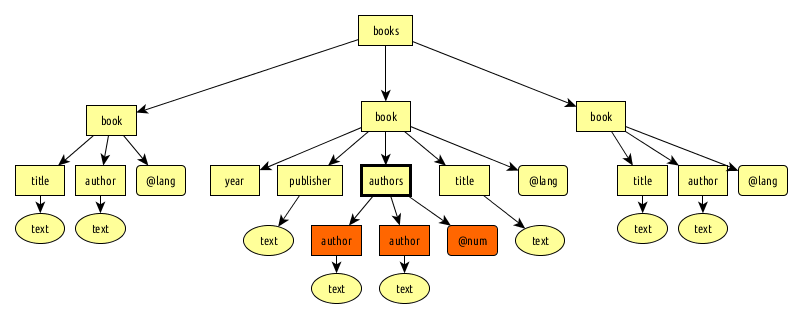

---

#Descendant

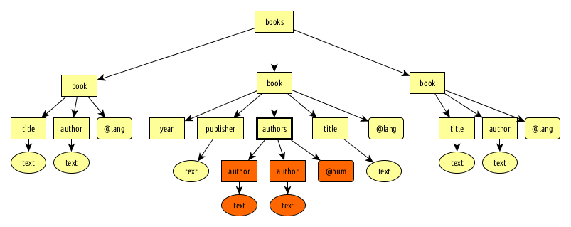

---

#Parent

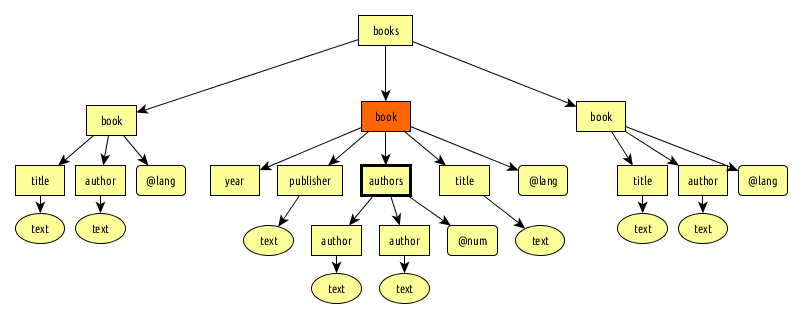

---

#Ancestor

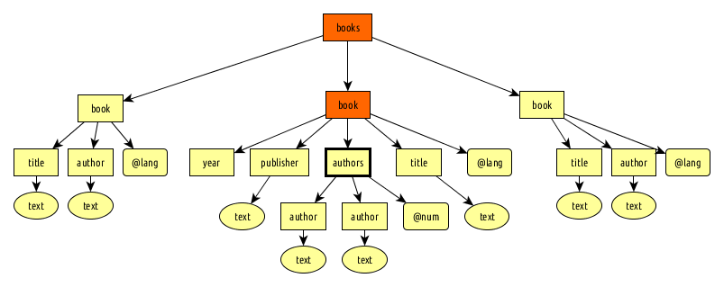

---

#Ancestor or Self

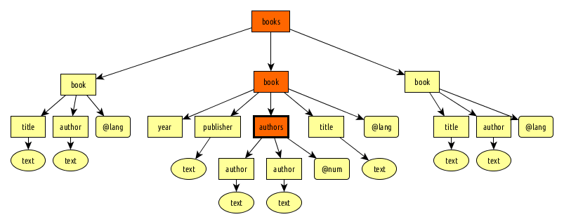

---

#Descendant or Self

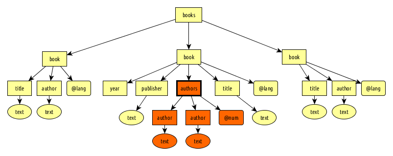

---

#Preceding Sibling

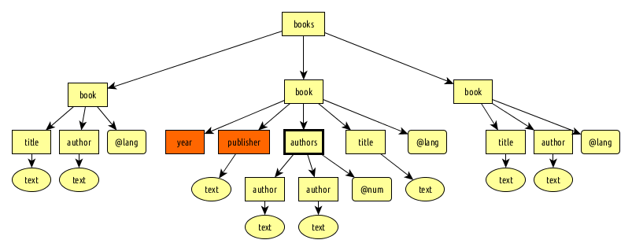

---

#Following Sibling

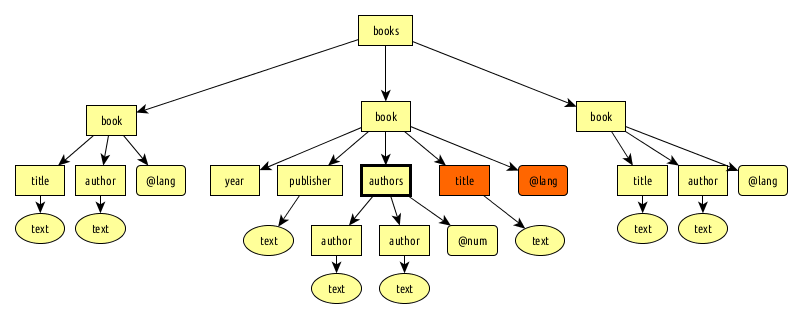

---

#Preceding

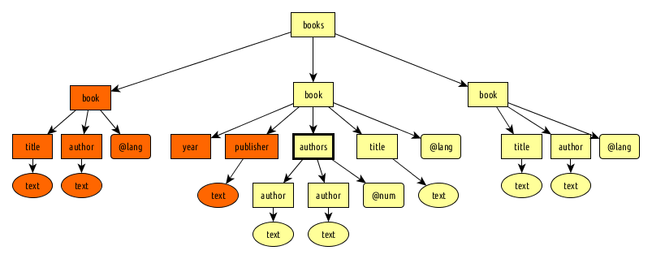

---

#Following

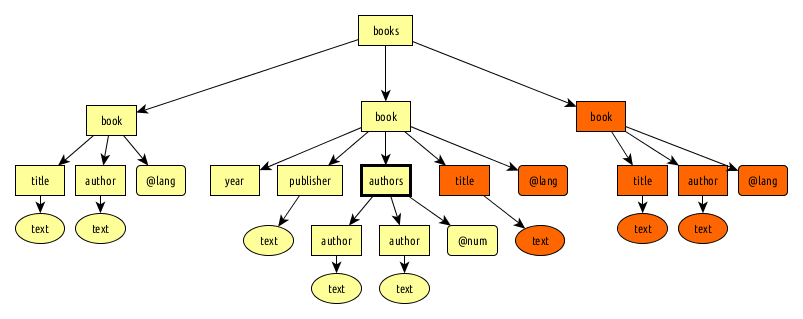

---

#Attribute

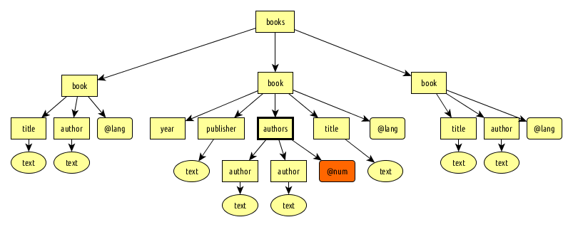

---

template:inverse
name:tests
# Node Tests

---

# Principal Node Type

Every axis has a principal node type. If an axis can contain elements, then the principal node type is element; otherwise, it is the type of the nodes that the axis can contain. Thus,

* For the **attribute** axis, the principal node type is **attribute**.
* For the **namespace** axis, the principal node type is **namespace**.
* For other **axes**, the principal node type is **element**.

---

# QName

A node test that is a **QName** is true if and only if the type of the node is the principal node type and has an name equal to the name specified by the QName.

```xpath
child::author
```

This XPath expression selects all children elements of the context node that are elements named author.

---

# All

A node test ***** is true for any node of the **principal node type**.

```xpath
child::*
```
This XPath expression selects all children elements of the context node.

```xpath
attribute::*
```
This XPath expression selects all attributes of the context node.

---

# Text

The node test **text()** is true for any text node.

```xpath
child::text()
```
This XPath expression selects all children text nodes of the context node.

---

# Comment

The node test **comment()** is true for any comment node.

```xpath
child::comment()
```
This XPath expression selects all children comment nodes of the context node.

---

# Processing Instruction

The node test **processing-instruction()** is true for any processing instruction node.

```xpath
child::processing-instruction()
```
This XPath expression selects all children processing instruction nodes of the context node.

---

# Node

A node test node() is true for any node of any type whatsoever (i.e. not only from the principal node type).

```xpath
child::node()
```

This XPath expression selects all children nodes of the context node.

---

template:inverse
name:predicates
# Predicates

---

# Predicates

In a **e1[e2]** expression, square brackets enclose a predicate, which specifies an expression e2 that selects nodes from a larger set e1.

A location step has 0 or more predicates.

```xpath
child::book[attribute::lang='en']
```

This XPath expression selects all children elements named book that have an attribute lang with the value *en*.

---

# Node Set Functions

Some of the functions that can be used in predicate expressions:

|||
|-:|-|
| **last()** | returns a number equal to the context size from the expression evaluation context. The context size is the number of children of the context node's parent.
| **position()** | returns a number equal to the context position from the expression evaluation context. The context position is the child number of the context node relative to its parent.
| **count(node-set)** | returns the number of nodes in the argument node-set.
| **false()** | returns the boolean *false* value.
| **true()** | returns the boolean *true* value.

---

# Examples

|||
|-:|-|
| **child::book[1]** | selects the first *book* child of the context node
| **child::book[last()]** | selects the last *book* child of the context node
| **child::book[attribute::lang="en"][5]** | selects the *book* childs with a attribute *lang* with the value *en*. Of those, selects the fifth one.

---

template:inverse
name:abbreviations
# Abbreviations

---

# Abbreviations

|||
|-:|-|
| **child::** | Can be omitted from a location step. In effect, child is the **default axis**.
| **//e**	| Abbreviation for descendant-or-self::e.
| **./e**	| Abbreviation for self::e.
| **../e**	| Abbreviation for parent::e.
| **@e**	| Abbreviation for attribute::e.

---

template:inverse
name:examples
# Examples

---

# Examples

|||
|-:|-|
| **book** | selects the *book* element children of the context node
| ***** | selects all element children of the context node
| **text()** | selects all text node children of the context node
| **@lang** | selects the *lang* attribute of the context node
| **@*** | selects all the attributes of the context node
| **book[1]** | selects the first *book* child of the context node
| **para[last()]** | selects the last *para* child of the context node
| ***/para** | selects all *para* grandchildren of the context node
| **/books/book[2]/authors[1]** | selects the first author of the second book of the root books element

---

# Examples

|||
|-:|-|
| **book//author** | selects the *author* element descendants of the *book* element children of the context node
| **//book** | selects all the *book* descendants of the document root and thus selects all *book* elements in the same document as the context node
| **//authors/author** | selects all the *author* elements in the same document as the context node that have an *authors* parent
| **.** | selects the context node
| **.//book** | selects the *book* element descendants of the context node
| **..** | selects the parent of the context node
| **../@lang** | selects the *lang* attribute of the parent of the context node

---

# Examples

|||
|-:|-|
| **book[@lang="en"]** | selects all *book* children of the context node that have a *lang* attribute with value *en*
| **book[@lang="en"][5]** | selects the fifth *book* child of the context node that has a *lang* attribute with value *en*
| **book[5][@lang="en"]** | selects the fifth *book* child of the context node if that child has a *lang* attribute with value *en*
| **book[title="XPath"]** | selects the *book* children of the context node that have one or more title children with string-value equal to *XPath*
| **book[title]** | selects the *book* children of the context node that have one or more *title* children

---

# Examples

|||
|-:|-|
| **book[@lang]** | selects the *book* children of the context node that have an attribute named *lang*
| **book[title and @lang]** | selects the *book* children of the context node that have both one or more title *children* and an attribute named *lang*
| **book[not(@lang)]** | selects the *book* children of the context node that do not have an attribute named *lang*
| **book[count(descendant::author) > 1]** | selects the *book* children of the context node that have more than one descendants *author*

---

template:inverse
name:javascript
#XPath in Javascript

---

# XPath in Javascript

The [document.evaluate](https://developer.mozilla.org/en-US/docs/Web/JavaScript/Introduction_to_using_XPath_in_JavaScript) function can be used to select elements using XPath expressions.

This allows us to select nodes that cannot be selected using a single CSS selector.

~~~javascript
let iterator = document.evaluate(
  '//a/ancestor::ul',     // the xpath expression
  document,               // the context node
  null,                   // a namespace resolver or null
  XPathResult.ANY_TYPE,   // the type of result we are looking for
  null                    // where the result should be stored
                          // or null to return a new result
);

while (true) {
  let node = iterator.iterateNext();
  if (node == null) break;
  console.log(node);
}
~~~

For example, the code above selects all *unordered lists* that contain *links*.

---

# Type Result

XPath expressions can result in a variety of result types. Using [XPathResult](https://developer.mozilla.org/en-US/docs/Web/API/XPathResult) we can select which one we want:

.small[
* **ANY_TYPE** 	- whatever type naturally results from evaluation of the expression
* **NUMBER_TYPE** - a result containing a single number
* **STRING_TYPE** - a result containing a single string
* **BOOLEAN_TYPE** - a result containing a single boolean value
* **UNORDERED_NODE_ITERATOR_TYPE** 	- an unordered node-set containing all the nodes matching the expression
* **ORDERED_NODE_ITERATOR_TYPE** 	- an ordered node-set containing all the nodes matching the expression
* **UNORDERED_NODE_SNAPSHOT_TYPE** 	- an unordered node-set containing snapshots of all the nodes matching the expression
* **ORDERED_NODE_SNAPSHOT_TYPE** 	- an ordered node-set containing snapshots of all the nodes matching the expression
* **ANY_UNORDERED_NODE_TYPE** - a result node-set containing any single node that matches the expression
* **FIRST_ORDERED_NODE_TYPE** - a result node-set containing the first node in the document that matches the expression
]


---

# Helper function

One problem with using this method is that the nodes cannot be modified as you iterate over the result.

You can use this simple helper function to overcome that problem (or just use *ORDERED_NODE_SNAPSHOT_TYPE*):

~~~javascript
function getElementsByXPath(xpath, context = document)
{
  let nodes = [];
  let query = document.evaluate(xpath, context,
      null, XPathResult.ORDERED_NODE_SNAPSHOT_TYPE, null);
  for (let i = 0, length=query.snapshotLength; i<length; ++i) {
    nodes.push(query.snapshotItem(i));
  }
  return nodes;
}
~~~

Using it:

~~~javascript
let nodes = getElementsByXPath('//a/ancestor::ul');
for (let i = 0; i < nodes.length; i++)
  nodes[i].style.color = 'green';
~~~

---

template:inverse
name:evaluator
#XPath Evaluator

http://www.freeformatter.com/xpath-tester.html
